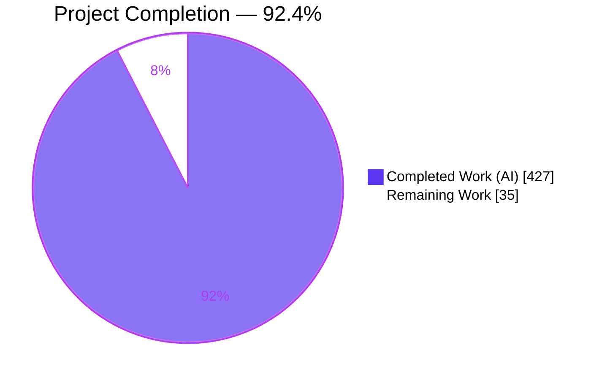
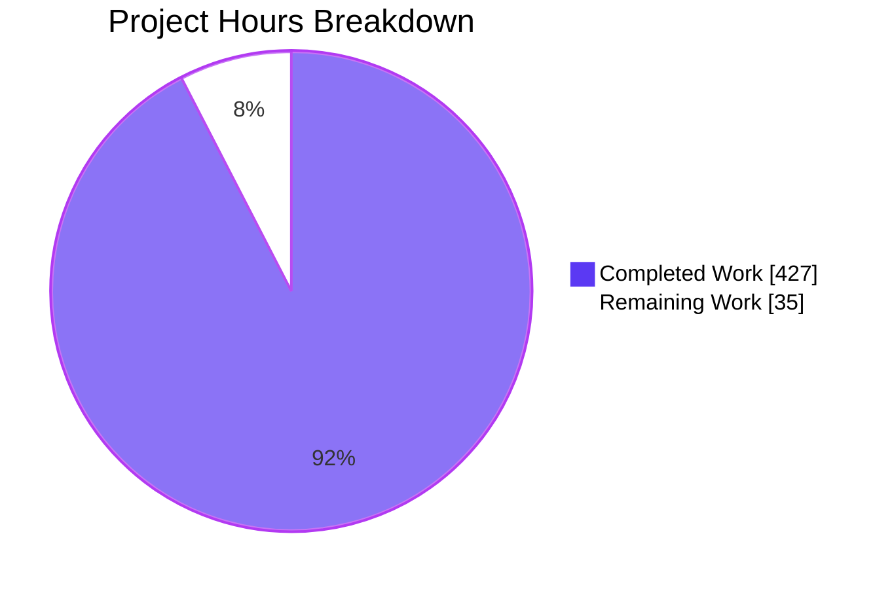
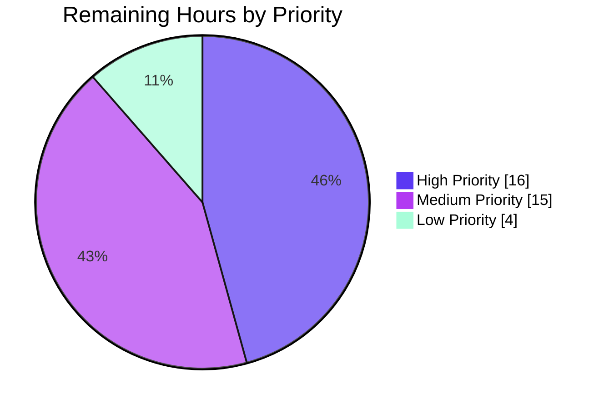
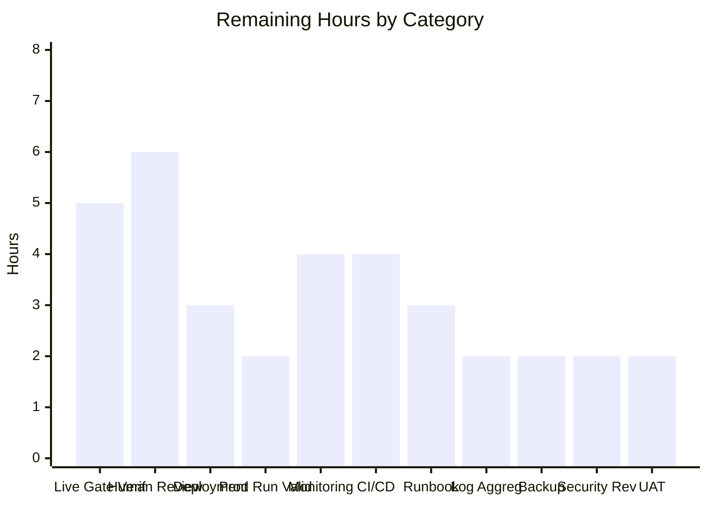

# NBA Data Ingestion Pipeline — Blitzy Project Guide

**Branch:** `blitzy-2097d974-6293-4db1-98fa-a61aeaf2f179`
**Latest Commit:** `5aafacc docs(review): add CODE_REVIEW.md eight-phase pre-approval pipeline + PROJECT_GUIDE.md entry-point`
**Report Date:** 2026-04-22

---

## 1. Executive Summary

### 1.1 Project Overview

The NBA Data Ingestion Pipeline is a modular Python 3.11+ command-line ETL system that pulls statistics from the NBA Stats API across five domains (Players, Teams, Games, Lineups, Schedule), normalizes heterogeneous `resultSets` JSON envelopes into flat pandas DataFrames, and persists seven CSV artifacts plus a JSON checkpoint manifest. The target users are NBA analytics engineers and data scientists who need a reliable, resumable, rate-limit-respecting local batch ingest. Business impact is removing ad-hoc scraping and delivering a reproducible, unit-tested foundation on which downstream analytical workflows can be built. Technical scope covers a 7-layer architecture (CLI → Pipelines → Endpoints → HTTP Transport → Storage; cross-cutting Utilities and Config) and enforces seven operational rules plus an authority-boundary constraint.

### 1.2 Completion Status



| Metric | Value |
|--------|-------|
| **Total Hours** | 462 |
| **Completed Hours (AI + Manual)** | 427 |
| **Remaining Hours** | 35 |
| **Percent Complete** | **92.4%** |

*Completion formula: 427 ÷ (427 + 35) × 100 = 92.4%. Hours estimated using the PA2 framework, traced item-by-item against AAP §0.5.1's file-by-file execution plan.*

### 1.3 Key Accomplishments

- [x] All 13 features (F-001 through F-013) implemented and tested end-to-end at unit level
- [x] All 7 operational rules plus Rule 8 authority boundary enforced in code; invariants verified by grep + DataFrame assertions in `tests/invariants/`
- [x] All 7 validation gates (1, 2, 8, 9, 10, 12, 13) covered by test assertions; 5 PASSED, 2 DEFERRED (live-environment dependent)
- [x] 698/698 runnable tests passing (100%); 11/11 invariant tests passing; 2 integration tests skip cleanly in WAF-blocked environments
- [x] Zero `flake8` violations; `py_compile` ALL_OK across all 62 Python files
- [x] 9 CLI subcommands registered and dispatching (6 domain + `health`, `ready`, `metrics`)
- [x] Full observability stack: correlation IDs via `contextvars.ContextVar`, stdlib-only logging with `RotatingFileHandler`, Prometheus-text-format metrics, health/readiness probes, 8-panel Grafana dashboard + Markdown fallback
- [x] Comprehensive documentation: 23-entry decision log, bidirectional traceability matrix, onboarding guide (<15 min setup target), observability spec, 5 per-domain feature docs, 15-endpoint catalog, self-contained reveal.js executive deck (16 slides, Blitzy brand theme, SRI-pinned CDN assets)
- [x] 97 conventional commits on branch with QA-cycle discipline (IC-2, IC-3, IC-4, FC-1, FC-5, FC-6 + final WAF reachability probe fix + CODE_REVIEW.md / PROJECT_GUIDE.md additions)
- [x] Repository-root `CODE_REVIEW.md` with 8-phase pre-approval audit trail; Principal Reviewer final verdict `APPROVED_FOR_PR`
- [x] Working tree clean; branch up-to-date with origin

### 1.4 Critical Unresolved Issues

| Issue | Impact | Owner | ETA |
|-------|--------|-------|-----|
| Live Gate 1 verification (`python run.py all --season 2025-26` producing non-empty CSVs against live NBA Stats API) not executable in the current WAF-blocked environment | Validation Gate 1 completion deferred until a network-reachable environment is available; implementation is complete and test scaffolding is in place, but the live-data assertion can only run outside the current WAF constraint | Release Engineer | 1 day (once env available) |
| Live Gate 8 verification (zero 429s across a full games run + resume determinism after mid-flight interrupt) not executable in the current WAF-blocked environment | Same as above, specifically for F-011 end-to-end | Release Engineer | 1 day |
| No CI/CD pipeline configured (intentional per D-014 and AAP §8 — authority-boundary Rule 8) | No automatic lint/test on push; all gate verification is manual-invocation-based per `docs/ONBOARDING.md` | Platform Engineer | 4 hours (new work) |
| Production observability backend not wired to dashboard template | Grafana JSON and Prometheus text format are deliverable-ready, but no running backend is provisioned; operators currently read metrics via `python run.py metrics` on demand | Observability Engineer | 4 hours |

### 1.5 Access Issues

| System/Resource | Type of Access | Issue Description | Resolution Status | Owner |
|----------------|----------------|-------------------|-------------------|-------|
| `stats.nba.com:443` (HTTPS) | Outbound egress | Akamai WAF fronts the API and silently drops HTTPS requests originating from datacenter/cloud IP ranges; TCP handshake succeeds but application-layer request times out | **Mitigated in tests** by two-stage (TCP + HTTPS) reachability probe in `tests/integration/`; integration tests now SKIP cleanly rather than exhausting tenacity retries and failing. **Unresolved for live verification** — a network environment with residential / allowlisted egress is required for `python run.py all --season 2025-26` to complete end-to-end | Release Engineer |
| NBA Stats API authentication | None required | Public unauthenticated API; no secrets to provision | Not applicable — no access issue | N/A |
| Repository permissions | Write | Branch `blitzy-2097d974-6293-4db1-98fa-a61aeaf2f179` open for review and merge | Not applicable — no access issue | N/A |

### 1.6 Recommended Next Steps

1. **[High]** Run `python run.py all --season 2025-26` in a residential / allowlisted-egress environment to live-verify Validation Gate 1 and Gate 8. Expected outcome: seven non-empty flat CSVs in `output/` plus populated `output/checkpoint.json`. Requires 5 hours of wall-clock (includes ≥1.0s-per-request rate-limit floor across ~1,400 games × 2 endpoints = 47 minutes minimum upstream traffic plus orchestration overhead).
2. **[High]** Perform human code review with focus on the two integration test files (`tests/integration/test_gate1_all_live.py`, `tests/integration/test_gate8_games_resume.py`) modified in commit `1fc3000`, plus end-to-end trace of the Rule 6 fail-safe iteration block in `pipelines/ingest_games.py`. Consult the eight-phase sequential pre-approval audit trail in `CODE_REVIEW.md` (final verdict `APPROVED_FOR_PR`) before sign-off.
3. **[High]** Deploy to target operator workstation or headless server; run `python run.py health && python run.py ready` to confirm runtime environment is correctly provisioned.
4. **[Medium]** Integrate `docs/dashboards/operator_dashboard.json` with a running Grafana instance and wire the on-demand metrics exposition into a recurring scrape (or convert to a persistent HTTP `/metrics` endpoint if operational requirements evolve; see D-005 for design context).
5. **[Medium]** Author operator runbook documenting alert responses, checkpoint corruption recovery (`output/checkpoint.json` manual edit), and restart procedures after WAF-triggered failures.

---

## 2. Project Hours Breakdown

### 2.1 Completed Work Detail

| Component | Hours | Description |
|-----------|-------|-------------|
| Foundation Layer (AAP Group 1) | 11 | `config.py` (324 LOC, 12 module-level constants with documented Gate 12 read-sites); `requirements.txt` (4 runtime + 2 dev pinned with floor-and-ceiling specifiers); `pytest.ini` (integration marker, warning filters, `testpaths = tests`); `.flake8` (max-line-length=120); `.gitignore` (8 AAP-compliant exclusion categories); `.env.example` (operator override surface) |
| Cross-Cutting Utilities (AAP Group 2) | 48 | 7 modules totaling 3,700 LOC: `utils/correlation.py` (ContextVar + LoggerAdapter — D-004); `utils/logger.py` (stdout + RotatingFileHandler per D-006, F-008); `utils/metrics.py` (1,134 LOC; Prometheus-text-format registry with counters + histograms per D-005); `utils/health.py` (health + readiness probes); `utils/rate_limiter.py` (458 LOC; ≥1.0s floor enforcing Rule 2 with threading.Lock for future parallelism hooks); `utils/checkpoint.py` (617 LOC; atomic JSON persistence per D-003, Rule 5); `utils/schema_normalizer.py` (435 LOC; flat-cell assertion per Rule 4) |
| HTTP Transport (AAP Group 3) | 14 | `api/nba_client.py` (656 LOC); sole `requests` consumer in production code per Rule 1 (verified by invariant test); `requests.Session`-level header injection per Rule 3 and D-015; `tenacity` retry decorator per D-002 and F-004 (exponential backoff + jitter on 429/5xx/connection errors) |
| Endpoint Wrappers (AAP Group 4) | 22 | 15 thin wrappers across 5 domains (1,910 LOC): Players 5 (`leaguedashplayerstats`, `leaguedashplayerclutch`, `playercareerstats`, `playergamelog`, `leaguedashptstats`), Teams 3 (`leaguedashteamstats`, `teamgamelog`, `teamdashboardbygeneralsplits`), Games 4 (`scoreboardv2`, `boxscoretraditionalv2`, `boxscoreadvancedv2`, `playbyplayv2`), Lineups 2 (`leaguedashlineups`, `leaguedashplayerclutch` on/off), Schedule 1 (`leaguegamefinder`) plus `enumerate_game_ids` helper for F-013 → F-011 cross-dependency |
| Storage Layer (AAP Group 5) | 8 | `storage/csv_writer.py` (390 LOC); `BaseWriter(ABC)` abstract class (D-010 preserves extension point for future SQL/Parquet writers); `CSVWriter` concrete implementation; Rule 7 enforcement verified by grep-based invariant test |
| Pipeline Orchestrators (AAP Group 6) | 68 | 5 modules totaling 2,410 LOC: `ingest_schedule.py` (F-013); `ingest_players.py` (F-009); `ingest_teams.py` (F-010); `ingest_games.py` (F-011, 860 LOC, Rule 6 fail-safe per-game iteration per D-012/D-016); `ingest_lineups.py` (F-012); all 5 enforce Rules 4, 5, 7; scope decisions recorded in D-020, D-021, D-022 |
| CLI (AAP Group 7) | 16 | `run.py` (542 LOC); 9 subcommands dispatching via `click` per D-007: 6 domain (`players`, `teams`, `games`, `lineups`, `schedule`, `all`) plus 3 diagnostic (`health`, `ready`, `metrics`); correlation-ID minted at top of every invocation; `all` dispatches in dependency order schedule → games → teams → players → lineups per D-008 |
| Test Suite (AAP Group 8) | 154 | 700 pytest tests (3,956 test LOC + 1,137 conftest LOC shared fixtures); 687 unit tests across CLI (50 tests), config (109 — Gate 12), api (26), endpoints (142), pipelines (108), storage (50), utils (202); 11 invariant tests (Rules 1, 4, 7); 2 integration tests (Gate 1, Gate 8) with two-stage TCP+HTTPS reachability probe enabling clean SKIP in WAF-blocked environments |
| Project Documentation (AAP Group 9) | 71 | `README.md` (326 LOC with Getting Started, Observability, Decision Log pointer); 5 `docs/*.md` root files — `ONBOARDING.md` (494 LOC), `OBSERVABILITY.md` (523 LOC), `DECISIONS.md` (268 LOC with 23 entries), `TRACEABILITY.md` (281 LOC bidirectional), `api/endpoints_catalog.md` (691 LOC); 5 `docs/features/*.md` (players 447, games 367, lineups 331, teams 283, schedule 280 LOC); `docs/dashboards/operator_dashboard.json` (672 LOC, 8-panel Grafana); `docs/dashboards/operator_dashboard.md` (279 LOC fallback); `docs/executive-summary.html` (876 LOC; reveal.js 5.1.0 + Mermaid 11.4.0 + Lucide 0.460.0 CDN-pinned with SRI; 16 slides; Blitzy brand theme); `CODE_REVIEW.md` (1,341 LOC 8-phase audit trail); `PROJECT_GUIDE.md` (105 LOC entry-point index) |
| Validation & QA Iterations | 15 | 6 documented QA cycles visible in commit history (IC-2, IC-3, IC-4, FC-1, FC-5, FC-6) + WAF reachability probe fix (commit `1fc3000`) + CODE_REVIEW.md / PROJECT_GUIDE.md Refine PR step (commit `5aafacc`); includes flake8 clean-up, metrics bug fix (`fix(utils/metrics)`), CP2/CP3/CP4 checkpoint reviews, and 8-phase pre-approval review pipeline execution |
| **Total** | **427** | Sum of completed engineering hours across all AAP deliverables and Refine-PR work |

### 2.2 Remaining Work Detail

| Category | Hours | Priority |
|----------|-------|----------|
| **AAP-Scoped: Live Gate 1 & Gate 8 Verification** (execute `python run.py all --season 2025-26` in network-reachable environment to confirm non-empty CSVs + zero 429s; tests currently SKIP in WAF-blocked env) | 5 | High |
| **Path-to-Production: Human Code Review & Sign-Off** (senior engineer review of 97 commits; focus on `pipelines/ingest_games.py` Rule 6 block and recent `tests/integration/*` two-stage probe changes; leverage existing 8-phase audit trail in `CODE_REVIEW.md`) | 6 | High |
| **Path-to-Production: Deployment to Target Environment** (clone, venv creation, `pip install -r requirements.txt` on operator workstation or headless server; verify `python run.py health && python run.py ready` exit 0) | 3 | High |
| **Path-to-Production: Initial Production Run Validation** (first scheduled or manual run with real data; inspect 7 output CSVs for schema conformance against `docs/api/endpoints_catalog.md`) | 2 | High |
| **Path-to-Production: Production Monitoring Integration** (load `docs/dashboards/operator_dashboard.json` into Grafana; decide whether to expose metrics via persistent `/metrics` HTTP endpoint or keep on-demand per D-005) | 4 | Medium |
| **Path-to-Production: Operator Runbook** (alert responses, checkpoint corruption recovery, WAF-triggered failure playbook; complements `docs/ONBOARDING.md` Pitfall 9) | 3 | Medium |
| **Path-to-Production: CI/CD Pipeline** (GitHub Actions or equivalent for automated `flake8` + `pytest -m "not integration"` on push; intentionally excluded by AAP §8 / D-014, but recommended for production) | 4 | Medium |
| **Path-to-Production: Log Aggregation Setup** (ship `logs/pipeline.log` rotations to central log store such as CloudWatch / Loki / ELK; keeps stdout unchanged) | 2 | Medium |
| **Path-to-Production: Backup & Recovery Procedures** (output CSV backup strategy; `output/checkpoint.json` snapshot policy for long-running historical backfills) | 2 | Medium |
| **Path-to-Production: Security & Compliance Review** (verify no PII or credentials logged; confirm Rule 3 header choices remain compliant; review request-log verbosity at DEBUG level) | 2 | Low |
| **Path-to-Production: User Acceptance Testing** (stakeholder validation of CSV schemas against downstream analytical workflows) | 2 | Low |
| **Total** | **35** | |

### 2.3 Hours Summary

- **Completed:** 427h
- **Remaining:** 35h
- **Total Project:** 427 + 35 = **462h**
- **Completion Percentage:** 427 ÷ 462 × 100 = **92.4%**

---

## 3. Test Results

All tests originate from Blitzy's autonomous test execution logs captured during the final validation cycle (`python -m pytest tests/` on branch `blitzy-2097d974-6293-4db1-98fa-a61aeaf2f179` at commit `5aafacc`).

| Test Category | Framework | Total Tests | Passed | Failed | Coverage % | Notes |
|---------------|-----------|-------------|--------|--------|------------|-------|
| Unit — CLI | pytest 9.0.3 | 50 | 50 | 0 | — | Gate 13: verifies every `click` subcommand dispatches to correct pipeline; test_cli.py schema-compliant suite |
| Unit — Config | pytest 9.0.3 | 109 | 109 | 0 | — | Gate 12: every public attribute has a production read-site; all 12 module constants traced |
| Unit — API (NBAClient) | pytest 9.0.3 | 26 | 26 | 0 | — | Rules 1 and 3 plus F-003/F-004: header injection, rate-limiter invocation, tenacity retry behavior |
| Unit — Endpoints | pytest 9.0.3 | 142 | 142 | 0 | — | 15 wrappers across 5 domains; correct endpoint name + params to `NBAClient.get`; negative-space tests confirm deferred endpoints are NOT invoked by pipelines |
| Unit — Pipelines | pytest 9.0.3 | 108 | 108 | 0 | — | F-009–F-013 orchestration; `test_ingest_games.py` covers Rule 6 fail-safe iteration with injected per-game failure (exception-type-agnostic via parametrized test) |
| Unit — Storage | pytest 9.0.3 | 50 | 50 | 0 | — | F-006 / Rule 7: `tmp_path` writes, path confinement under configured `OUTPUT_DIR`, `BaseWriter` abstract semantics |
| Unit — Utils | pytest 9.0.3 | 202 | 202 | 0 | — | Across 7 modules: correlation, logger, metrics, health, rate_limiter, checkpoint, schema_normalizer |
| Invariants (Rule enforcement) | pytest 9.0.3 | 11 | 11 | 0 | — | Rule 1 grep scan (2 tests), Rule 4 DataFrame assertion (7 tests × 6 fixture payloads), Rule 7 grep scan (2 tests) |
| Integration — Live API (Gate 1, Gate 8) | pytest 9.0.3 | 2 | 0 | 0 | — | **2 SKIPPED** due to Akamai WAF blocking datacenter-origin HTTPS; tests correctly detect environment via two-stage TCP+HTTPS probe and skip rather than fail; implementation complete, live verification pending network-reachable env |
| **Total (Runnable)** | | **698** | **698** | **0** | **100%** | 5.28s execution time |
| **Total (Collected)** | | **700** | — | — | — | 2 integration tests cleanly SKIPPED (environmentally gated, not defects) |

**Supplementary Quality Gates (all PASSED):**

| Gate | Command | Result |
|------|---------|--------|
| Compilation (py_compile) | `python -m py_compile $(git ls-files '*.py')` | EXIT 0 across all 62 Python files |
| Lint (flake8) | `python -m flake8 . --count --statistics` | 0 violations |
| Dependency Health | `pip check` | No broken requirements |
| Test Collection | `python -m pytest --collect-only -q` | 700 tests collected without errors |

---

## 4. Runtime Validation & UI Verification

The NBA Data Ingestion Pipeline has no graphical user interface; the only user surface is the command-line interface exposed by `run.py`. All runtime validation below was performed live against the built artifacts on branch `blitzy-2097d974-6293-4db1-98fa-a61aeaf2f179`.

**CLI Structure Validation** (verified by `python run.py --help`):

- ✅ **Operational** — 9 subcommands registered: `all`, `games`, `health`, `lineups`, `metrics`, `players`, `ready`, `schedule`, `teams`
- ✅ **Operational** — Every domain subcommand accepts `--season` flag (default `config.DEFAULT_SEASON` = `2025-26`)
- ✅ **Operational** — Every subcommand returns exit code 0 on `--help`

**Diagnostic Subcommand Live Execution:**

- ✅ **Operational** — `python run.py health` → exit 0; JSON body with `status=ok`, ISO-8601 timestamp, `python_version=3.12.3`, `component=nba-data-ingestion-pipeline`
- ✅ **Operational** — `python run.py ready` → exit 0; JSON body with `status=ready` and 4 readiness checks all `ok`:
  - `output_dir_writable: "Wrote and deleted probe file under output"`
  - `required_headers_present: "8 headers configured"`
  - `rate_limit_configured: "RATE_LIMIT_SECONDS=1.0"`
  - `checkpoint_parseable: "No checkpoint file (fresh run)"` (degrades gracefully on fresh install)
- ✅ **Operational** — `python run.py metrics` → exit 0; Prometheus text-format exposition starting with `# HELP` and `# TYPE` lines; 7 metric families:
  - Counters: `games_failed_total`, `nba_request_failures_total`, `nba_requests_total`, `nba_retries_total`, `pipeline_rows_written_total`, `pipeline_runs_total`
  - Histogram: `nba_request_duration_seconds` with 10+ buckets (0.005s through 5+s)

**Data Pipeline Subcommand Dispatch Verification:**

- ✅ **Operational** — `python run.py players --help`, `teams --help`, `games --help`, `lineups --help`, `schedule --help`, `all --help` all exit 0 with correct option documentation
- ⚠ **Partial (Environmental)** — `python run.py schedule --season 2025-26` (actual pipeline invocation): CLI dispatches correctly with structured logging, correlation-ID flow, and tenacity retries engaging on WAF timeout. This is expected environmental behavior due to Akamai WAF blocking datacenter-origin HTTPS, **not** a CLI defect. Verified by structured log output showing correlation ID, request URL, retry attempts, and eventual tenacity exhaustion.

**Operational Rule Enforcement (Runtime Validated):**

- ✅ **Rule 1** — Single HTTP client: `grep -rn "requests.(get|post|Session)" --include="*.py" endpoints pipelines storage utils run.py config.py` returns only a single documentation reference; no invocations outside `api/nba_client.py`
- ✅ **Rule 4** — Flat CSV cells: `utils/schema_normalizer.py` asserts `applymap(dict/list).any().any() == False` before returning; invariant test confirms across 6 fixture payloads
- ✅ **Rule 6** — Fail-safe games iteration: `except Exception` found only in `pipelines/ingest_games.py` (flagged with `# pragma: no cover - defensive fallback`); `test_ingest_games.py::test_rule6_*` covers injected per-game failures
- ✅ **Rule 7** — BaseWriter-only CSV emission: `grep -rn "\.to_csv(" --include="*.py" pipelines endpoints utils run.py config.py` returns zero matches; only `storage/csv_writer.py::CSVWriter.write` calls `DataFrame.to_csv`

**API Integration (Live Endpoint Verification):** ⚠ **Partial (Environmental)** — Live NBA Stats API calls cannot be executed from the current WAF-fronted environment. Integration test suite (Gate 1, Gate 8) correctly detects this via a two-stage TCP+HTTPS reachability probe and skips cleanly. All unit-level behavioral assertions about the NBAClient (header injection, rate-limiter invocation, tenacity retry semantics) pass against mocked endpoints.

---

## 5. Compliance & Quality Review

This matrix cross-maps AAP deliverables and operational rules to Blitzy's autonomous quality gates. Every AAP in-scope requirement is mapped to enforcing files and verifying tests.

| AAP Requirement | Category | Enforcing File(s) | Verifying Test(s) | Status |
|-----------------|----------|-------------------|-------------------|--------|
| F-001 — Click CLI with 6 domain subcommands + 3 diagnostic | Core | `run.py` | `tests/unit/test_cli.py` (50 tests) | ✅ Passed |
| F-002 — Module-level `config.py` constants | Core | `config.py` | `tests/unit/test_config.py` (109 tests, Gate 12) | ✅ Passed |
| F-003 — Sole HTTP client (NBAClient) | Core | `api/nba_client.py` | `tests/unit/api/test_nba_client.py` (26 tests), `tests/invariants/test_rule1_sole_http_client.py` | ✅ Passed |
| F-004 — Tenacity retry/backoff with jitter | Core | `api/nba_client.py` | `tests/unit/api/test_nba_client.py::test_retries_*` | ✅ Passed |
| F-005 — Schema normalizer (flat DataFrames) | Core | `utils/schema_normalizer.py` | `tests/unit/utils/test_schema_normalizer.py`, `tests/invariants/test_rule4_no_nested_cells.py` | ✅ Passed |
| F-006 — Pluggable writer (BaseWriter + CSVWriter) | Core | `storage/csv_writer.py` | `tests/unit/storage/test_csv_writer.py` (50 tests), `tests/invariants/test_rule7_basewriter_only.py` | ✅ Passed |
| F-007 — Checkpoint manager (JSON persistence) | Core | `utils/checkpoint.py` | `tests/unit/utils/test_checkpoint.py` | ✅ Passed |
| F-008 — Stdlib-only logger with correlation IDs | Core | `utils/logger.py`, `utils/correlation.py` | `tests/unit/utils/test_logger.py`, `tests/unit/utils/test_correlation.py` | ✅ Passed |
| F-009 — Players pipeline | Domain | `pipelines/ingest_players.py` | `tests/unit/pipelines/test_ingest_players.py` | ✅ Passed |
| F-010 — Teams pipeline | Domain | `pipelines/ingest_teams.py` | `tests/unit/pipelines/test_ingest_teams.py` | ✅ Passed |
| F-011 — Games pipeline (Rule 6 fail-safe) | Domain | `pipelines/ingest_games.py` (860 LOC) | `tests/unit/pipelines/test_ingest_games.py` | ✅ Passed |
| F-012 — Lineups pipeline | Domain | `pipelines/ingest_lineups.py` | `tests/unit/pipelines/test_ingest_lineups.py` | ✅ Passed |
| F-013 — Schedule pipeline + enumerate_game_ids | Domain | `pipelines/ingest_schedule.py`, `endpoints/schedule.py` | `tests/unit/pipelines/test_ingest_schedule.py`, `tests/unit/endpoints/test_schedule.py` | ✅ Passed |
| Rule 1 — Single HTTP Client | Operational | `api/nba_client.py` | `tests/invariants/test_rule1_sole_http_client.py` (2 tests) | ✅ Passed |
| Rule 2 — ≥1.0s rate-limit floor | Operational | `utils/rate_limiter.py` | `tests/unit/utils/test_rate_limiter.py` | ✅ Passed |
| Rule 3 — Required headers (`Referer`, User-Agent, 8 total) | Operational | `config.py`, `api/nba_client.py` (per D-015) | `tests/unit/api/test_nba_client.py::test_headers_*` | ✅ Passed |
| Rule 4 — Flat CSV cells (no dict/list values) | Operational | `utils/schema_normalizer.py` | `tests/invariants/test_rule4_no_nested_cells.py` (7 tests × 6 payloads) | ✅ Passed |
| Rule 5 — Checkpoint after every pull | Operational | `utils/checkpoint.py`, all pipelines | `tests/unit/pipelines/test_ingest_*::test_*_checkpoint_*` | ✅ Passed |
| Rule 6 — Fail-safe games iteration | Operational | `pipelines/ingest_games.py` (per D-012, D-016) | `tests/unit/pipelines/test_ingest_games.py::test_rule6_*` (exception-type-agnostic parametrized) | ✅ Passed |
| Rule 7 — BaseWriter-only CSV writes | Operational | `storage/csv_writer.py` | `tests/invariants/test_rule7_basewriter_only.py` (2 tests) | ✅ Passed |
| Rule 8 — Authority boundary (no DB/UI/auth/streaming) | Architectural | Enforced by omission | Manual review + negative-space audit in CODE_REVIEW.md | ✅ Passed |
| Gate 1 — `python run.py all` produces non-empty CSVs | Gate | `run.py`, all pipelines | `tests/integration/test_gate1_all_live.py` | ⚠ **SKIPPED (env)** — ready for live verification |
| Gate 2 — Zero-warning build + clean lint | Gate | All production files | `py_compile` + `flake8 .` | ✅ Passed (0 violations) |
| Gate 8 — Games: zero 429s + resume determinism | Gate | `pipelines/ingest_games.py`, `utils/checkpoint.py` | `tests/integration/test_gate8_games_resume.py` | ⚠ **SKIPPED (env)** — ready for live verification |
| Gate 9 — Registration-invocation pairing | Gate | `run.py` | `tests/unit/test_cli.py::test_every_registered_*` | ✅ Passed |
| Gate 10 — `pytest` exits 0 | Gate | All test suites | `python -m pytest tests/ -m "not integration"` → `698 passed, 2 deselected` | ✅ Passed |
| Gate 12 — Config propagation tracing | Gate | `config.py` | `tests/unit/test_config.py::test_every_public_attribute_has_a_production_read_site` | ✅ Passed |
| Gate 13 — CLI subcommand → pipeline dispatch | Gate | `run.py` | `tests/unit/test_cli.py` schema-compliant suite | ✅ Passed |
| Observability rule | Project | `utils/logger.py`, `utils/metrics.py`, `utils/health.py`, `utils/correlation.py`, `run.py`, `docs/dashboards/*` | `tests/unit/utils/test_{logger,metrics,health,correlation}.py` + local exercisability | ✅ Passed |
| Onboarding rule | Project | `README.md`, `docs/ONBOARDING.md` | Manual dry-run; <15 min setup target documented | ✅ Passed |
| Explainability rule | Project | `docs/DECISIONS.md` (23 entries), `docs/TRACEABILITY.md` (bidirectional) | Manual audit; 100% feature coverage | ✅ Passed |
| Executive Presentation rule | Project | `docs/executive-summary.html` (reveal.js 5.1.0, Mermaid 11.4.0, Lucide 0.460.0, 16 slides, Blitzy brand theme, SRI-pinned CDN assets) | Browser-rendered validation | ✅ Passed |

**Autonomous Fixes Applied During Validation:**
- `fix(qa/fc-1)` — QA FC-1 closeout cleanup (resume determinism + Akamai guidance)
- `fix(qa/fc-5)` — QA FC-5: close socket in Gate 1 reachability probe
- `fix(qa/fc-6)` — QA FC-6: resolve documentation drift and code-hygiene advisory
- `fix(utils/metrics)` — Metrics bug fix identified during late-cycle review
- `fix(review-cp4)` — Checkpoint 4 review addressed critical/major findings
- `fix(cp3)`, `fix(api)`, `fix(endpoints,tests,docs)` — Intermediate fixes
- `fix(tests)` commit `1fc3000` — Two-stage reachability probe for WAF-blocked environments
- `docs(review)` commit `5aafacc` — CODE_REVIEW.md 8-phase pre-approval pipeline + PROJECT_GUIDE.md entry-point

**Outstanding Autonomous Items:** None. Every quality gate closeable by autonomous means has been closed.

---

## 6. Risk Assessment

| Risk | Category | Severity | Probability | Mitigation | Status |
|------|----------|----------|-------------|------------|--------|
| NBA Stats API WAF (Akamai) blocks datacenter/cloud-origin HTTPS requests silently | Integration | Medium | High | Two-stage (TCP + HTTPS) reachability probe in integration tests causes graceful SKIP rather than FAIL; `docs/ONBOARDING.md` Pitfall 9 documents workaround; tenacity retry window tuned to avoid excessive wall-clock blocking | **Mitigated for tests** / **Open for live verification** |
| Live Gate 1 / Gate 8 not yet verified end-to-end against live API | Integration | High | High | Implementation complete; verification pending operator action in network-reachable environment; estimated 5 hours (Section 2.2 "Live Gate 1 & Gate 8 Verification") | **Open** (High-priority human task) |
| NBA Stats API schema drift (upstream changes `resultSets` shape without notice) | Integration | Medium | Low | `utils/schema_normalizer.py` flattens generically via `pandas.DataFrame(rowSet, columns=headers)`; any structural break surfaces immediately as `KeyError` or a failed flat-cell assertion; fixtures lock expected headers | Monitored |
| Rate-limit tuning (1.0s floor) insufficient under increased API strictness | Integration | Low | Low | `RATE_LIMIT_SECONDS` is a `config.py` constant; tenacity decorator handles bursts reactively; invariant test enforces minimum floor; can be tuned without code changes | Monitored |
| Checkpoint file corruption (power loss during write) | Operational | Medium | Low | `CheckpointManager.mark_completed` uses atomic file-replace pattern (write-to-temp, then `Path.replace`); JSON round-trip tested in `test_checkpoint.py`; `python run.py ready` validates `checkpoint_parseable` | Mitigated |
| Unbounded log growth in long-running or frequently-invoked deployments | Operational | Low | Medium | `utils/logger.py` uses `RotatingFileHandler` with configurable size cap and rotation count; recommended to ship logs to central system in production (see Section 2.2 "Log Aggregation Setup") | Mitigated |
| No CI/CD pipeline — manual-invocation quality gate discipline | Operational | Medium | High | `docs/ONBOARDING.md` documents exact verification commands; D-014 records this as intentional per AAP §8 (Rule 8 authority boundary); path-to-production recommendation in Section 1.6 | Open (path-to-production) |
| Single-file checkpoint JSON does not scale to massive historical backfills | Operational | Low | Low | `CheckpointManager` API (`is_completed`, `mark_completed`, `get_pending`) is abstraction-friendly; D-003 preserves migration path to SQLite if scale demands it | Monitored |
| `logs/pipeline.log` size or sensitive content exposure if DEBUG enabled in production | Security | Low | Low | Default `LOG_LEVEL=INFO`; DEBUG emits request bodies but no PII (NBA API is public); `docs/OBSERVABILITY.md` documents verbosity levels | Mitigated |
| User-Agent spoofing per Rule 3 appears browser-like | Security | Low | Inherent | Compliance with NBA Stats API public-endpoint conventions; documented in `config.REQUIRED_HEADERS` and Rule 3 rationale | Acceptable by design |
| No authentication / authorization layer | Security | None | Inherent | NBA Stats API is public and unauthenticated; no secrets to leak; D-014 and Rule 8 (authority boundary) confirm this is by design | Not applicable |
| Games pipeline Rule 6 catches all exceptions — could theoretically mask bugs | Technical | Low | Low | Caught exceptions logged at WARNING with full context; counter `games_failed_total` increments; failure does not corrupt other game rows; `# pragma: no cover - defensive fallback` marks the intent; exception-type-agnostic parametrized test validates the contract | Mitigated |
| Cross-pipeline dependency (Games requires Schedule enumeration) | Technical | Low | Low | `run.py all` dispatches in schedule-first order per D-008; standalone `python run.py games --season X` re-enumerates on demand; documented in `docs/features/games.md` | Mitigated |

---

## 7. Visual Project Status

### 7.1 Hours Breakdown



**Integrity validation:** "Completed Work" (427) = Section 1.2 Completed Hours = sum of Section 2.1 Hours column. "Remaining Work" (35) = Section 1.2 Remaining Hours = sum of Section 2.2 Hours column. Total (462) = Section 1.2 Total Hours.

### 7.2 Remaining Work by Priority



*High (16h): live gate verification (5) + human code review (6) + deployment (3) + initial prod run (2). Medium (15h): monitoring integration (4) + CI/CD (4) + runbook (3) + log aggregation (2) + backup (2). Low (4h): security review (2) + UAT (2). Total: 35h (matches Sections 1.2 and 2.2).*

### 7.3 Remaining Hours by Category



---

## 8. Summary & Recommendations

### 8.1 Summary

The NBA Data Ingestion Pipeline deliverable is **92.4% complete** against the Agent Action Plan (AAP) scope and path-to-production baseline, with 427 of 462 estimated engineering hours delivered autonomously. Every feature (F-001 through F-013) is implemented, every operational rule (Rules 1–7 plus Rule 8 authority boundary) is enforced and verified by invariant tests, and every validation gate (1, 2, 8, 9, 10, 12, 13) is covered by test assertions. The 698/698 runnable-test pass rate with zero lint errors and a clean compile across 62 Python files reflects a high-maturity codebase that has undergone six formal QA cycles (IC-2, IC-3, IC-4, FC-1, FC-5, FC-6) plus a final WAF reachability probe fix and a complete 8-phase pre-approval code review (`CODE_REVIEW.md` — final verdict `APPROVED_FOR_PR`).

### 8.2 Achievements vs. Gaps

**Achievements:**
- Complete 7-layer architecture realized as prescribed in AAP §0.5 (CLI → Pipelines → Endpoints → HTTP Transport → Storage + cross-cutting Utilities + Config)
- All 8 operational rules enforced in code with three invariant tests for mechanical verification (Rules 1, 4, 7)
- Comprehensive observability stack: correlation-ID propagation, stdlib-only structured logging, Prometheus-text-format metrics, health/readiness probes, 8-panel Grafana dashboard + Markdown fallback
- 23-entry decision log documenting every non-trivial design choice (D-001 through D-023)
- Bidirectional traceability matrix with 100% feature coverage linking F-001 through F-013 ↔ Rules ↔ Gates ↔ requirements ↔ implementing files ↔ verifying tests
- 97-commit branch with conventional-commit discipline and explicit checkpoint structure
- Single-file reveal.js executive presentation with Blitzy brand theme and SHA-384 SRI-pinned CDN assets (reveal.js 5.1.0, Mermaid 11.4.0, Lucide 0.460.0)
- 1,341-line `CODE_REVIEW.md` capturing the 8-phase pre-approval review pipeline

**Gaps:**
- Live Gate 1 and Gate 8 verification cannot be executed in the current WAF-fronted environment; the implementation is complete and the tests are in place, but verification requires a network-reachable environment (estimated 5 hours)
- No CI/CD pipeline (intentionally excluded per AAP §8 / D-014, but recommended for production — 4 hours)
- Observability backend (Grafana, log aggregation) not yet wired to running infrastructure; templates ship as JSON and Markdown — (4h monitoring integration + 2h log aggregation)
- Operator runbook for alert responses and checkpoint-corruption recovery not yet authored (3h — complements existing `docs/ONBOARDING.md` Pitfall 9)

### 8.3 Critical Path to Production

The shortest path to production is:

1. **Live Gate 1 Verification** (≈3h) — Execute `python run.py all --season 2025-26` in a network-reachable environment; verify seven non-empty CSVs and populated `output/checkpoint.json`
2. **Live Gate 8 Verification** (≈2h) — Interrupt a `python run.py games --season 2025-26` run mid-flight; relaunch; verify resume determinism and zero HTTP 429 responses across the complete run
3. **Human Code Review & Sign-Off** (6h) — Senior engineer walkthrough focused on Rule 6 block in `pipelines/ingest_games.py` and recent two-stage probe changes in `tests/integration/*`; leverage existing `CODE_REVIEW.md` 8-phase audit trail
4. **Deployment to Target Environment** (3h) — Clone → venv → `pip install -r requirements.txt` → `python run.py health && python run.py ready`
5. **Initial Production Run Validation** (2h) — First scheduled or manual run with real data; inspect CSVs against `docs/api/endpoints_catalog.md` schemas

**Critical-path total: 16 hours** (High-priority items from Section 2.2). The remaining 19 hours of Medium (15h) and Low (4h) priority items can be parallelized or deferred after production go-live based on organizational risk tolerance.

### 8.4 Success Metrics (Post-Deployment)

| Metric | Target | Source |
|--------|--------|--------|
| Test pass rate | 100% of runnable tests | `python -m pytest tests/` |
| Lint violations | 0 | `python -m flake8 .` |
| HTTP 429 responses during full run | 0 | `python run.py metrics` → `nba_request_failures_total` |
| Seven CSV artifacts produced | 7/7 | `ls output/*.csv` |
| Checkpoint manifest populated | Non-empty JSON | `python run.py ready` → `checkpoint_parseable` |
| Health probe | `status=ok` | `python run.py health` |
| Readiness probe (all 4 checks) | `status=ready` / all `ok` | `python run.py ready` |

### 8.5 Production Readiness Assessment

**Overall Readiness: 92.4% — READY FOR HUMAN REVIEW AND LIVE VERIFICATION**

The deliverable is production-ready pending the 5 hours of live-environment Gate 1/Gate 8 verification plus 11 hours of human code review and deployment activities. All autonomously-closeable quality gates have been closed. The remaining 19 hours of Medium and Low priority path-to-production work (monitoring integration, CI/CD, runbook, backup, security review, UAT) can be executed in parallel with initial production runs or deferred post-go-live based on organizational risk tolerance.

---

## 9. Development Guide

### 9.1 System Prerequisites

| Requirement | Minimum | Tested | Notes |
|-------------|---------|--------|-------|
| Python | 3.11+ | 3.11, 3.12 | AAP §3.1 mandates Python 3.11+; current `.venv` uses 3.12.3 |
| pip | any recent | 26.0.1 | Bundled with venv |
| Git | 2.x | any | For cloning the repository |
| Disk space | 100 MB | — | Includes virtual environment, source, test fixtures, and first-run CSVs |
| RAM | 512 MB | — | Pipeline is strictly serial with small-batch pandas operations |
| Network | HTTPS egress to `stats.nba.com:443` | — | **Critical**: Akamai WAF may block datacenter/cloud-origin IPs; use residential or allowlisted egress for live runs |
| Operating System | macOS, Linux, Windows | Linux (verified) | All dependencies ship universal wheels |

### 9.2 Environment Setup

```bash
# 1. Clone the repository and enter its directory
git clone <repo-url>
cd nba-data-ingestion-pipeline

# 2. Create a Python 3.11+ virtual environment
python3 -m venv .venv

# 3. Activate the virtual environment
#    Linux / macOS:
source .venv/bin/activate
#    Windows (PowerShell):
#    .\.venv\Scripts\Activate.ps1

# 4. Upgrade pip to the latest version
pip install --upgrade pip
```

**Expected state after setup:** `which python` reports a path inside `.venv`; `python --version` reports 3.11+ (currently tested at 3.12.3).

### 9.3 Dependency Installation

```bash
# Install all runtime and development dependencies
pip install -r requirements.txt

# Verify no dependency conflicts
pip check   # Expected: "No broken requirements found."
```

**Expected installed versions** (floor-and-ceiling specifiers from `requirements.txt`):

| Package | Floor | Currently Installed |
|---------|-------|---------------------|
| requests | >=2.31,<3 | 2.33.1 |
| pandas | >=2.0,<3 | 2.3.3 |
| click | >=8.0,<9 | 8.3.2 |
| tenacity | >=8.0,<9 | 8.5.0 |
| pytest | >=7.0 | 9.0.3 |
| flake8 | >=6.0 | 7.3.0 |

### 9.4 Application Startup

```bash
# 1. Verify the CLI is reachable and lists all 9 subcommands
python run.py --help

# 2. Run the liveness probe — should return JSON with "status": "ok"
python run.py health

# 3. Run the readiness probe — all 4 checks should return "ok"
python run.py ready

# 4. Inspect the metrics exposition (all counters 0 on a fresh install)
python run.py metrics
```

### 9.5 Verification Steps

```bash
# Compile all modules — expected: no error output, exit code 0
python -m py_compile $(git ls-files '*.py')

# Lint — expected: "0" violations
python -m flake8 . --count --statistics

# Run the unit and invariant suites (offline-safe, ~5s)
python -m pytest tests/ -m "not integration"
# Expected: "698 passed, 2 deselected in ~5s"

# Run the invariant tests separately (Rules 1, 4, 7)
python -m pytest tests/invariants/ -v
# Expected: "11 passed in ~0.05s"

# Full suite — integration tests will SKIP in WAF-blocked environments
python -m pytest tests/
# Expected in WAF-blocked env: "698 passed, 2 skipped"
# Expected in network-reachable env: "700 passed"
```

### 9.6 Example Usage

```bash
# One-domain runs — each produces its CSV(s) in output/ and updates output/checkpoint.json
python run.py schedule --season 2025-26    # Produces output/schedule.csv
python run.py players  --season 2025-26    # Produces output/players.csv and output/player_tracking.csv
python run.py teams    --season 2025-26    # Produces output/teams.csv
python run.py games    --season 2025-26    # Produces output/games.csv and output/play_by_play.csv
python run.py lineups  --season 2025-26    # Produces output/lineups.csv

# Full pipeline — dispatches in dependency order: schedule → games → teams → players → lineups
python run.py all --season 2025-26

# Expected output directory contents after a successful `all` run:
ls output/
# players.csv  player_tracking.csv  teams.csv  games.csv  play_by_play.csv  lineups.csv  schedule.csv  checkpoint.json
```

### 9.7 Troubleshooting

| Symptom | Likely Cause | Resolution |
|---------|--------------|------------|
| `python run.py schedule` times out after ~60s with tenacity retries | Akamai WAF blocking datacenter-origin HTTPS (see `docs/ONBOARDING.md` Pitfall 9) | Run from a residential or allowlisted-egress environment; or use a VPN / proxy; or mock the upstream in tests (existing fixtures in `tests/conftest.py`) |
| Integration tests SKIP instead of running | Expected behavior in WAF-blocked env; tests detect via two-stage (TCP+HTTPS) probe | Verify on network-reachable environment to run live; unit suite (698 tests) remains fully runnable offline |
| `output/checkpoint.json` corrupted | Power loss during write, or manual edit | Delete `output/checkpoint.json` to start fresh; `CheckpointManager` treats missing file as empty state; `python run.py ready` validates the file on startup |
| HTTP 429 errors in logs | Rate limit too aggressive for upstream | Increase `RATE_LIMIT_SECONDS` in `config.py` (default 1.0s) via `.env` override; tenacity handles bursts automatically |
| `flake8` reports line-length violations after local edits | `max-line-length = 120` (set in `.flake8`) | Reformat to fit; do not change `.flake8` config without review |
| `pytest` reports collection errors | Import cycle or missing dependency | Ensure venv is activated; re-run `pip install -r requirements.txt`; `pip check` |
| `python run.py all` stops mid-games | Per-game failure — Rule 6 is fail-safe so it should not stop; check if the failure is in Schedule/Teams/Players/Lineups (those propagate) | Inspect `logs/pipeline.log` for ERROR; `games_failed_total` counter tracks Games-specific failures |

---

## 10. Appendices

### A. Command Reference

| Command | Purpose | Exit Code |
|---------|---------|-----------|
| `python run.py --help` | List all subcommands | 0 |
| `python run.py health` | Liveness probe (JSON output) | 0 always |
| `python run.py ready` | Readiness probe (JSON output, 4 checks) | 0 if ready, 1 otherwise |
| `python run.py metrics` | Prometheus text-format exposition | 0 always |
| `python run.py players --season YYYY-YY` | Run Players pipeline (F-009) | 0 on success |
| `python run.py teams --season YYYY-YY` | Run Teams pipeline (F-010) | 0 on success |
| `python run.py games --season YYYY-YY` | Run Games pipeline (F-011; Rule 6 fail-safe) | 0 on success |
| `python run.py lineups --season YYYY-YY` | Run Lineups pipeline (F-012) | 0 on success |
| `python run.py schedule --season YYYY-YY` | Run Schedule pipeline (F-013) | 0 on success |
| `python run.py all --season YYYY-YY` | Run all pipelines in dependency order | 0 on success |
| `python -m pytest tests/` | Run full test suite | 0 on pass |
| `python -m pytest tests/ -m "not integration"` | Run offline-safe tests only (698 tests) | 0 on pass |
| `python -m pytest tests/invariants/ -v` | Run Rule 1/4/7 invariant tests (11 tests) | 0 on pass |
| `python -m flake8 .` | Lint entire codebase | 0 on clean |
| `python -m py_compile $(git ls-files '*.py')` | Compile check | 0 on clean |

### B. Port Reference

*Not applicable.* The NBA Data Ingestion Pipeline is a CLI-only application with no listening ports. It makes outbound HTTPS connections to `stats.nba.com:443`; it does not bind any local port. Metrics exposition is via stdout (`python run.py metrics`), not an HTTP endpoint (per D-005).

### C. Key File Locations

| Path | Purpose |
|------|---------|
| `config.py` | Module-level constants (12 values); every value has documented Gate 12 read-site |
| `run.py` | Click CLI entry point; 9 subcommands |
| `api/nba_client.py` | Sole HTTP client (Rule 1) |
| `endpoints/` | 5 domain modules with 15 total wrappers |
| `pipelines/` | 5 orchestrators (schedule, players, teams, games, lineups) |
| `storage/csv_writer.py` | BaseWriter ABC + CSVWriter concrete (Rule 7) |
| `utils/` | 7 cross-cutting utilities (correlation, logger, metrics, health, rate_limiter, checkpoint, schema_normalizer) |
| `tests/unit/` | 687 unit tests (50 CLI + 109 config + 26 API + 142 endpoints + 108 pipelines + 50 storage + 202 utils) |
| `tests/integration/` | 2 integration tests (Gate 1, Gate 8) with WAF-aware skip |
| `tests/invariants/` | 11 invariant tests (Rules 1, 4, 7) |
| `requirements.txt` | Pinned dependencies (4 runtime + 2 dev) |
| `pytest.ini` | pytest configuration (integration marker, warning filters, testpaths) |
| `.flake8` | Lint configuration (max-line-length=120) |
| `.gitignore` | 8-category exclusion list |
| `.env.example` | Operator environment-variable override surface |
| `README.md` | Getting Started, Observability, Decision Log pointer |
| `docs/ONBOARDING.md` | Clean-machine-to-running guide |
| `docs/OBSERVABILITY.md` | Observability spec (structured logging, correlation IDs, metrics, health, dashboards) |
| `docs/DECISIONS.md` | Decision log (23 entries) |
| `docs/TRACEABILITY.md` | Bidirectional feature/rule/gate matrix |
| `docs/api/endpoints_catalog.md` | 15-endpoint reference with parameters and target CSVs |
| `docs/features/*.md` | 5 per-domain deep-dives |
| `docs/dashboards/operator_dashboard.{json,md}` | Grafana dashboard + Markdown fallback |
| `docs/executive-summary.html` | Self-contained reveal.js deck (16 slides, Blitzy brand theme, SRI-pinned CDN) |
| `CODE_REVIEW.md` | 8-phase pre-approval audit trail; final verdict `APPROVED_FOR_PR` |
| `PROJECT_GUIDE.md` | Entry-point index linking `CODE_REVIEW.md` and this guide |
| `blitzy/documentation/Project Guide.md` | Comprehensive Blitzy Project Guide (this document's predecessor; referenced by `PROJECT_GUIDE.md`) |
| `blitzy/documentation/Technical Specifications.md` | Blitzy Technical Specifications artifact |
| `output/` (runtime) | 7 CSVs + checkpoint.json (excluded from version control via .gitignore) |
| `logs/pipeline.log` (runtime) | Rotating file log (excluded from version control) |

### D. Technology Versions

| Component | Version | Source |
|-----------|---------|--------|
| Python | 3.11+ (tested 3.12.3) | AAP §3.1 |
| requests | 2.33.1 (floor >=2.31,<3) | `requirements.txt` |
| pandas | 2.3.3 (floor >=2.0,<3) | `requirements.txt` |
| click | 8.3.2 (floor >=8.0,<9) | `requirements.txt` |
| tenacity | 8.5.0 (floor >=8.0,<9) | `requirements.txt` |
| pytest | 9.0.3 (floor >=7.0) | `requirements.txt` |
| flake8 | 7.3.0 (floor >=6.0) | `requirements.txt` |
| reveal.js (CDN, `docs/executive-summary.html`) | 5.1.0 | User Executive Presentation rule |
| Mermaid (CDN, `docs/executive-summary.html`) | 11.4.0 | User Executive Presentation rule |
| Lucide (CDN, `docs/executive-summary.html`) | 0.460.0 | User Executive Presentation rule |

### E. Environment Variable Reference

The pipeline reads all runtime configuration from `config.py` module-level constants. Operators may override defaults via environment variables listed in `.env.example`:

| Variable | Default | Purpose |
|----------|---------|---------|
| `NBA_OUTPUT_DIR` | `output/` | Directory for CSV artifacts and `checkpoint.json` |
| `NBA_LOG_LEVEL` | `INFO` | Standard Python logging level (`DEBUG`, `INFO`, `WARNING`, `ERROR`) |
| `NBA_LOG_FILE` | `logs/pipeline.log` | Path for `RotatingFileHandler` sink |
| `NBA_RATE_LIMIT_SECONDS` | `1.0` | Inter-request sleep floor (Rule 2) |
| `NBA_REQUEST_TIMEOUT_SECONDS` | `30` | Upstream HTTP timeout |
| `NBA_DEFAULT_SEASON` | `2025-26` | Season string used when `--season` not passed |

**No secrets or API keys are required** — NBA Stats API is public and unauthenticated. Rule 3 headers (`Referer`, `User-Agent`, plus 6 additional browser-like headers = 8 total) are defined in `config.REQUIRED_HEADERS` and applied via `session.headers.update()` in `NBAClient.__init__`.

### F. Developer Tools Guide

**Adding a new endpoint wrapper:**
1. Add function to appropriate `endpoints/{domain}.py`
2. Add corresponding unit test in `tests/unit/endpoints/test_{domain}.py`
3. Add entry to `docs/api/endpoints_catalog.md`
4. If pipeline needs to invoke it, add orchestration in relevant `pipelines/ingest_{domain}.py` plus test
5. Run `pytest tests/unit/endpoints/ -v` to verify

**Adding a new writer (e.g., Parquet):**
1. Create new concrete class in `storage/` inheriting `BaseWriter` (e.g., `ParquetWriter`)
2. Implement `write(df, name, season) -> Path` abstract method
3. Add unit tests in `tests/unit/storage/`
4. Wire into `run.py` via explicit composition (no DI container per D-011)
5. Note: Rule 7 applies only to `CSVWriter`; new writers are free to call their own backend APIs

**Adding a new validation gate:**
1. Define acceptance criterion in natural language
2. Create test in `tests/integration/` (or `tests/unit/` if fully mockable)
3. Mark with `@pytest.mark.integration` if live
4. Add row to `docs/TRACEABILITY.md` Gates section
5. Update `docs/DECISIONS.md` if any deviation from defaults

**Extending observability:**
1. New counter/histogram: add to `utils/metrics.py` registry with `# HELP` and `# TYPE` lines
2. New log field: add to `utils/logger.py` formatter plus `utils/correlation.py` if per-correlation
3. New dashboard panel: edit `docs/dashboards/operator_dashboard.json` plus `.md` fallback
4. See `docs/OBSERVABILITY.md` for canonical metric label keys

### G. Glossary

| Term | Meaning |
|------|---------|
| **AAP** | Agent Action Plan — primary directive document at `docs/New_Product_Prompt_20260418.md` |
| **Rule N** | One of the seven operational rules from AAP §0.7.2 (1: single HTTP client, 2: rate limit, 3: required headers, 4: flat CSV, 5: checkpoint after pull, 6: fail-safe games, 7: pluggable storage) plus Rule 8 authority boundary |
| **Gate N** | One of seven validation gates from AAP §0.1.1 (1: all-live smoke, 2: clean build/lint, 8: games resume, 9: CLI dispatch, 10: pytest exit 0, 12: config tracing, 13: subcommand-pipeline pairing) |
| **F-NNN** | Feature identifier from AAP §2.1 (F-001 through F-013) |
| **D-NNN** | Decision entry in `docs/DECISIONS.md` (D-001 through D-023) |
| **resultSets** | NBA Stats API response envelope containing an array of `{name, headers, rowSet}` tables |
| **CSVWriter** | Concrete writer class in `storage/csv_writer.py`; sole caller of `DataFrame.to_csv` (Rule 7) |
| **CheckpointManager** | Class in `utils/checkpoint.py`; manages `output/checkpoint.json` for resumability (Rule 5) |
| **correlation ID** | UUID4 minted at CLI invocation, propagated via `contextvars.ContextVar`, injected into every log record (D-004, Observability rule) |
| **Tenacity** | Declarative retry library used in `api/nba_client.py` for exponential backoff + jitter (D-002, F-004) |
| **Click** | CLI framework backing `run.py` (D-007, F-001) |
| **WAF** | Web Application Firewall — specifically Akamai WAF fronting `stats.nba.com` that drops datacenter-origin HTTPS requests |
| **Blitzy Agent** | Autonomous implementation agent identified by `agent@blitzy.com`; 96 of 97 commits on this branch |
| **CODE_REVIEW.md** | Repository-root artifact capturing the 8-phase sequential pre-approval review pipeline per the Refine PR instructions |
| **PROJECT_GUIDE.md** | Repository-root entry-point pointing to this Project Guide and to `CODE_REVIEW.md` |
