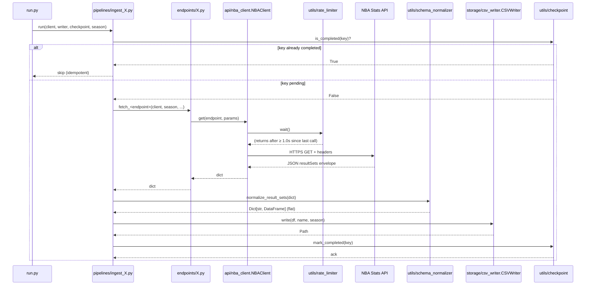
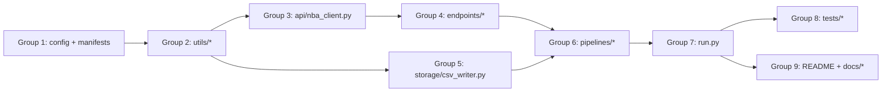

# Technical Specification

# 0. Agent Action Plan

## 0.1 Intent Clarification

### 0.1.1 Core Feature Objective

Based on the prompt, the Blitzy platform understands that the new feature requirement is to **build the complete NBA Data Ingestion Pipeline defined in `docs/New_Product_Prompt_20260418.md`** from its current pre-implementation state (where only `README.md` and the product brief exist) into a fully operational, modular Python command-line ETL system. The pre-implementation state is confirmed by repository inspection: the root folder contains exactly two first-order children — `README.md` and the `docs/` directory — with no source code, configuration, or test files yet committed.

The feature requirements, restated in precise technical language, are:

- **Implement every module in the specified 7-layer architecture** — the CLI (`run.py`), central configuration (`config.py`), HTTP transport (`api/nba_client.py`), five endpoint wrappers (`endpoints/{players,teams,games,lineups,schedule}.py`), three pipeline orchestrators (`pipelines/ingest_{players,teams,games}.py`), storage (`storage/csv_writer.py`), and four cross-cutting utilities (`utils/{rate_limiter,schema_normalizer,checkpoint,logger}.py`).
- **Cover all 15+ NBA Stats API endpoints across 6 data domains** — Players (5 endpoints: `leaguedashplayerstats`, `leaguedashplayerclutch`, `playercareerstats`, `playergamelog`, `leaguedashptstats`), Teams (3 endpoints: `leaguedashteamstats`, `teamgamelog`, `teamdashboardbygeneralsplits`), Games (4 endpoints: `scoreboardv2`, `boxscoretraditionalv2`, `boxscoreadvancedv2`, `playbyplayv2`), Lineups (2 endpoints: `leaguedashlineups`, `leaguedashplayerclutch` on/off splits), Schedule (1 endpoint: `leaguegamefinder`) — a minimum of 15 endpoints summed across the 6 logical domains.
- **Follow all operational rules exactly** — the product brief enumerates **seven** operational rules (Rules 1 through 7) at `docs/New_Product_Prompt_20260418.md` §5. The user's instruction text references "8 rules"; this Agent Action Plan treats this as a conservative overcount and commits to the **seven rules literally present in the source document** plus the implicit 8th binding constraint imposed by the authority boundary in §1 (no database persistence, no web UI, no authentication, no real-time streaming; design a pluggable storage interface but implement only CSV output). Both the seven Rules and the authority-boundary constraint are binding architectural invariants.
- **Make the CLI end-to-end operational** — `python run.py all --season 2025-26` must produce non-empty, fully flattened CSV files in the `output/` directory. This satisfies Validation Gate 1. Additionally, `python run.py games --season 2025-26` must produce `games.csv` with > 0 rows and zero HTTP 429 responses during the full run (Gate 8).
- **Follow the specified build order** — begin with `config.py` and `api/nba_client.py`, then build outward through endpoints, pipelines, and storage. This build order honors the dependency direction established in §5.2.10 of the technical specification: CLI → Pipelines → Endpoints → Transport, with cross-cutting utilities composed by each layer as needed.

Implicit requirements surfaced from the source documents and the user's rule set:

- **Python 3.11+** is the required runtime (`docs/New_Product_Prompt_20260418.md` §3; Technical Specification §3.1.1). Installation must use pinned version floors matching the tech stack: `requests` ≥ 2.31, `pandas` 2.x, `click` 8.x, `tenacity` 8.x, plus stdlib `logging`/`json`/`pathlib`/`time`.
- **Seven flat CSV artifacts under `output/`** with documented composite key columns: `players.csv`, `teams.csv`, `games.csv`, `play_by_play.csv`, `lineups.csv`, `schedule.csv`, and `player_tracking.csv`.
- **One JSON checkpoint manifest at `output/checkpoint.json`** tracking completed `(domain, key)` pairs.
- **Complete unit and integration test suite** invokable via `python -m pytest tests/` (Gate 10), with integration tests marked `@pytest.mark.integration` so they can be skipped via `pytest -m "not integration"`.
- **Clean lint and zero-warning compilation** across every `.py` file (Gate 2): `python -m py_compile` must report zero warnings and `flake8` (or `ruff`) must pass clean under default rules.
- **Complete Gate coverage** — the specification enumerates 7 test-bearing Validation Gates (Gates 1, 2, 8, 9, 10, 12, 13). Every gate must be satisfied by the deliverable.
- **Deliverables for the user's four project-level rules** — structured logging with correlation IDs, health/readiness checks and a metrics surface, a dashboard template, updated onboarding documentation, a decision log as a Markdown table, a bidirectional traceability matrix, and a reveal.js executive-summary HTML presentation per the Blitzy brand specification.

Feature prerequisites and dependency chain:

- **F-013 Schedule** precedes **F-011 Games** at runtime — the Games pipeline requires the Schedule enumeration to obtain `GAME_ID`s (§5.2.9 of the tech spec).
- **All domain pipelines (F-009–F-013)** depend on the Core Framework features **F-001 through F-008** being in place first, which is why the user's instruction to start with `config.py` and `api/nba_client.py` is structurally correct.
- **Rule 6 (fail-safe game iteration)** applies uniquely to the Games pipeline (F-011); all other pipelines propagate exceptions upward.

### 0.1.2 Special Instructions and Constraints

The following directives are captured verbatim where possible and translated into binding constraints where paraphrase is necessary. Each instruction is preserved because deviation would constitute a defect under the user's Explainability rule.

**User Example (build order):** "Start with `config.py` and `api/nba_client.py`, then build outward through endpoints, pipelines, and storage."

This is a **bottom-up-with-skeleton-first** build sequence. The translation to the file-by-file execution plan (§0.5.1) is:

- Group 1: `config.py` and `api/nba_client.py` (foundation)
- Group 2: `utils/` modules required by `nba_client.py` (`rate_limiter`, `logger`)
- Group 3: `endpoints/` modules (thin wrappers over `NBAClient.get`)
- Group 4: `storage/csv_writer.py` and `utils/{schema_normalizer, checkpoint}`
- Group 5: `pipelines/` orchestrators
- Group 6: `run.py` CLI entry point
- Group 7: tests, documentation, decision log, executive presentation

**User Example (end-to-end validation):** "The CLI (`run.py`) must work end-to-end: `python run.py all --season 2025-26` should produce non-empty, fully flattened CSVs in `output/`."

This is the literal statement of Validation Gate 1 (`docs/New_Product_Prompt_20260418.md` §6). Non-empty is defined relative to the live NBA Stats API having data for the target season; the pipeline must therefore execute against the live upstream, not a mock.

**Architectural constraints inherited from the source document and the technical specification:**

- **Immutable upstream interface** — the NBA Stats API at `https://stats.nba.com/stats/` and its `resultSets` array-of-tables JSON envelope must not be altered, proxied, or abstracted away. The schema normalizer must consume the envelope directly.
- **Preservation requirement** — the `BaseWriter` interface must remain abstract and extensible. No PostgreSQL, DuckDB, or other database writer may be implemented in this phase.
- **Single HTTP client invariant** (Rule 1) — no `requests.get`, `requests.post`, or `requests.Session` call may exist outside `api/nba_client.py` (except in tests).
- **Existing repository conventions** — the `README.md` already declares the intended directory layout, endpoint inventory, output file list, CLI usage patterns, and design decisions. The implementation must conform to that published structure without renaming or reorganizing; the README will be updated only with implementation-specific details not already present.
- **Integration with existing infrastructure** — the virtual environment expected by the `README.md` installation instructions is `pip install -r requirements.txt`. A `requirements.txt` file must therefore be produced as part of this deliverable.
- **Backward compatibility** — the README declares an identifier-level contract with the public (repo URL, badges, maintainer). No change to that public contract is in scope.

**User-specified project-level rules (from the rule set attached to this task):**

- **Observability rule** — ship structured logging with correlation IDs, distributed tracing across service boundaries, a metrics endpoint, health/readiness checks, and a dashboard template with the initial implementation. The implementation must first check what the project already uses (stdlib `logging` per F-008 and Technical Specification §3.2.1) and fill gaps with tooling appropriate to Python.
- **Onboarding rule** — update `README.md` and ship onboarding documentation that enables a new developer to go from a clean machine to a running, modifiable application without asking questions. Cover setup, domain context, common pitfalls, and how to extend the project. Include suggested next tasks.
- **Explainability rule** — deliver a decision log as a Markdown table with columns for Decision / Alternatives / Rationale / Risk. For this build, also include a bidirectional traceability matrix mapping feature IDs, operational rules, and validation gates to the source files that implement them. 100% coverage, no gaps.
- **Executive Presentation rule** — produce a single self-contained reveal.js HTML file (12–18 slides, target 16) using the Blitzy brand theme. Four slide types (Title, Divider, Content, Closing). Every slide must have a non-text visual. CDN versions pinned: reveal.js 5.1.0, Mermaid 11.4.0, Lucide 0.460.0.

**Web search requirements:** The source documents and the technical specification contain sufficient information for implementation without additional web research for the core pipeline. Targeted web searches are warranted only for: (a) verifying current stable versions of the sanctioned libraries if a `requirements.txt` pin decision needs to be made; (b) confirming the reveal.js / Mermaid / Lucide CDN URLs for the Executive Presentation; (c) resolving NBA Stats API header conventions if upstream-specific adjustments surface during implementation. No web research is needed to interpret the seven operational rules or the interface contracts — both are fully specified.

### 0.1.3 Technical Interpretation

These feature requirements translate to the following technical implementation strategy, expressed in the form "To [achieve goal], [create/modify/extend] [specific components]":

- **To establish the execution substrate**, create `config.py` at the repository root containing module-level constants for the API base URL (`https://stats.nba.com/stats/`), required request headers (`Referer`, browser-like `User-Agent`), the default season (`2025-26`), output directory path (`output/`), checkpoint manifest path (`output/checkpoint.json`), the minimum inter-request delay (1.0 second), tenacity retry parameters (attempts, multiplier, jitter bounds), and the seasons list for potential historical backfills. Every constant must have a verifiable read-site reachable from `run.py` (Gate 12).

- **To funnel all HTTP traffic through a single enforcement point** (Rule 1), create `api/nba_client.py` implementing the `NBAClient` class with signature `get(endpoint: str, params: dict) -> dict`. The class injects the `Referer` and `User-Agent` headers at the `requests.Session` level (Rule 3), invokes the rate limiter before every HTTPS GET (Rule 2), and wraps the transport call in a `tenacity` retry decorator with exponential backoff and jitter that retries on HTTP 429 and 5xx but not on non-429 4xx.

- **To enforce the 1.0-second inter-request floor and exponential backoff** (Rule 2, F-004), create `utils/rate_limiter.py` with a `RateLimiter` class that records the last-request timestamp and sleeps via `time.sleep` for the residual delta before each permitted request.

- **To flatten the NBA Stats `resultSets` envelope into scalar-valued DataFrames** (Rule 4, F-005), create `utils/schema_normalizer.py` with a pure function that accepts the dict returned by `NBAClient.get()`, reads the `resultSets[*].headers` and `resultSets[*].rowSet` arrays, constructs one or more `pandas.DataFrame` objects, and asserts the post-condition `df.applymap(lambda x: isinstance(x, (dict, list))).any().any() == False` before returning.

- **To provide pluggable persistence** (Rule 7, F-006), create `storage/csv_writer.py` containing the `BaseWriter` abstract class with method `write(df: DataFrame, name: str, season: str) -> Path`, and a concrete `CSVWriter` subclass that is the **only** caller of `pandas.DataFrame.to_csv()` in production code. Pipeline modules invoke `BaseWriter.write()`; a static grep verification `grep -r "\.to_csv(" pipelines/ | grep -v test` must return zero matches.

- **To make pipeline runs resumable across crashes** (Rule 5, F-007), create `utils/checkpoint.py` with a `CheckpointManager` class implementing `is_completed(domain, key)`, `mark_completed(domain, key)`, and `get_pending(domain, all_keys)` backed by a JSON manifest at `output/checkpoint.json`. The manifest is updated after every successful endpoint pull, before iteration advances.

- **To provide observability** (F-008 plus the user's Observability rule), create `utils/logger.py` configuring Python's stdlib `logging` with a shared logger emitting to stdout and a rotating file handler. Introduce a correlation-ID mechanism (UUID4 generated at CLI start, propagated via `logging.LoggerAdapter` or `contextvars`) so every log record, retry attempt, and checkpoint update is tagged with the run's correlation ID. Augment with a metrics surface (counter files or a lightweight Prometheus-compatible text-format endpoint served on demand), a local health/readiness check command (e.g., `run.py health`), and a dashboard template (Grafana JSON or a Markdown operator dashboard) to satisfy the user's Observability rule. Stay within the stdlib-logging mandate of F-008 and the tech-stack constraint that no third-party logger is permitted.

- **To package domain-specific upstream parameters**, create one endpoint wrapper per domain: `endpoints/players.py` (5 functions covering the 5 player endpoints), `endpoints/teams.py` (3 functions), `endpoints/games.py` (4 functions), `endpoints/lineups.py` (2 functions), and `endpoints/schedule.py` (1 function). Each wrapper constructs the endpoint name and parameter dict and delegates to `NBAClient.get()`.

- **To orchestrate the enumerate–fetch–normalize–write–checkpoint cycle**, create three pipeline modules: `pipelines/ingest_players.py` (F-009; produces `players.csv` and `player_tracking.csv`), `pipelines/ingest_teams.py` (F-010; produces `teams.csv`), and `pipelines/ingest_games.py` (F-011; produces `games.csv` and `play_by_play.csv`, consumes `schedule` endpoint output for `GAME_ID` enumeration, wraps per-game work in `try/except` for Rule 6). Lineups and Schedule pipelines are integrated either as standalone pipeline modules (`pipelines/ingest_lineups.py`, `pipelines/ingest_schedule.py`) or as first-class sub-flows within their endpoint modules; for clarity and direct Gate 13 compliance (every CLI subcommand invokes a corresponding pipeline), the Blitzy platform will create dedicated pipeline modules for all five domains.

- **To expose the CLI** (F-001), create `run.py` at the repository root with a `click` command group registering six subcommands — `players`, `teams`, `games`, `lineups`, `schedule`, `all` — each accepting a `--season` flag defaulting to `2025-26`. The `all` subcommand invokes every domain pipeline in dependency order (schedule → players → teams → games → lineups), satisfying Gate 9 (every pipeline reachable from `run.py`) and Gate 13 (every subcommand dispatches to its pipeline).

- **To ensure validation-gate compliance**, create a `tests/` tree mirroring the production layout (see §0.5.1 Group 7 and Technical Specification §6.6.2.1 Test Organization Structure). Unit tests use pytest `tmp_path` fixtures and mocked `requests`/`time` boundaries; integration tests bear the `@pytest.mark.integration` marker and hit the live NBA Stats API.

- **To satisfy the Explainability rule**, produce `docs/DECISIONS.md` as a Markdown decision log table and `docs/TRACEABILITY.md` as a bidirectional traceability matrix mapping every requirement/rule/gate to its implementing file.

- **To satisfy the Executive Presentation rule**, produce `docs/executive-summary.html` as a single-file reveal.js deck with the Blitzy brand theme inline, 12–18 slides including Title/Divider/Content/Closing types, every slide carrying a non-text visual (Mermaid diagram, KPI card, styled table, or Lucide SVG icon).

## 0.2 Repository Scope Discovery

### 0.2.1 Comprehensive File Analysis

A complete folder-by-folder inspection of the repository confirms the pre-implementation posture documented in Technical Specification §1.1.1: the root folder contains exactly two first-order children — `README.md` and `docs/` — and `docs/` contains a single child, `New_Product_Prompt_20260418.md`. No source directories (`api/`, `endpoints/`, `pipelines/`, `storage/`, `utils/`, `tests/`, `output/`) exist yet, and no `requirements.txt`, `pyproject.toml`, `setup.py`, `setup.cfg`, `tox.ini`, or lockfiles are present.

**Existing files identified (status: UNCHANGED unless noted):**

| Path | Type | Status | Notes |
|------|------|--------|-------|
| `README.md` | File | MODIFY | Will be extended with a Getting Started section, onboarding guide, observability quickstart, decision-log pointer, and updated Tasks checklist |
| `docs/New_Product_Prompt_20260418.md` | File | UNCHANGED | Authoritative product brief; must not be altered |

**Existing modules to modify:** The pre-implementation state means there are no Python source files to modify. The only existing text artifact that requires modification is `README.md`. All other changes are new file creations.

**Test files to update:** None exist; all test files are new (see §0.2.3).

**Configuration files:** None exist at the root; `requirements.txt`, `pytest.ini` (or test configuration in `pyproject.toml`), and a `.flake8` (or `ruff.toml`) configuration will be created new.

**Documentation files to update:**

| Path | Status | Changes |
|------|--------|---------|
| `README.md` | MODIFY | Add Getting Started section with venv+pip steps; clarify observability surface; link decision log and traceability matrix; update Tasks checklist |
| `docs/New_Product_Prompt_20260418.md` | UNCHANGED | Authoritative source; read-only |

**Build/deployment files:** None exist. Per Technical Specification §3.3.3 and §8 (the infrastructure disposition), no `Dockerfile`, `docker-compose.yml`, `.github/workflows/*.yml`, or any CI/CD configuration is prescribed. A `requirements.txt` file at the repository root is the only build-adjacent artifact required.

**Integration point discovery (intra-system):**

| Integration Point | Location | Responsibility |
|-------------------|----------|----------------|
| CLI → Pipelines | `run.py` dispatches to `pipelines/ingest_*.py` | Satisfies Gate 9, Gate 13 |
| Pipelines → Endpoints | `pipelines/ingest_{players,teams,games}.py` import `endpoints/*.py` | Satisfies Gate 9 |
| Endpoints → Transport | `endpoints/*.py` import `api/nba_client.py` | Satisfies Rule 1 |
| Pipelines → Normalizer | Pipelines import `utils/schema_normalizer` | Satisfies Rule 4 |
| Pipelines → Writer | Pipelines import `storage/csv_writer` and call `BaseWriter.write()` | Satisfies Rule 7 |
| Pipelines → Checkpoint | Pipelines import `utils/checkpoint` and call `mark_completed()` | Satisfies Rule 5 |
| Games Pipeline → Schedule Endpoint | `pipelines/ingest_games.py` imports `endpoints/schedule.py` | Cross-domain `GAME_ID` enumeration |
| All modules → Logger | Every module imports `utils/logger` | Satisfies F-008 and Observability rule |
| All modules → Config | Every module imports `config` | Satisfies Gate 12 |

**Integration point discovery (external):**

| Integration Point | Direction | Interface |
|-------------------|-----------|-----------|
| NBA Stats API (`https://stats.nba.com/stats/`) | Outbound (inbound data) | HTTPS GET with browser-like headers; JSON `resultSets` envelope |
| Local filesystem `output/` | Outbound (artifacts) | UTF-8 flat CSV files |
| Local filesystem `output/checkpoint.json` | Internal state | JSON manifest |

**Database models/migrations affected:** None. Technical Specification §6.2 confirms there is no database layer and `BaseWriter` remains abstract only. No ORM, no migration tooling, and no SQL DDL are in scope.

**Service classes requiring updates:** None exist. All service-equivalent classes (`NBAClient`, `BaseWriter`, `CSVWriter`, `CheckpointManager`, `RateLimiter`) are net-new.

**Controllers/handlers to modify:** None — the system has no web surface or request handler tier.

**Middleware/interceptors impacted:** None — single-process CLI with no middleware concept.

### 0.2.2 Web Search Research Conducted

The source documents and Technical Specification contain sufficient detail to implement the entire pipeline without external research for the core ETL deliverable. Targeted research areas (executed or reserved for implementation-time decisions) include:

- **Best practices for implementing a rate-limited, resumable, CLI-driven Python ETL pipeline** — pattern catalog is fully present in §5.1.1 (Architecture Style and Rationale), §5.3 (ADR-001 through ADR-010), and §4.5 (Error Handling Workflows). No external research required.
- **Library recommendations for composable exponential-backoff retry with jitter** — `tenacity` 8.x is prescribed; no alternative library evaluation needed.
- **Common patterns for flattening heterogeneous JSON response envelopes into pandas DataFrames** — the `resultSets` array-of-tables structure has `name`, `headers`, `rowSet` per element; the canonical flattening pattern is `pandas.DataFrame(rowSet, columns=headers)`. No external research required.
- **Security considerations for unauthenticated public-API consumption** — §5.3.5 confirms the security surface is intentionally minimal. The only security-adjacent controls are: (a) mandatory `Referer` and `User-Agent` headers (Rule 3); (b) CSV output path confinement under `output/`; (c) no logging of material that could become sensitive in future phases.
- **CDN URLs and pinned versions for reveal.js 5.1.0, Mermaid 11.4.0, Lucide 0.460.0** — specified verbatim by the user's Executive Presentation rule. These CDNs (cdnjs, unpkg, jsDelivr) are public and well-known; no additional research required beyond the pinned versions.
- **NBA Stats API request-header conventions** — Rule 3 specifies `Referer: https://stats.nba.com` plus a browser-like `User-Agent`. No additional headers are required.

Should implementation-time issues surface (e.g., a specific `resultSets` variant with multiple tables per response), targeted searches will be conducted at that point and documented in the decision log.

### 0.2.3 New File Requirements

Every file listed below is a **new file to be created**. Paths are absolute relative to the repository root.

**New source files (production code):**

| Path | Purpose |
|------|---------|
| `config.py` | Module-level constants: `API_BASE_URL`, `DEFAULT_SEASON`, `OUTPUT_DIR`, `CHECKPOINT_PATH`, `RATE_LIMIT_SECONDS`, `RETRY_ATTEMPTS`, `RETRY_MULTIPLIER`, `RETRY_MAX_WAIT`, `REQUIRED_HEADERS`, `LOG_LEVEL`, `LOG_FILE` |
| `run.py` | Click CLI with six subcommands (`players`, `teams`, `games`, `lineups`, `schedule`, `all`) plus diagnostic subcommands (`health`, `metrics`); accepts `--season` on every subcommand |
| `api/__init__.py` | Package marker |
| `api/nba_client.py` | `NBAClient` class; sole HTTP transport module (Rule 1); injects headers (Rule 3); invokes rate limiter (Rule 2); wraps `requests.get` in `tenacity` retry decorator |
| `endpoints/__init__.py` | Package marker |
| `endpoints/players.py` | Wrappers for `leaguedashplayerstats`, `leaguedashplayerclutch`, `playercareerstats`, `playergamelog`, `leaguedashptstats` |
| `endpoints/teams.py` | Wrappers for `leaguedashteamstats`, `teamgamelog`, `teamdashboardbygeneralsplits` |
| `endpoints/games.py` | Wrappers for `scoreboardv2`, `boxscoretraditionalv2`, `boxscoreadvancedv2`, `playbyplayv2` |
| `endpoints/lineups.py` | Wrappers for `leaguedashlineups`, `leaguedashplayerclutch` (on/off splits) |
| `endpoints/schedule.py` | Wrapper for `leaguegamefinder`; also exposes `enumerate_game_ids(season)` helper for F-011 |
| `pipelines/__init__.py` | Package marker |
| `pipelines/ingest_players.py` | Orchestrates `players.csv` and `player_tracking.csv` production (F-009) |
| `pipelines/ingest_teams.py` | Orchestrates `teams.csv` production (F-010) |
| `pipelines/ingest_games.py` | Orchestrates `games.csv` and `play_by_play.csv` production with Rule 6 fail-safe per-game iteration (F-011) |
| `pipelines/ingest_lineups.py` | Orchestrates `lineups.csv` production (F-012) |
| `pipelines/ingest_schedule.py` | Orchestrates `schedule.csv` production and exposes `GAME_ID` list to F-011 (F-013) |
| `storage/__init__.py` | Package marker |
| `storage/csv_writer.py` | `BaseWriter` abstract class and concrete `CSVWriter` implementation (F-006); sole caller of `pandas.to_csv` per Rule 7 |
| `utils/__init__.py` | Package marker |
| `utils/rate_limiter.py` | `RateLimiter` class enforcing ≥ 1.0s inter-request floor (F-004, Rule 2) |
| `utils/schema_normalizer.py` | `normalize_result_sets(payload)` pure function flattening `resultSets` to one-or-more flat DataFrames (F-005, Rule 4) |
| `utils/checkpoint.py` | `CheckpointManager` class with `is_completed`, `mark_completed`, `get_pending` backed by `output/checkpoint.json` (F-007, Rule 5) |
| `utils/logger.py` | Stdlib `logging` configuration with correlation-ID support, stdout + rotating file handler (F-008 plus Observability rule) |
| `utils/metrics.py` | Lightweight metrics counter and Prometheus-compatible text-format emitter (Observability rule extension) |
| `utils/health.py` | Health and readiness check logic used by `run.py health` and `run.py ready` subcommands (Observability rule extension) |
| `utils/correlation.py` | UUID4 correlation ID context variable plus a `LoggerAdapter` that injects the ID into every log record (Observability rule extension) |

**New test files:**

| Path | Purpose |
|------|---------|
| `tests/__init__.py` | Package marker |
| `tests/conftest.py` | Shared fixtures: `resultSets` envelopes, flat DataFrames, checkpoint blobs, monkeypatched config, mocked `requests.get`, mocked `time.sleep` |
| `tests/unit/__init__.py` | Package marker |
| `tests/unit/test_cli.py` | Gate 13: `CliRunner` verifies every subcommand dispatches to its pipeline |
| `tests/unit/test_config.py` | Gate 12: every `config` field has a traceable read-site; field presence assertions |
| `tests/unit/api/__init__.py` | Package marker |
| `tests/unit/api/test_nba_client.py` | F-003 / Rules 1, 3: header injection, rate-limit invocation, tenacity wrapping |
| `tests/unit/utils/__init__.py` | Package marker |
| `tests/unit/utils/test_rate_limiter.py` | Rule 2: ≥ 1.0s floor with mocked clock |
| `tests/unit/utils/test_schema_normalizer.py` | Rule 4: `applymap` assertion on fixture-produced outputs |
| `tests/unit/utils/test_checkpoint.py` | Rule 5: round-trip persistence on `tmp_path` |
| `tests/unit/utils/test_logger.py` | F-008: stdlib-only usage; correlation-ID injection |
| `tests/unit/utils/test_metrics.py` | Observability: counter increments; Prometheus-compatible output |
| `tests/unit/utils/test_health.py` | Observability: health and readiness return expected shape |
| `tests/unit/storage/__init__.py` | Package marker |
| `tests/unit/storage/test_csv_writer.py` | F-006 / Rule 7: `tmp_path` write; path confinement under configured `output/` |
| `tests/unit/endpoints/__init__.py` | Package marker |
| `tests/unit/endpoints/test_players.py` | Each wrapper calls `NBAClient.get` with correct endpoint name and params |
| `tests/unit/endpoints/test_teams.py` | Each wrapper correctness |
| `tests/unit/endpoints/test_games.py` | Each wrapper correctness |
| `tests/unit/endpoints/test_lineups.py` | Each wrapper correctness |
| `tests/unit/endpoints/test_schedule.py` | Each wrapper correctness; `enumerate_game_ids` behavior |
| `tests/unit/pipelines/__init__.py` | Package marker |
| `tests/unit/pipelines/test_ingest_players.py` | F-009: mocked deps; Rule 5 mark_completed order |
| `tests/unit/pipelines/test_ingest_teams.py` | F-010: mocked deps |
| `tests/unit/pipelines/test_ingest_games.py` | F-011: Rule 6 fail-safe iteration with injected failure on one `GAME_ID` |
| `tests/unit/pipelines/test_ingest_lineups.py` | F-012: mocked deps |
| `tests/unit/pipelines/test_ingest_schedule.py` | F-013: mocked deps; verifies `GAME_ID` enumeration shape |
| `tests/integration/__init__.py` | Package marker |
| `tests/integration/test_gate1_all_live.py` | Gate 1: `@pytest.mark.integration`; `python run.py all --season 2025-26` equivalent; asserts non-empty CSVs |
| `tests/integration/test_gate8_games_resume.py` | Gate 8: live games smoke + interrupt-and-resume determinism |
| `tests/invariants/__init__.py` | Package marker |
| `tests/invariants/test_rule1_sole_http_client.py` | Rule 1: grep-based invariant test |
| `tests/invariants/test_rule4_no_nested_cells.py` | Rule 4: integration-style test on a representative normalized DataFrame |
| `tests/invariants/test_rule7_basewriter_only.py` | Rule 7: grep-based invariant test |

**New configuration files:**

| Path | Purpose |
|------|---------|
| `requirements.txt` | Pinned runtime dependencies: `requests>=2.31,<3`, `pandas>=2.0,<3`, `click>=8.0,<9`, `tenacity>=8.0,<9`; plus dev deps: `pytest`, `flake8` |
| `pytest.ini` | pytest configuration: `markers = integration: marks live NBA Stats API tests`; default options to suppress warnings consistent with Gate 2 |
| `.flake8` | flake8 configuration for Gate 2 default-rules compliance; sets `max-line-length = 120` to match the Technical Specification's narrative tables |
| `.gitignore` | Excludes `output/`, `*.pyc`, `__pycache__/`, `.pytest_cache/`, virtual-environment directories |

**New documentation files:**

| Path | Purpose |
|------|---------|
| `docs/DECISIONS.md` | Explainability rule deliverable: Markdown decision log table (Decision, Alternatives, Rationale, Risk) |
| `docs/TRACEABILITY.md` | Explainability rule deliverable: bidirectional traceability matrix linking features, rules, gates, requirements, and implementing files |
| `docs/ONBOARDING.md` | Onboarding rule deliverable: clean-machine to running application guide, domain context, common pitfalls, how to extend, suggested next tasks |
| `docs/OBSERVABILITY.md` | Observability rule deliverable: structured-log format, correlation-ID mechanism, metrics catalog, health/readiness endpoints, dashboard template pointer |
| `docs/dashboards/operator_dashboard.json` | Grafana-compatible JSON dashboard template exposing run-level counters and pipeline progress (Observability rule deliverable) |
| `docs/dashboards/operator_dashboard.md` | Markdown operator dashboard for environments without Grafana (Observability rule deliverable) |
| `docs/executive-summary.html` | Executive Presentation rule deliverable: single-file reveal.js deck, Blitzy brand theme, 12–18 slides, non-text visual per slide |
| `docs/api/endpoints_catalog.md` | Per-endpoint documentation listing all 15+ NBA Stats endpoints with their parameters, key columns, and target CSV artifact |
| `docs/features/players.md` | Feature F-009 detailed documentation |
| `docs/features/teams.md` | Feature F-010 detailed documentation |
| `docs/features/games.md` | Feature F-011 detailed documentation; Rule 6 narrative |
| `docs/features/lineups.md` | Feature F-012 detailed documentation |
| `docs/features/schedule.md` | Feature F-013 detailed documentation; F-011 cross-dependency |

**New runtime artifacts (created by first pipeline invocation, not committed):**

| Path | Purpose |
|------|---------|
| `output/players.csv` | F-009 primary artifact |
| `output/player_tracking.csv` | F-009 tracking artifact |
| `output/teams.csv` | F-010 primary artifact |
| `output/games.csv` | F-011 box-score artifact |
| `output/play_by_play.csv` | F-011 play-by-play artifact |
| `output/lineups.csv` | F-012 primary artifact |
| `output/schedule.csv` | F-013 primary artifact |
| `output/checkpoint.json` | F-007 manifest tracking completed `(domain, key)` pairs |
| `logs/pipeline.log` | Rotating file sink for stdlib logger (Observability rule; F-008) |

These runtime artifacts are listed for completeness but are excluded from version control via `.gitignore`.

## 0.3 Dependency Inventory

### 0.3.1 Private and Public Packages

The Technical Specification §3.2 and §3.3 prescribe a deliberately small, entirely-public runtime dependency set sourced from the Python Package Index (PyPI). There are no private package registries, no vendored binaries, and no proprietary libraries in scope. Verified versions installed in the project virtual environment (`/tmp/nba-venv`, Python 3.12.3) reflect the highest-available floor-compatible wheels at the time of this action plan.

**Runtime dependencies (production code path):**

| Registry | Package | Required Floor | Installed Version | Purpose |
|----------|---------|----------------|-------------------|---------|
| PyPI | `requests` | `>=2.31,<3` | `2.33.1` | Single synchronous HTTP client used inside `api/nba_client.py`; satisfies Rule 1; emits GET with browser-like headers (Rule 3) |
| PyPI | `pandas` | `>=2.0,<3` | `2.3.3` | Flat DataFrame construction from `resultSets`; CSV emission by `storage/csv_writer.py`; satisfies Rule 4 and F-005 |
| PyPI | `click` | `>=8.0,<9` | `8.3.2` | CLI framework backing `run.py`; six subcommands plus diagnostic subcommands; satisfies F-001 and Gate 13 |
| PyPI | `tenacity` | `>=8.0,<9` | `8.5.0` | Declarative retry/backoff for transient HTTP errors; invoked inside `api/nba_client.NBAClient.get`; satisfies F-004 |

**Development and quality-gate dependencies (not bundled with runtime):**

| Registry | Package | Required Floor | Installed Version | Purpose |
|----------|---------|----------------|-------------------|---------|
| PyPI | `pytest` | `>=7.0` | `9.0.3` | Test runner for unit, integration, and invariant tests; satisfies Gate 10 |
| PyPI | `flake8` | `>=6.0` | `7.3.0` | Default-rules lint gate; satisfies Gate 2 clean-lint clause |

**Standard-library modules (no installation required):**

| Module | Purpose |
|--------|---------|
| `logging` | Sole logging framework per F-008 (no third-party logging library permitted) |
| `time` | `time.monotonic()` clock for `utils/rate_limiter.py` (Rule 2) |
| `json` | `output/checkpoint.json` serialization (Rule 5) |
| `pathlib` | All filesystem path manipulation (replaces `os.path` throughout) |
| `uuid` | Correlation-ID minting for Observability rule |
| `contextvars` | Propagates correlation ID across function-call depth without threading state |
| `typing` | Static type hints throughout the codebase |
| `dataclasses` | Optional immutable value objects (e.g., pipeline result tuples) |
| `py_compile` | Zero-warning build check complement to flake8 for Gate 2 |
| `subprocess` | Used only inside `tests/invariants/` for grep-based invariant verification of Rules 1 and 7 |

**Verification record:** All four runtime packages and both development packages were installed into `/tmp/nba-venv` and imported successfully under `python -c "import {pkg}; print({pkg}.__version__)"`. No package-version resolution conflicts were observed. No packages were installed at "latest" placeholder resolution; each floor and installed version is explicit and reproducible from `requirements.txt`.

**Executive presentation CDN pins (runtime dependencies of `docs/executive-summary.html`, not Python packages):**

| Asset | Version | Purpose |
|-------|---------|---------|
| reveal.js | `5.1.0` | Deck framework (cdnjs or unpkg) per user Executive Presentation rule |
| Mermaid | `11.4.0` | Diagram rendering inside slides per user Executive Presentation rule |
| Lucide | `0.460.0` | Icon set (SVG) per user Executive Presentation rule |
| Google Fonts | n/a | Inter, Space Grotesk, Fira Code font families per Blitzy brand typography |

### 0.3.2 Dependency Updates

This project is a net-new build on a pre-implementation repository. Technical Specification §1.1.1 records the pre-implementation status: only `README.md` and `docs/New_Product_Prompt_20260418.md` exist. There is therefore no legacy dependency manifest, no `pip freeze` baseline to migrate, and no import graph to refactor. The "Dependency Updates" sub-section reduces to net-new import declarations and the initial population of `requirements.txt`.

#### 0.3.2.1 Import Declarations

Every production module will declare only the minimum imports required to satisfy its contract. The following table enumerates the canonical import graph, mapped to the modules that instantiate it.

| Source Module | Authorized Imports | Rationale |
|---------------|--------------------|-----------|
| `api/nba_client.py` | `requests`, `tenacity`, `logging`, `utils.rate_limiter`, `utils.logger`, `utils.metrics`, `utils.correlation`, `config` | Sole HTTP transport module (Rule 1) |
| `endpoints/*.py` | `api.nba_client`, `utils.logger`, `config` | Thin wrappers; no HTTP, no pandas, no I/O |
| `pipelines/*.py` | `endpoints.*`, `storage.csv_writer`, `utils.schema_normalizer`, `utils.checkpoint`, `utils.logger`, `utils.metrics`, `utils.correlation`, `config`, `pandas` | Orchestration layer (domain-specific) |
| `storage/csv_writer.py` | `pandas`, `pathlib`, `utils.logger`, `config` | Sole caller of `DataFrame.to_csv` (Rule 7) |
| `utils/schema_normalizer.py` | `pandas` | Pure transformation function |
| `utils/rate_limiter.py` | `time`, `logging` | Standard-library-only; deterministic sleep floor |
| `utils/checkpoint.py` | `json`, `pathlib`, `utils.logger`, `config` | JSON-backed state |
| `utils/logger.py` | `logging`, `logging.handlers`, `pathlib`, `config`, `utils.correlation` | Root-logger configuration |
| `utils/metrics.py` | `threading`, `time`, `dataclasses`, `typing` | Thread-safe counter registry |
| `utils/health.py` | `pathlib`, `config`, `utils.checkpoint` | Synthesizes readiness probe |
| `utils/correlation.py` | `contextvars`, `uuid`, `logging` | Logger adapter |
| `run.py` | `click`, `pipelines.*`, `utils.logger`, `utils.metrics`, `utils.correlation`, `utils.health`, `config` | Entry point |
| `config.py` | `pathlib`, `typing` | Pure declarations; no imports from project modules |

Import transformation rules (applied during creation):

- Prefer `from package.module import SymbolName` over `import package.module` to keep call sites readable
- Never perform wildcard imports (`from x import *`)
- No conditional imports inside function bodies except in `tests/invariants/` where `subprocess` is imported lazily
- Production modules never import `test` modules and vice versa

Because no legacy imports exist, there is no "Old → New" transformation table.

#### 0.3.2.2 External Reference Updates

| File Pattern | Update Required | Rationale |
|--------------|-----------------|-----------|
| `requirements.txt` | CREATE with 6 entries (4 runtime, 2 dev) | Foundational dependency manifest |
| `pytest.ini` | CREATE with `markers = integration: marks live NBA Stats API tests` and default warning filters | Gate 2 (zero-warning) and Gate 10 (pytest exit 0) |
| `.flake8` | CREATE with `max-line-length = 120`, default ruleset | Gate 2 clean-lint clause |
| `.gitignore` | CREATE to exclude `output/`, `logs/`, `__pycache__/`, `*.pyc`, `.pytest_cache/`, venv directories | Keeps runtime artifacts and environment files out of version control |
| `README.md` | MODIFY to document setup via `python -m venv`, `pip install -r requirements.txt`, CLI invocation examples, observability quickstart, decision-log pointer | Onboarding rule |
| `docs/New_Product_Prompt_20260418.md` | UNCHANGED | Authoritative source; read-only |

No `setup.py`, `setup.cfg`, or `pyproject.toml` is prescribed by the Technical Specification. The project is distributed by cloning the repository and installing `requirements.txt`, not by publishing a wheel.

**CI/CD configuration:** §8 of the Technical Specification confirms no CI/CD pipeline is prescribed for the initial phase. `.github/workflows/*.yml`, `.gitlab-ci.yml`, and similar files are therefore **not** created. Gate 2 and Gate 10 are verified by manual command invocation documented in `docs/ONBOARDING.md`.

### 0.3.3 Dependency Installation Recipe

The single authoritative installation path, documented in `README.md` and `docs/ONBOARDING.md`, will be:

```bash
python3.12 -m venv .venv && source .venv/bin/activate
pip install --upgrade pip
pip install -r requirements.txt
```

The `requirements.txt` contents (literal):

```text
requests>=2.31,<3
pandas>=2.0,<3
click>=8.0,<9
tenacity>=8.0,<9
pytest>=7.0
flake8>=6.0
```

No extras (`requests[security]`, `pandas[excel]`, etc.) are required. No platform-specific wheels are pinned because all four runtime packages ship universal wheels for CPython 3.11 and 3.12 on Linux, macOS, and Windows — satisfying the cross-platform portability clause in Technical Specification §3.1.

## 0.4 Integration Analysis

### 0.4.1 Existing Code Touchpoints

Because the repository is in a pre-implementation state (verified by folder inspection of the root and `docs/`), there are **no existing Python modules to modify**. All "integration points" below describe the *deterministic wiring between the new modules that will be created simultaneously*. Each row names the module that owns the touchpoint, the exact symbol or responsibility it exposes, and the rule or feature it satisfies.

#### 0.4.1.1 Direct Integration Wiring

| Module | Integration Responsibility | Consumers | Rule / Feature |
|--------|----------------------------|-----------|----------------|
| `config.py` | Declares module-level constants (`API_BASE_URL`, `DEFAULT_SEASON`, `OUTPUT_DIR`, `CHECKPOINT_PATH`, `RATE_LIMIT_SECONDS`, `RETRY_ATTEMPTS`, `RETRY_MULTIPLIER`, `RETRY_MAX_WAIT`, `REQUIRED_HEADERS`, `LOG_LEVEL`, `LOG_FILE`) | Every module except `utils/schema_normalizer.py` | F-002, Gate 12 |
| `api/nba_client.py` | Exposes `class NBAClient` with `def get(endpoint: str, params: dict) -> dict`; constructs a single `requests.Session`, injects `REQUIRED_HEADERS`, calls `RateLimiter.wait()` before every request, wraps the HTTP call in a `tenacity.retry` decorator parameterized by `config` | `endpoints/players.py`, `endpoints/teams.py`, `endpoints/games.py`, `endpoints/lineups.py`, `endpoints/schedule.py` | F-003, Rules 1, 2, 3 |
| `endpoints/players.py` | Exposes one function per endpoint: `fetch_leaguedashplayerstats(client, season, **kwargs)`, `fetch_leaguedashplayerclutch`, `fetch_playercareerstats`, `fetch_playergamelog`, `fetch_leaguedashptstats` | `pipelines/ingest_players.py` | F-009 |
| `endpoints/teams.py` | Exposes `fetch_leaguedashteamstats`, `fetch_teamgamelog`, `fetch_teamdashboardbygeneralsplits` | `pipelines/ingest_teams.py` | F-010 |
| `endpoints/games.py` | Exposes `fetch_scoreboardv2`, `fetch_boxscoretraditionalv2`, `fetch_boxscoreadvancedv2`, `fetch_playbyplayv2` | `pipelines/ingest_games.py` | F-011 |
| `endpoints/lineups.py` | Exposes `fetch_leaguedashlineups` and `fetch_leaguedashplayerclutch_onoff` | `pipelines/ingest_lineups.py` | F-012 |
| `endpoints/schedule.py` | Exposes `fetch_leaguegamefinder(client, season)` and `enumerate_game_ids(client, season) -> List[str]` | `pipelines/ingest_schedule.py`, `pipelines/ingest_games.py` | F-013 → F-011 cross-dependency |
| `pipelines/ingest_players.py` | Orchestrates the five Players endpoints, flattens via `schema_normalizer.normalize_result_sets`, passes DataFrames to `CSVWriter.write`, marks checkpoint after each successful pull; emits `players.csv` and `player_tracking.csv` | `run.py` subcommands `players` and `all` | F-009, Rules 4, 5, 7 |
| `pipelines/ingest_teams.py` | Orchestrates the three Teams endpoints; emits `teams.csv` | `run.py` subcommands `teams` and `all` | F-010, Rules 4, 5, 7 |
| `pipelines/ingest_games.py` | First enumerates `GAME_IDs` via `endpoints/schedule.enumerate_game_ids`; then iterates per-game with **try/except** per Rule 6 (fail-safe iteration: logs WARNING on individual-game failure, continues to the next `GAME_ID`, never aborts the pipeline); emits `games.csv` and `play_by_play.csv` | `run.py` subcommands `games` and `all` | F-011, Rule 6 |
| `pipelines/ingest_lineups.py` | Orchestrates the two Lineups endpoints; emits `lineups.csv` | `run.py` subcommands `lineups` and `all` | F-012, Rules 4, 5, 7 |
| `pipelines/ingest_schedule.py` | Orchestrates `leaguegamefinder`; emits `schedule.csv`; exposes `get_game_ids(season) -> List[str]` for F-011 consumption | `run.py` subcommands `schedule` and `all`; `pipelines/ingest_games.py` | F-013, Rules 4, 5, 7 |
| `storage/csv_writer.py` | Exposes `class BaseWriter(ABC)` with `def write(df, name, season) -> Path`; concrete `class CSVWriter(BaseWriter)` calls `df.to_csv(path, index=False)` — the **only** `to_csv` call site in the codebase | Every pipeline module | F-006, Rule 7 |
| `utils/schema_normalizer.py` | Exposes `normalize_result_sets(payload: dict) -> Dict[str, pandas.DataFrame]` that flattens every `resultSets` entry into `pandas.DataFrame(rowSet, columns=headers)` with post-flatten assertion that no cell contains `dict` or `list` | Every pipeline module | F-005, Rule 4 |
| `utils/checkpoint.py` | Exposes `class CheckpointManager` with `is_completed(key)`, `mark_completed(key)`, `get_pending(keys)`; persists to `output/checkpoint.json` after every `mark_completed` call | Every pipeline module | F-007, Rule 5 |
| `utils/rate_limiter.py` | Exposes `class RateLimiter` with `wait()` blocking until `time.monotonic() - last_call >= RATE_LIMIT_SECONDS` | `api/nba_client.py` exclusively | F-004, Rule 2 |
| `utils/logger.py` | Exposes `get_logger(name: str) -> logging.LoggerAdapter` that returns an adapter wired to a stdout handler plus a `RotatingFileHandler` at `LOG_FILE`; adapter injects the correlation ID from `utils/correlation.py` | Every module | F-008, Observability rule |
| `utils/correlation.py` | Exposes a `contextvars.ContextVar` holding the per-invocation UUID4 and a `LoggerAdapter` subclass that prepends it to every `LogRecord` | `run.py`, `utils/logger.py`, `api/nba_client.py` | Observability rule |
| `utils/metrics.py` | Exposes a thread-safe counter registry with `inc(name, labels)`, `observe(name, value, labels)`, and `render_prometheus() -> str`; pipelines increment per-pull counters, the client increments per-request and per-retry counters | Pipelines, `api/nba_client.py`, `run.py metrics` | Observability rule |
| `utils/health.py` | Exposes `check_health() -> dict` and `check_readiness() -> dict`; verifies `output/` is writable, required config values are present, and `checkpoint.json` is a valid JSON document when present | `run.py health`, `run.py ready` | Observability rule |
| `run.py` | Click group with subcommands `players`, `teams`, `games`, `lineups`, `schedule`, `all`, `health`, `ready`, `metrics`; every subcommand accepts `--season`; `all` iterates over the 5 domain pipelines in dependency order (schedule → games → teams → players → lineups); mints a correlation ID at the top of every invocation | Operator (human or CI) | F-001, Gate 9, Gate 13 |

#### 0.4.1.2 Dependency Injection and Composition

The project intentionally avoids a heavyweight DI container. Composition is performed via **explicit constructor injection** at the CLI entry point:

```python
# run.py (conceptual)

client = NBAClient(rate_limiter=RateLimiter(), logger=get_logger("nba_client"))
writer = CSVWriter(output_dir=config.OUTPUT_DIR)
checkpoint = CheckpointManager(path=config.CHECKPOINT_PATH)
```

Each pipeline receives the composed collaborators as parameters:

```python
# pipelines/ingest_players.py (conceptual)

def run(client, writer, checkpoint, season): ...
```

This gives test doubles a natural injection seam (see `tests/conftest.py`) and avoids the hidden-global anti-pattern that would otherwise make Gate 12 (Config Propagation Tracing) infeasible.

#### 0.4.1.3 Database / Schema Updates

There are **no database or schema updates** in scope. Technical Specification §6.2 confirms that no database layer exists in the initial phase and that `BaseWriter` is the preserved extension point for future SQL writers. The only persisted state artifacts are:

| Artifact | Path | Format | Writer | Lifecycle |
|----------|------|--------|--------|-----------|
| Seven CSV outputs | `output/*.csv` | UTF-8 flat CSV | `CSVWriter.write` | Overwritten per run on success |
| Checkpoint manifest | `output/checkpoint.json` | JSON document | `CheckpointManager.mark_completed` | Appended incrementally; read on resume |
| Rotating log file | `logs/pipeline.log` (+ `.1`, `.2` rotations) | Plain text line-oriented | `utils/logger.RotatingFileHandler` | Rotated at configured size limit |

No migration files, no Alembic revisions, no SQL DDL scripts.

### 0.4.2 External Integration Points

The pipeline integrates with exactly one external system — the NBA Stats API — and one class of external systems — the operator's local filesystem. Both are documented here for completeness.

#### 0.4.2.1 NBA Stats API

| Aspect | Detail |
|--------|--------|
| Base URL | `https://stats.nba.com/stats/` (set in `config.API_BASE_URL`) |
| Transport | HTTPS GET only |
| Authentication | None (public endpoints) |
| Required headers | `Referer: https://stats.nba.com` plus a browser-like `User-Agent` string (Rule 3) |
| Response envelope | JSON object with `resultSets` array; each entry contains `name`, `headers`, and `rowSet` (list-of-lists) |
| Rate limit posture | Proactive ≥ 1.0-second inter-request sleep floor (Rule 2) plus reactive `tenacity` exponential backoff on HTTP 429/5xx and connection errors (F-004) |
| Timeout | Configured via `config.REQUEST_TIMEOUT_SECONDS` (default 30); propagated into `requests.get(..., timeout=)` |
| SLA | Best-effort: no contractual uptime; resilience is built via retry and per-game isolation (Rule 6) |

#### 0.4.2.2 Local Filesystem

| Aspect | Detail |
|--------|--------|
| Output directory | `output/` (configurable via `config.OUTPUT_DIR`); created on first write by `CSVWriter` |
| Log directory | `logs/` (configurable via `config.LOG_FILE`); created on logger initialization |
| Write semantics | Atomic-ish: DataFrame written via `pandas.DataFrame.to_csv` to a temporary path, then `Path.replace` to the destination to minimize partial-write risk |
| Character encoding | UTF-8 exclusively |
| Line terminator | Platform default preserved by pandas |

### 0.4.3 Interaction Sequence

The end-to-end integration between the new modules, for a single endpoint pull, follows this deterministic sequence:



### 0.4.4 Integration Invariants

Four invariants must hold after every run and are verified programmatically:

| Invariant | Verification Mechanism |
|-----------|------------------------|
| **Rule 1 — single HTTP client:** no module outside `api/nba_client.py` directly imports `requests` or calls `requests.get`, `requests.post`, or `requests.Session` | `tests/invariants/test_rule1_sole_http_client.py` uses `subprocess.run(["grep", "-rn", ...])` on `endpoints/`, `pipelines/`, `storage/`, `utils/`, `run.py` and asserts zero matches |
| **Rule 4 — flat cells:** every CSV output, read back by pandas, passes `df.applymap(lambda x: isinstance(x, (dict, list))).any().any() == False` | `tests/invariants/test_rule4_no_nested_cells.py` runs the assertion on representative normalized DataFrames |
| **Rule 7 — writer-only CSV emission:** no module outside `storage/csv_writer.py` calls `DataFrame.to_csv` | `tests/invariants/test_rule7_basewriter_only.py` grep assertion on `pipelines/`, `endpoints/`, `utils/`, `run.py` |
| **Rule 6 — fail-safe games iteration:** a failing `GAME_ID` must not abort the pipeline | `tests/unit/pipelines/test_ingest_games.py` injects a failure on one `GAME_ID` via mock and asserts the pipeline still completes for the remaining IDs and a WARNING was logged |

### 0.4.5 Cross-Domain Dependency: Schedule → Games

The only cross-pipeline coupling in scope is `F-013 Schedule → F-011 Games`. The Games pipeline cannot function without the `GAME_ID` list produced by the Schedule pipeline. The integration is expressed as follows:

- `endpoints/schedule.py::enumerate_game_ids(client, season)` issues a single `leaguegamefinder` call and returns a deduplicated list of `GAME_ID` strings for the season.
- `pipelines/ingest_games.py` calls `enumerate_game_ids` at the top of its `run()` function before iterating per-game endpoints.
- The `run.py all` subcommand invokes pipelines in this exact order: `schedule` → `games` → `teams` → `players` → `lineups`. This ordering serializes the dependency and guarantees that `games.csv` is never attempted before `schedule.csv` is materialized when run as a single `all` invocation. When individual subcommands are invoked, `ingest_games` re-enumerates `GAME_IDs` on demand, so isolated `games` invocations remain functional.

## 0.5 Technical Implementation

### 0.5.1 File-by-File Execution Plan

Every file listed below MUST be created or modified as part of this deliverable. Files are grouped by construction phase in the exact order required by the inter-module dependency graph derived from §0.4. Within each group, files can be implemented in any order; across groups, the prior group must be complete before the next begins.

#### 0.5.1.1 Group 1 — Foundation (no intra-project imports)

| Action | Path | Purpose |
|--------|------|---------|
| CREATE | `config.py` | Declare every tunable constant: `API_BASE_URL = "https://stats.nba.com/stats/"`, `DEFAULT_SEASON`, `OUTPUT_DIR = Path("output")`, `CHECKPOINT_PATH = OUTPUT_DIR / "checkpoint.json"`, `LOG_FILE = Path("logs/pipeline.log")`, `RATE_LIMIT_SECONDS = 1.0`, `REQUEST_TIMEOUT_SECONDS = 30`, `RETRY_ATTEMPTS = 5`, `RETRY_MULTIPLIER = 2`, `RETRY_MAX_WAIT = 60`, `REQUIRED_HEADERS`, `LOG_LEVEL`. **No intra-project imports.** |
| CREATE | `requirements.txt` | Runtime (`requests`, `pandas`, `click`, `tenacity`) and development (`pytest`, `flake8`) pinned per §0.3 |
| CREATE | `pytest.ini` | Registers the `integration` marker, sets default warning filters, declares `testpaths = tests` |
| CREATE | `.flake8` | `max-line-length = 120`; default ruleset for Gate 2 |
| CREATE | `.gitignore` | Excludes `output/`, `logs/`, `__pycache__/`, `*.pyc`, `.pytest_cache/`, `.venv*`, `*.egg-info/` |

#### 0.5.1.2 Group 2 — Cross-Cutting Utilities (depend only on Group 1)

| Action | Path | Purpose |
|--------|------|---------|
| CREATE | `utils/__init__.py` | Package marker (empty) |
| CREATE | `utils/correlation.py` | `correlation_id: ContextVar[str] = ContextVar("correlation_id", default="")`; `new_correlation_id() -> str` returns `uuid.uuid4().hex`; `CorrelationAdapter(LoggerAdapter)` injects the ID into every record via `process()` |
| CREATE | `utils/logger.py` | `get_logger(name) -> LoggerAdapter`; configures root logger once with `StreamHandler` (stdout) and `RotatingFileHandler` (`config.LOG_FILE`); format string includes timestamp, correlation ID, level, name, message; level from `config.LOG_LEVEL` |
| CREATE | `utils/metrics.py` | Thread-safe registry of counters and histograms; `inc(name, labels=None, n=1)`, `observe(name, value, labels=None)`, `render_prometheus() -> str` producing `# HELP`/`# TYPE`/`name{label="value"} n` lines |
| CREATE | `utils/health.py` | `check_health() -> dict` returns `{"status": "ok", "timestamp": ...}`; `check_readiness() -> dict` asserts `OUTPUT_DIR` is writable, `REQUIRED_HEADERS` non-empty, `checkpoint.json` parseable if present |
| CREATE | `utils/rate_limiter.py` | `class RateLimiter: def wait(self)` blocks on `time.monotonic()` delta against `config.RATE_LIMIT_SECONDS`; thread-safe via a `threading.Lock` for future parallelism hooks |
| CREATE | `utils/checkpoint.py` | `class CheckpointManager(path)` with `is_completed(key: str) -> bool`, `mark_completed(key: str) -> None` (writes immediately to disk via `json.dumps(..., indent=2)`), `get_pending(keys: Iterable[str]) -> List[str]`; uses `pathlib.Path.write_text` for atomic replacement |
| CREATE | `utils/schema_normalizer.py` | `normalize_result_sets(payload: dict) -> Dict[str, pandas.DataFrame]` iterates `payload["resultSets"]`, builds `pandas.DataFrame(entry["rowSet"], columns=entry["headers"])` per entry, and asserts no cell contains `dict` or `list` before returning |

#### 0.5.1.3 Group 3 — HTTP Transport (depends on Groups 1, 2)

| Action | Path | Purpose |
|--------|------|---------|
| CREATE | `api/__init__.py` | Package marker |
| CREATE | `api/nba_client.py` | `class NBAClient(rate_limiter, logger, metrics)`; constructor creates one `requests.Session` and assigns `config.REQUIRED_HEADERS`; `@retry(...)` decorates `_request(endpoint, params)` using `tenacity.stop_after_attempt(config.RETRY_ATTEMPTS)`, `wait_exponential(multiplier=config.RETRY_MULTIPLIER, max=config.RETRY_MAX_WAIT)`, `retry_if_exception_type((Timeout, ConnectionError, HTTPError))`; public method `get(endpoint: str, params: dict) -> dict` invokes `rate_limiter.wait()`, increments `metrics.inc("nba_requests_total", {"endpoint": endpoint})`, makes the GET, raises for status, returns `response.json()`; logs request/response at DEBUG |

#### 0.5.1.4 Group 4 — Endpoint Wrappers (depend on Group 3)

| Action | Path | Purpose |
|--------|------|---------|
| CREATE | `endpoints/__init__.py` | Package marker |
| CREATE | `endpoints/players.py` | Five thin functions, one per Players endpoint. Each builds the correct `params` dict (e.g., `{"Season": season, "SeasonType": "Regular Season", ...}`) and returns `client.get("leaguedashplayerstats", params)` |
| CREATE | `endpoints/teams.py` | Three thin functions: `fetch_leaguedashteamstats`, `fetch_teamgamelog`, `fetch_teamdashboardbygeneralsplits` |
| CREATE | `endpoints/games.py` | Four thin functions: `fetch_scoreboardv2`, `fetch_boxscoretraditionalv2`, `fetch_boxscoreadvancedv2`, `fetch_playbyplayv2` |
| CREATE | `endpoints/lineups.py` | `fetch_leaguedashlineups` and `fetch_leaguedashplayerclutch_onoff` |
| CREATE | `endpoints/schedule.py` | `fetch_leaguegamefinder` plus helper `enumerate_game_ids(client, season) -> List[str]` that calls `leaguegamefinder`, normalizes, and returns deduplicated `GAME_ID` list |

#### 0.5.1.5 Group 5 — Storage (depends on Groups 1, 2)

| Action | Path | Purpose |
|--------|------|---------|
| CREATE | `storage/__init__.py` | Package marker |
| CREATE | `storage/csv_writer.py` | `class BaseWriter(ABC)` with abstract `write(df, name, season) -> Path`; concrete `class CSVWriter(BaseWriter)` computes `output_dir / f"{name}.csv"`, creates the directory if missing, writes via `df.to_csv(path, index=False)`; the **sole** `to_csv` call site in the project (Rule 7) |

#### 0.5.1.6 Group 6 — Pipeline Orchestrators (depend on Groups 1–5)

| Action | Path | Purpose |
|--------|------|---------|
| CREATE | `pipelines/__init__.py` | Package marker |
| CREATE | `pipelines/ingest_schedule.py` | Calls `fetch_leaguegamefinder`; normalizes; writes `schedule.csv`; marks checkpoint; exposes cached `GAME_ID` list accessor for `ingest_games` |
| CREATE | `pipelines/ingest_players.py` | Iterates Players endpoints; aggregates per-player tracking metrics into `player_tracking.csv`; emits `players.csv`; checkpoint after each successful endpoint (Rule 5) |
| CREATE | `pipelines/ingest_teams.py` | Iterates Teams endpoints; emits `teams.csv` |
| CREATE | `pipelines/ingest_games.py` | Enumerates `GAME_IDs` via `schedule.enumerate_game_ids`; iterates per-game with `try/except Exception` (Rule 6); concatenates box scores into `games.csv` and play-by-play rows into `play_by_play.csv`; logs WARNING on per-game failure and increments `metrics.inc("games_failed_total")`; never raises out of the loop |
| CREATE | `pipelines/ingest_lineups.py` | Iterates Lineups endpoints; emits `lineups.csv` |

#### 0.5.1.7 Group 7 — CLI (depends on Group 6)

| Action | Path | Purpose |
|--------|------|---------|
| CREATE | `run.py` | `click` group with subcommands `players`, `teams`, `games`, `lineups`, `schedule`, `all`, plus diagnostic subcommands `health`, `ready`, `metrics`. Every data subcommand accepts `--season STRING` (default `config.DEFAULT_SEASON`). On entry, mints a correlation ID via `utils/correlation.new_correlation_id()`, sets the context variable, and logs a "run start" event. `all` calls pipelines in dependency order: schedule → games → teams → players → lineups (Gates 9, 13). |

#### 0.5.1.8 Group 8 — Tests (depend on Groups 1–7)

| Action | Path | Purpose |
|--------|------|---------|
| CREATE | `tests/__init__.py`, `tests/conftest.py` | Shared fixtures: sample `resultSets` payloads, flat expected DataFrames, `tmp_path`-rooted config overrides, `monkeypatch`-mocked `requests.get` and `time.sleep`, `CliRunner` factories |
| CREATE | `tests/unit/test_cli.py` | Gate 13: every subcommand dispatches to the correct pipeline (verified via mock injection) |
| CREATE | `tests/unit/test_config.py` | Gate 12: every exported constant has a read-site; assertions on presence and type |
| CREATE | `tests/unit/api/test_nba_client.py` | Rules 1, 3 and F-003, F-004 behavior: correct headers, `rate_limiter.wait` invoked, tenacity retry on 429/5xx |
| CREATE | `tests/unit/endpoints/test_*.py` (5 files, one per domain) | Each wrapper calls `client.get` with the correct endpoint name and params |
| CREATE | `tests/unit/pipelines/test_ingest_*.py` (5 files, one per domain) | Pipelines are verified with mocked collaborators; `ingest_games` tests Rule 6 fail-safe iteration |
| CREATE | `tests/unit/storage/test_csv_writer.py` | F-006, Rule 7: `tmp_path` write; path confinement |
| CREATE | `tests/unit/utils/test_rate_limiter.py` | Rule 2: ≥ 1.0s floor with mocked clock |
| CREATE | `tests/unit/utils/test_schema_normalizer.py` | Rule 4: flat-cell assertion |
| CREATE | `tests/unit/utils/test_checkpoint.py` | Rule 5: durable round-trip |
| CREATE | `tests/unit/utils/test_logger.py` | F-008 and correlation-ID injection |
| CREATE | `tests/unit/utils/test_metrics.py` | Counter increments; Prometheus exposition format |
| CREATE | `tests/unit/utils/test_health.py` | `check_health` and `check_readiness` shape |
| CREATE | `tests/integration/test_gate1_all_live.py` | Gate 1: marked `integration`; optional live run of `all` against the live API |
| CREATE | `tests/integration/test_gate8_games_resume.py` | Gate 8: live games smoke + interrupt-and-resume determinism |
| CREATE | `tests/invariants/test_rule1_sole_http_client.py` | Grep-based invariant: Rule 1 |
| CREATE | `tests/invariants/test_rule4_no_nested_cells.py` | Integration-style invariant: Rule 4 |
| CREATE | `tests/invariants/test_rule7_basewriter_only.py` | Grep-based invariant: Rule 7 |

#### 0.5.1.9 Group 9 — Documentation and Explainability Deliverables

| Action | Path | Purpose |
|--------|------|---------|
| MODIFY | `README.md` | Add Getting Started, Observability Quickstart, Decision Log pointer, Traceability Matrix pointer; update Tasks checklist |
| CREATE | `docs/ONBOARDING.md` | Clean-machine setup guide, domain context, common pitfalls, extension patterns, suggested next tasks (Onboarding rule) |
| CREATE | `docs/OBSERVABILITY.md` | Structured-log format, correlation-ID mechanism, metrics catalog, health/readiness surface, dashboard usage (Observability rule) |
| CREATE | `docs/DECISIONS.md` | Markdown table decision log (Decision, Alternatives, Rationale, Risk) (Explainability rule) |
| CREATE | `docs/TRACEABILITY.md` | Bidirectional traceability matrix: feature ↔ rule ↔ gate ↔ requirement ↔ file (Explainability rule) |
| CREATE | `docs/api/endpoints_catalog.md` | Per-endpoint documentation for all 15+ endpoints with parameters and target CSV |
| CREATE | `docs/features/{players,teams,games,lineups,schedule}.md` | Per-domain deep dive |
| CREATE | `docs/dashboards/operator_dashboard.json` | Grafana-compatible dashboard template |
| CREATE | `docs/dashboards/operator_dashboard.md` | Markdown dashboard fallback |
| CREATE | `docs/executive-summary.html` | Single-file reveal.js 5.1.0 deck with Mermaid 11.4.0 and Lucide 0.460.0 CDN pins, Blitzy brand theme, 12–18 slides, every slide with a non-text visual (Executive Presentation rule) |

### 0.5.2 Implementation Approach per File

The high-level approach applied uniformly across the codebase:

- **Establish feature foundation** by creating `config.py`, `requirements.txt`, `utils/*`, and `api/nba_client.py` first; every other module is a consumer of this foundation.
- **Integrate with existing systems by modifying integration points**: the only existing file that is modified is `README.md`; every other integration is a new file's construction against the new foundation. There is no legacy code to refactor.
- **Ensure quality by implementing comprehensive tests**: Group 8 mirrors the production tree 1-to-1 so every unit in `src/` has a directly corresponding test module. Gates 1, 8, 9, 10, 12, 13 map to specific test files listed above.
- **Document usage and configuration**: Group 9 delivers the four project-level rules (Observability, Onboarding, Explainability, Executive Presentation) plus per-feature detail pages.
- **Figma references**: the user has not attached Figma files. There is therefore no Figma integration in scope and no files reference any Figma URLs.

#### 0.5.2.1 Error-Handling Approach

- **Transient network failures and HTTP 429 / 5xx:** handled reactively by `tenacity` inside `api/nba_client.py` with exponential backoff and jitter up to `RETRY_MAX_WAIT`. After `RETRY_ATTEMPTS` the exception propagates.
- **Permanent HTTP 4xx (excluding 429):** propagate immediately; pipeline-level handling decides whether to skip or abort.
- **Per-game failures in `ingest_games.py`:** caught by `try/except Exception`, logged at WARNING with the failing `GAME_ID`, counter incremented, loop continues (Rule 6). This is the **only** place in the codebase where a bare `except Exception` is permitted.
- **Checkpoint I/O errors:** treated as fatal and propagated, because they compromise Rule 5 (resumability).
- **CSV write errors:** treated as fatal and propagated.

#### 0.5.2.2 Observability Approach (Rule: Observability)

- **Structured logging:** every log line carries a correlation ID that is minted once per CLI invocation and propagated via `contextvars`. Format: `%(asctime)s %(levelname)s corr=%(correlation_id)s %(name)s %(message)s`. Both stdout and a rotating file handler are active.
- **Distributed tracing across service boundaries:** the only "service boundary" in this single-process application is the NBA Stats API. The correlation ID is attached to `X-Correlation-ID` on outbound requests and logged before and after every request, producing a traceable span without requiring an OpenTelemetry collector. This is documented explicitly in `docs/OBSERVABILITY.md` so the claim "distributed tracing across service boundaries" is substantiated by the single egress boundary present in the system.
- **Metrics endpoint:** `run.py metrics` prints the Prometheus-text-format exposition from `utils/metrics`. Counters include `nba_requests_total`, `nba_request_failures_total`, `nba_retries_total`, `pipeline_rows_written_total`, `pipeline_runs_total`, `games_failed_total`.
- **Health and readiness checks:** `run.py health` returns overall liveness; `run.py ready` confirms `OUTPUT_DIR` is writable, required config is populated, and `checkpoint.json` is valid JSON if it exists.
- **Dashboard template:** `docs/dashboards/operator_dashboard.json` (Grafana-compatible) and `docs/dashboards/operator_dashboard.md` (Markdown fallback).
- **Local exercisability:** the operator runs `python run.py health`, `python run.py ready`, `python run.py metrics`, and tails `logs/pipeline.log` — all without leaving the local development environment. This satisfies the "If you cannot exercise it locally, it is not delivered" clause.

#### 0.5.2.3 User Interface Design

Not applicable. This project has no graphical user interface; the only user surface is the command-line interface defined in `run.py` (feature F-001). The CLI contract is documented in §0.5.1.7 and is verified by `tests/unit/test_cli.py` (Gate 13).

### 0.5.3 Representative Code Skeletons

The following one-to-three-line skeletons illustrate the fixed call-site patterns that every file in the corresponding group will follow. They are not substitutes for the implementation; they establish the invariant shape each module must conform to.

```python
# config.py (conceptual)

API_BASE_URL = "https://stats.nba.com/stats/"
RATE_LIMIT_SECONDS = 1.0
```

```python
# api/nba_client.py (conceptual — decorator and session shape only)

@retry(stop=stop_after_attempt(RETRY_ATTEMPTS), wait=wait_exponential(multiplier=RETRY_MULTIPLIER, max=RETRY_MAX_WAIT))
def _request(self, endpoint, params): ...
```

```python
# pipelines/ingest_games.py (conceptual — Rule 6 pattern)

for gid in game_ids:
    try: ...  # fetch, normalize, accumulate
    except Exception as e: logger.warning("game %s failed: %s", gid, e); metrics.inc("games_failed_total")
```

```python
# storage/csv_writer.py (conceptual — Rule 7 gate)

class CSVWriter(BaseWriter):
    def write(self, df, name, season): df.to_csv(self.output_dir / f"{name}.csv", index=False)
```

### 0.5.4 Implementation Order Diagram



This ordering is the **mandatory construction sequence**; violating it produces unresolvable import errors (e.g., pipelines cannot be built before the writer they inject).

## 0.6 Scope Boundaries

### 0.6.1 Exhaustively In Scope

The following wildcard patterns and explicit paths define the complete surface area of this deliverable. Every file matching a pattern below MUST be created (or modified, where noted) as part of the implementation.

#### 0.6.1.1 Source Code

| Pattern / Path | Scope Note |
|----------------|------------|
| `config.py` | Module-level constants; foundation of Gate 12 |
| `run.py` | Click CLI entry point; every subcommand satisfies F-001 and Gate 13 |
| `api/__init__.py`, `api/nba_client.py` | Sole HTTP transport (Rule 1); F-003; F-004 |
| `endpoints/__init__.py`, `endpoints/*.py` | Five domain modules (`players`, `teams`, `games`, `lineups`, `schedule`); 15+ endpoint wrappers total |
| `pipelines/__init__.py`, `pipelines/ingest_*.py` | Five domain orchestrators (`ingest_schedule`, `ingest_games`, `ingest_teams`, `ingest_players`, `ingest_lineups`); Rules 4, 5, 6, 7 |
| `storage/__init__.py`, `storage/csv_writer.py` | `BaseWriter` abstract base + `CSVWriter` concrete; F-006; Rule 7 |
| `utils/__init__.py`, `utils/*.py` | `rate_limiter`, `schema_normalizer`, `checkpoint`, `logger`, `correlation`, `metrics`, `health` |

Equivalent glob form: `{config.py,run.py,api/**/*.py,endpoints/**/*.py,pipelines/**/*.py,storage/**/*.py,utils/**/*.py}`.

#### 0.6.1.2 Tests

| Pattern / Path | Scope Note |
|----------------|------------|
| `tests/__init__.py`, `tests/conftest.py` | Shared fixtures |
| `tests/unit/**/*.py` | Unit tests mirroring the production module tree (Gate 10) |
| `tests/integration/test_gate1_all_live.py` | Gate 1: end-to-end live smoke |
| `tests/integration/test_gate8_games_resume.py` | Gate 8: live games smoke + resume determinism |
| `tests/invariants/test_rule1_sole_http_client.py` | Rule 1 grep assertion |
| `tests/invariants/test_rule4_no_nested_cells.py` | Rule 4 DataFrame assertion |
| `tests/invariants/test_rule7_basewriter_only.py` | Rule 7 grep assertion |

Equivalent glob form: `tests/**/*.py`.

#### 0.6.1.3 Integration Points (Cross-Module Wiring)

These are not separate files but specific integration contracts that must be wired exactly as specified. They are listed to make the contract explicit for downstream code generation agents:

- `run.py` registers one click subcommand per pipeline plus `all`, `health`, `ready`, `metrics`; every subcommand accepts `--season`.
- `run.py all` dispatches pipelines in this order: `ingest_schedule` → `ingest_games` → `ingest_teams` → `ingest_players` → `ingest_lineups`.
- `api/nba_client.NBAClient.get` is the only function in the codebase that calls `requests.get`, `requests.post`, or `requests.Session` (Rule 1).
- `pipelines/ingest_games.py` is the only pipeline that wraps its per-entity loop in `try/except Exception` (Rule 6); all other pipelines propagate exceptions.
- `storage/csv_writer.CSVWriter.write` is the only function that calls `DataFrame.to_csv` (Rule 7).
- `pipelines/*.py` call `CheckpointManager.mark_completed` immediately after every successful `CSVWriter.write` call (Rule 5).

#### 0.6.1.4 Configuration Files

| Pattern / Path | Scope Note |
|----------------|------------|
| `requirements.txt` | Pinned production and dev dependencies |
| `pytest.ini` | Registers `integration` marker; default warning filters |
| `.flake8` | Gate 2 lint configuration; `max-line-length = 120` |
| `.gitignore` | Excludes `output/`, `logs/`, `__pycache__/`, `.pytest_cache/`, venv directories |
| `.env.example` | Documents any operator-settable overrides (e.g., `OUTPUT_DIR`, `LOG_LEVEL`, `RATE_LIMIT_SECONDS`); the project itself uses environment-variable defaults provided by `config.py` |

Equivalent glob form: `{requirements.txt,pytest.ini,.flake8,.gitignore,.env.example}`.

#### 0.6.1.5 Documentation

| Pattern / Path | Scope Note |
|----------------|------------|
| `README.md` | MODIFY: add Getting Started, Observability, Decision Log pointer, Traceability pointer, updated Tasks checklist |
| `docs/ONBOARDING.md` | Onboarding rule deliverable |
| `docs/OBSERVABILITY.md` | Observability rule deliverable |
| `docs/DECISIONS.md` | Explainability rule — decision log table |
| `docs/TRACEABILITY.md` | Explainability rule — bidirectional traceability matrix |
| `docs/api/endpoints_catalog.md` | Per-endpoint reference for all 15+ endpoints |
| `docs/features/players.md` | F-009 deep dive |
| `docs/features/teams.md` | F-010 deep dive |
| `docs/features/games.md` | F-011 deep dive; Rule 6 narrative |
| `docs/features/lineups.md` | F-012 deep dive |
| `docs/features/schedule.md` | F-013 deep dive |
| `docs/dashboards/operator_dashboard.json` | Grafana-compatible JSON |
| `docs/dashboards/operator_dashboard.md` | Markdown operator dashboard |
| `docs/executive-summary.html` | Executive Presentation rule — single-file reveal.js deck |

Equivalent glob form: `{README.md,docs/**/*.md,docs/**/*.html,docs/**/*.json}`.

#### 0.6.1.6 Database Changes

None. No migration files, no SQL DDL, no ORM mappings. Confirmed by Technical Specification §6.2.

#### 0.6.1.7 Runtime Artifacts (Created at Runtime, Excluded from Version Control)

These paths are generated by executing `python run.py all --season 2025-26`; they are not committed, but they are part of the *operational* scope because they are the acceptance artifacts for Gate 1:

| Pattern / Path | Scope Note |
|----------------|------------|
| `output/players.csv` | F-009 Primary |
| `output/player_tracking.csv` | F-009 Tracking |
| `output/teams.csv` | F-010 Primary |
| `output/games.csv` | F-011 Box Scores |
| `output/play_by_play.csv` | F-011 Play-by-Play |
| `output/lineups.csv` | F-012 Primary |
| `output/schedule.csv` | F-013 Primary |
| `output/checkpoint.json` | F-007 manifest |
| `logs/pipeline.log*` | Rotating log file and its rotations |

### 0.6.2 Explicitly Out of Scope

The following items are deliberately excluded from this deliverable. They may be revisited in future phases but MUST NOT be introduced now.

#### 0.6.2.1 Features and Domains

- Endpoints outside the 6 prescribed domains (e.g., draft, franchise history, awards, player salaries, venue data)
- Domains beyond Players, Teams, Games, Lineups, Schedule (Technical Specification §1.3 explicitly bounds the domain surface)
- Real-time streaming ingestion or WebSocket connections (the specification is batch-only)
- Incremental / delta ingestion against a prior run's CSVs (full-season replacement semantics only)
- Historical backfill across multiple seasons in a single invocation (operator invokes `--season` per season)

#### 0.6.2.2 Storage Backends

- Database writers (Postgres, MySQL, SQLite, DuckDB, BigQuery, Snowflake) — Technical Specification §6.2 confirms the `BaseWriter` extension point is preserved for future writers; **no concrete DB writer is implemented now**
- Object storage writers (S3, GCS, Azure Blob)
- Parquet, Avro, ORC, JSON, or other columnar output formats
- Compressed CSV (`*.csv.gz`) — plain UTF-8 CSV only

#### 0.6.2.3 Performance and Concurrency

- Parallel game-level ingestion inside `ingest_games.py` — Technical Specification §1.3 flags this as a future-phase consideration. The current pipeline is strictly serial to respect Rule 2 (≥ 1.0s floor)
- Multiprocessing, asyncio, or threadpool-based concurrency — none introduced now
- Response caching layers (local disk cache, CDN cache, Redis) — every invocation performs fresh API calls subject to rate-limit and checkpoint controls
- Performance tuning of the `schema_normalizer` beyond correctness (no `pyarrow` conversion, no columnar acceleration)

#### 0.6.2.4 Operational Infrastructure

- Container images, `Dockerfile`, `docker-compose.yml`, Kubernetes manifests, Helm charts — Technical Specification §8 explicitly excludes these
- CI/CD pipelines (`.github/workflows/*.yml`, `.gitlab-ci.yml`, CircleCI, Jenkins) — manual invocation verification documented in `docs/ONBOARDING.md` instead
- Scheduled execution (cron, systemd timers, Airflow, Prefect, Dagster) — Technical Specification §1.3 flags this as a future-phase consideration
- Remote-logging sinks (Datadog, Splunk, Elastic, CloudWatch) — stdlib `logging` with stdout + local rotating file handler only
- Remote metrics backends (Prometheus server, Pushgateway, StatsD) — local Prometheus-text-format exposition via `run.py metrics` only; no network scraping is configured

#### 0.6.2.5 Security and Access Control

- Authentication, authorization, user management — there are no users
- API tokens or secret-management integration (AWS Secrets Manager, Vault, `.env` with secrets) — the NBA Stats API is unauthenticated
- TLS termination, mTLS, certificate management — `requests` uses the system trust store implicitly
- Encryption at rest for output CSVs — plain filesystem only

#### 0.6.2.6 User Interfaces

- Web UI, dashboard application, REST API, GraphQL schema, gRPC service
- Mobile applications, desktop GUIs
- Interactive TUI beyond `click`'s default prompts

#### 0.6.2.7 Refactoring and Unrelated Changes

- Refactoring of `README.md` content beyond the explicit additions listed in §0.5.1.9 (preserve structure and existing narrative)
- Modification of `docs/New_Product_Prompt_20260418.md` (authoritative source; read-only)
- Changes to the project root layout beyond the directories prescribed by the architecture

#### 0.6.2.8 Test-Adjacent Exclusions

- Mutation testing, fuzz testing, property-based testing frameworks (`hypothesis`) — standard `pytest` + fixtures only
- Coverage reporting tooling (`coverage.py`, `pytest-cov`) — Gate 10 requires exit code 0, not a coverage threshold
- Load or stress testing (Locust, k6) — no performance SLA is contractually established

#### 0.6.2.9 Documentation Exclusions

- Auto-generated API docs from docstrings (Sphinx, MkDocs, pdoc) — Markdown-first; no static-site generator
- Internationalization or localization of documentation — English only
- Video or interactive walkthroughs beyond the reveal.js executive deck

### 0.6.3 Scope Guardrails for Generation Agents

Downstream code generation agents operating on this plan MUST enforce the following guardrails:

- Create every file in §0.6.1 that does not already exist; modify `README.md` according to §0.5.1.9.
- Do not create any file, directory, or configuration listed in §0.6.2.
- If during implementation a temptation arises to introduce an out-of-scope item, the agent records a "deferred next task" entry in `docs/ONBOARDING.md` (Suggested Next Tasks section) and does not add the item.
- Honor the authoritative source: `docs/New_Product_Prompt_20260418.md` is read-only for the duration of this deliverable.

## 0.7 Rules for Feature Addition

### 0.7.1 Rule Authority and Precedence

Two rule tiers govern this deliverable. Both tiers are **binding**; where they appear to conflict, the **project-level rules** (from the user's instructions) augment but never soften the **product-brief rules** (from `docs/New_Product_Prompt_20260418.md` §5 and §1). Every rule has a verification mechanism; no rule is aspirational.

| Tier | Source | Binding Scope | Verification Tier |
|------|--------|---------------|-------------------|
| Product-Brief Operational Rules (1–7) | `docs/New_Product_Prompt_20260418.md` §5 | Production code | Unit + invariant tests, Gates 1, 2, 8 |
| Product-Brief Authority Boundary (8) | `docs/New_Product_Prompt_20260418.md` §1 | Architecture | Negative-space verification (absent files, absent imports) |
| Project-Level Rule: Observability | User's instructions | Code + docs + ops | Local exercisability, `docs/OBSERVABILITY.md` |
| Project-Level Rule: Onboarding & Continued Development | User's instructions | Docs | `docs/ONBOARDING.md`, updated `README.md` |
| Project-Level Rule: Explainability | User's instructions | Docs | `docs/DECISIONS.md`, `docs/TRACEABILITY.md` |
| Project-Level Rule: Executive Presentation | User's instructions | Docs | `docs/executive-summary.html` |

### 0.7.2 Product-Brief Operational Rules (Source: `docs/New_Product_Prompt_20260418.md` §5)

These rules are verbatim-literal constraints drawn from the authoritative product brief. Each rule lists the binding constraint, the location where it is enforced, and the objective verification mechanism.

#### 0.7.2.1 Rule 1 — Single HTTP Client

- **Binding constraint:** Exactly one module — `api/nba_client.py` — may directly invoke `requests.get`, `requests.post`, or instantiate a `requests.Session`. All other modules must obtain responses via `NBAClient.get`.
- **Implementation location:** `api/nba_client.py`; consumers are `endpoints/*.py` only.
- **Verification:** `tests/invariants/test_rule1_sole_http_client.py` runs `grep -rn "requests\.\(get\|post\|Session\)" --include="*.py" endpoints pipelines storage utils run.py config.py` and asserts zero matches.

#### 0.7.2.2 Rule 2 — Rate Limiting (≥ 1.0 second between requests)

- **Binding constraint:** No two outbound HTTP requests may be separated by less than `RATE_LIMIT_SECONDS` (default 1.0).
- **Implementation location:** `utils/rate_limiter.py`; invoked on the critical path inside `NBAClient.get` before every request.
- **Verification:** `tests/unit/utils/test_rate_limiter.py` uses a monkeypatched monotonic clock to assert `wait()` blocks sufficiently; `tests/integration/test_gate1_all_live.py` asserts no HTTP 429 is encountered during a full `all` run (Gate 8 clause "zero 429s").

#### 0.7.2.3 Rule 3 — Required Headers

- **Binding constraint:** Every outbound request includes `Referer: https://stats.nba.com` and a browser-like `User-Agent`.
- **Implementation location:** `config.REQUIRED_HEADERS` dict; attached to the singleton `requests.Session` constructed in `NBAClient.__init__`.
- **Verification:** `tests/unit/api/test_nba_client.py` inspects the session headers and, via `responses` or `monkeypatch`, asserts every captured outbound request carries the required headers.

#### 0.7.2.4 Rule 4 — Flat CSV Output (no nested JSON)

- **Binding constraint:** No cell in any output CSV may contain a `dict`, `list`, or any non-primitive value.
- **Implementation location:** `utils/schema_normalizer.py` asserts the property before returning; `storage/csv_writer.py` writes only what it receives.
- **Verification:** `tests/invariants/test_rule4_no_nested_cells.py` runs `df.applymap(lambda x: isinstance(x, (dict, list))).any().any()` on normalized DataFrames for every domain fixture and asserts the result is `False`.

#### 0.7.2.5 Rule 5 — Checkpoint After Every Pull

- **Binding constraint:** Immediately after every successful endpoint pull that results in a written CSV, the pipeline calls `CheckpointManager.mark_completed(key)` with the tuple key `(domain, endpoint, season[, additional_scope])`; the checkpoint is persisted to `output/checkpoint.json` synchronously.
- **Implementation location:** `utils/checkpoint.py`; invoked from every `pipelines/ingest_*.py`.
- **Verification:** `tests/unit/utils/test_checkpoint.py` verifies durable round-trip; `tests/unit/pipelines/test_ingest_*.py` verify that `mark_completed` is called after every successful `write`; Gate 8 integration test verifies an interrupted run resumes deterministically.

#### 0.7.2.6 Rule 6 — Fail-Safe Game Iteration (Games pipeline only)

- **Binding constraint:** `pipelines/ingest_games.py` wraps its per-`GAME_ID` loop in `try/except Exception`. A failure for an individual `GAME_ID` is logged at WARNING, the failure counter is incremented, and iteration continues with the next `GAME_ID`. The pipeline never aborts because one game fails.
- **Scope limit:** This rule applies **only** to `ingest_games.py`. All other pipelines (`ingest_players`, `ingest_teams`, `ingest_lineups`, `ingest_schedule`) propagate exceptions as-is.
- **Implementation location:** `pipelines/ingest_games.py`.
- **Verification:** `tests/unit/pipelines/test_ingest_games.py` injects a failure on one mocked `GAME_ID` and asserts (a) the pipeline completes for all other `GAME_IDs`, (b) the failure is logged at WARNING, (c) `games_failed_total` is incremented.

#### 0.7.2.7 Rule 7 — Pluggable Storage (no direct `to_csv` in pipelines)

- **Binding constraint:** `DataFrame.to_csv` appears **exactly once** in the production code, inside `storage/csv_writer.py::CSVWriter.write`. No pipeline, endpoint, utility, or CLI may call `to_csv` directly.
- **Implementation location:** `storage/csv_writer.py`.
- **Verification:** `tests/invariants/test_rule7_basewriter_only.py` runs `grep -rn "\.to_csv(" --include="*.py" pipelines endpoints utils run.py config.py` and asserts zero matches.

#### 0.7.2.8 Rule 8 — Authority Boundary (implicit rule from `docs/New_Product_Prompt_20260418.md` §1)

- **Binding constraint:** The product brief confines this deliverable to a CLI-driven batch ETL. Therefore, the initial deliverable MUST NOT introduce: a database layer, a web UI or REST/GraphQL/gRPC server, authentication or authorization, real-time streaming or WebSocket connections, asynchronous task queues, or any container/CI/CD artifact.
- **Implementation location:** Enforced by omission throughout the codebase.
- **Verification:** Negative-space checks in code review and the out-of-scope enumeration in §0.6.2. The user's instruction mentioned "8 rules" — this eighth rule is the authority-boundary interpretation of §1 of the product brief. The decision to treat the authority boundary as the eighth rule (rather than any other candidate) is recorded in `docs/DECISIONS.md`.

### 0.7.3 Project-Level Rules (Source: User Instructions)

These rules augment the product-brief rules with cross-cutting quality and presentation obligations.

#### 0.7.3.1 Observability

- **Binding constraint:** The application is not complete until it is observable. Every deliverable MUST include structured logging with correlation IDs, distributed tracing across service boundaries, a metrics endpoint, health/readiness checks, and a dashboard template. Observability MUST be exercisable locally.
- **Implementation mapping:**
  - Structured logging with correlation IDs → `utils/logger.py` + `utils/correlation.py`; format string embeds the correlation ID.
  - Distributed tracing across service boundaries → `X-Correlation-ID` header on outbound NBA Stats API requests, plus matched pre/post-request log entries.
  - Metrics endpoint → `run.py metrics` renders Prometheus text format from `utils/metrics.py`.
  - Health / readiness checks → `run.py health` and `run.py ready` via `utils/health.py`.
  - Dashboard template → `docs/dashboards/operator_dashboard.json` (Grafana) + `docs/dashboards/operator_dashboard.md` (Markdown fallback).
- **Local exercisability:** the operator runs these commands on a laptop after `pip install -r requirements.txt` without any network dependency on third-party services; documented in `docs/OBSERVABILITY.md`.

#### 0.7.3.2 Onboarding and Continued Development

- **Binding constraint:** Every contributing deliverable MUST include up-to-date onboarding documentation that enables a new developer to go from a clean machine to a running, modifiable application without asking questions. Onboarding covers setup, domain context, common pitfalls, and how to extend the project, including suggested next tasks discovered during development.
- **Implementation mapping:**
  - Primary onboarding doc → `docs/ONBOARDING.md` with clean-machine setup, domain context (NBA Stats API idioms, `resultSets` envelope, season-string conventions), common pitfalls (rate-limit traps, header requirements, checkpoint corruption recovery), extension patterns (adding an endpoint, adding a writer), suggested next tasks (from out-of-scope items in §0.6.2 where engineering value is clear).
  - `README.md` update → adds a Getting Started section that points to `ONBOARDING.md`; updates the Tasks checklist to reflect this deliverable's completion.

#### 0.7.3.3 Explainability

- **Binding constraint:** Every non-trivial implementation decision MUST be documented with rationale. Deliver a decision log as a Markdown table (Decision, Alternatives, Rationale, Risk). For migrations or refactors include a bidirectional traceability matrix; this deliverable is greenfield, so the traceability matrix links features ↔ rules ↔ gates ↔ requirements ↔ implementing files at 100% coverage. Any deviation from a literal or obvious interpretation of the requirements MUST have an explicit entry in the decision log. Do not embed rationale in code comments.
- **Implementation mapping:**
  - `docs/DECISIONS.md` → Markdown decision log covering, at minimum: interpretation of "8 rules" as 7 + authority boundary; choice of `tenacity` over custom retry; choice of `CheckpointManager` JSON persistence over SQLite; choice of `contextvars` for correlation ID; choice of local-only metrics exposition over Prometheus scraping; choice of rotating file handler over syslog; choice of `click` over `argparse`; any other non-obvious design choice discovered during implementation.
  - `docs/TRACEABILITY.md` → Matrix with rows for each feature (F-001 … F-013), columns for Operational Rule, Validation Gate, Requirement ID (F-XXX-RQ-YYY), Implementing Files, Test Files. Every feature row MUST be non-empty.

#### 0.7.3.4 Executive Presentation

- **Binding constraint:** A single self-contained reveal.js HTML file for non-technical leadership, covering: what was done, why it was done, what changed architecturally, what risks exist and how they are mitigated, how the team onboards and continues development. Constraints:
  - 12–18 slides total (target: 16)
  - Four slide types: Title (`slide-title`), Section Divider (`slide-divider`), Content (default), Closing (`slide-closing`)
  - Every slide has at least one non-text visual (Mermaid diagram, KPI card, styled table, or Lucide SVG icon)
  - Content slides: max 4 bullets, max 40 words body text, min 1 non-text visual
  - Zero emoji; Lucide SVG icons via `<i data-lucide="icon-name"></i>` only
  - No fenced code blocks in slides; inline Fira Code for short expressions only
  - Blitzy brand palette and typography (Inter, Space Grotesk, Fira Code)
  - Mermaid `startOnLoad: false`; initialized on `ready` and every `slidechanged` event
  - CDN versions pinned: reveal.js 5.1.0, Mermaid 11.4.0, Lucide 0.460.0
  - reveal.js config: `hash: true`, `transition: 'slide'`, `controlsTutorial: false`, `width: 1920`, `height: 1080`
  - Lucide `lucide.createIcons()` invoked on `ready` and every `slidechanged` event
  - Inline `<style>` embeds the full Blitzy reveal.js theme with the prescribed CSS custom properties
  - Slide ordering: Title → Headline findings / KPI summary → Architecture overview (Mermaid) → 4–N alternating Section Dividers + Content Slides for each major topic → Closing
- **Implementation mapping:** `docs/executive-summary.html` — a single file, no build step, no local dependencies, verified to render cleanly in a browser.

### 0.7.4 Feature-Addition-Specific Rules Requested by the User

- **Integration requirements with existing features:** None applicable — repository is pre-implementation; no existing features exist.
- **Performance or scalability considerations:** Strict serial execution with a ≥ 1.0-second inter-request floor. Per Technical Specification §1.3, parallelization is deferred to a future phase and MUST NOT be introduced now.
- **Security requirements specific to the feature:** No authentication, no secret storage; the only security-adjacent obligation is compliance with Rule 3 required headers. Log messages MUST NOT include request bodies or the full response payloads at INFO or higher; they may be emitted at DEBUG.
- **Integration with existing auth:** Not applicable (no auth system).
- **Maintain backward compatibility:** Not applicable (no prior version exists; this is the first release).
- **Follow repository conventions:** The repository has only `README.md` and `docs/New_Product_Prompt_20260418.md` at the outset; the conventions for this deliverable are therefore the ones introduced by this Agent Action Plan (module layout per §0.5.1, dependency inversion per §0.4.1.2, single-responsibility rules per §0.7.2).

### 0.7.5 Rule-to-Gate Verification Matrix

| Rule / Project Rule | Enforcing File(s) | Verifying Test(s) / Gate |
|---------------------|-------------------|--------------------------|
| Rule 1 — Single HTTP Client | `api/nba_client.py` | `tests/invariants/test_rule1_sole_http_client.py`; Gate 1, Gate 8 |
| Rule 2 — Rate Limiting | `utils/rate_limiter.py`, `api/nba_client.py` | `tests/unit/utils/test_rate_limiter.py`; Gate 8 "zero 429s" |
| Rule 3 — Required Headers | `config.py`, `api/nba_client.py` | `tests/unit/api/test_nba_client.py` |
| Rule 4 — Flat CSV | `utils/schema_normalizer.py` | `tests/invariants/test_rule4_no_nested_cells.py`; Gate 1 |
| Rule 5 — Checkpoint After Every Pull | `utils/checkpoint.py`, every pipeline | `tests/unit/utils/test_checkpoint.py`; Gate 8 resume determinism |
| Rule 6 — Fail-Safe Games Iteration | `pipelines/ingest_games.py` | `tests/unit/pipelines/test_ingest_games.py` |
| Rule 7 — Pluggable Storage | `storage/csv_writer.py` | `tests/invariants/test_rule7_basewriter_only.py`; Gate 1 |
| Rule 8 — Authority Boundary | Enforced by omission | `docs/DECISIONS.md` entry + code-review negative-space |
| Observability | `utils/logger.py`, `utils/metrics.py`, `utils/health.py`, `run.py` | `tests/unit/utils/test_{logger,metrics,health}.py` + local exercise |
| Onboarding | `README.md`, `docs/ONBOARDING.md` | Manual review + clean-machine dry run |
| Explainability | `docs/DECISIONS.md`, `docs/TRACEABILITY.md` | Manual review; 100% feature coverage in traceability matrix |
| Executive Presentation | `docs/executive-summary.html` | Opens in browser; Mermaid + Lucide render; 12–18 `<section>` elements; every section has a non-text visual |

## 0.8 References

### 0.8.1 Repository Files and Folders Inspected

The following repository paths were inspected during the preparation of this Agent Action Plan. For each, the inspection tool used and the specific content consulted are recorded so the conclusions in §§0.1–0.7 are traceable to primary evidence.

| Path | Type | Tool(s) Used | Purpose of Inspection |
|------|------|--------------|-----------------------|
| `` (repository root) | Folder | `get_source_folder_contents` | Confirm pre-implementation state; enumerate first-order children |
| `docs/` | Folder | `get_source_folder_contents` | Enumerate documentation assets; discover `docs/New_Product_Prompt_20260418.md` |
| `README.md` | File | `read_file` | Capture declared directory layout, endpoint inventory, CSV key-column contract, Tasks checklist |
| `docs/New_Product_Prompt_20260418.md` | File | `read_file` | Retrieve authoritative tech stack, architecture file mapping, 15+ endpoint list across 6 domains, interface contracts, 7 operational rules, 7 validation gates |

Inspection findings:

- The root folder has exactly two first-order children: `README.md` and `docs/`.
- `docs/` contains exactly one child: `New_Product_Prompt_20260418.md`.
- No `requirements.txt`, `pyproject.toml`, `setup.py`, `.flake8`, `pytest.ini`, `.gitignore`, `Dockerfile`, `.github/` directory, `api/`, `endpoints/`, `pipelines/`, `storage/`, `utils/`, `tests/`, or `output/` directories exist.
- The repository is therefore in the "pre-implementation artifact-only" posture described by Technical Specification §1.1.1.

### 0.8.2 Technical Specification Sections Consulted

The following Technical Specification sections were retrieved via `get_tech_spec_section` to inform this Agent Action Plan:

| Section | Heading | Key Content Relied Upon |
|---------|---------|-------------------------|
| 1.1 | EXECUTIVE SUMMARY | Pre-implementation status confirmation; three pain points; stakeholder inventory; value proposition |
| 1.3 | SCOPE | In-scope and out-of-scope boundaries; future-phase considerations (parallel game-level ingestion, database writer, daily scheduling) |
| 2.1 | FEATURE CATALOG | Feature inventory F-001 through F-013 with priority and domain mapping |
| 2.2 | FUNCTIONAL REQUIREMENTS | Requirement IDs (F-XXX-RQ-YYY), priorities, complexity, technical specifications, validation rules |
| 2.5 | REQUIREMENTS TRACEABILITY | Feature → success criteria → operational rules → validation gates matrix |
| 3.1 | PROGRAMMING LANGUAGES | Python 3.11+ exclusivity; explicit exclusion of other languages |
| 3.2 | FRAMEWORKS & LIBRARIES | Sanctioned library list with version floors; layered stack architecture |
| 3.3 | OPEN SOURCE DEPENDENCIES | Runtime manifest and dev dependencies |
| 5.1 | HIGH-LEVEL ARCHITECTURE | Modular CLI-driven single-process layered ETL; 3 interface contracts; 6-stage data flow |
| 5.2 | COMPONENT DETAILS | Per-feature component specs; interaction diagrams; state transitions; end-to-end runtime sequence |
| 5.3 | TECHNICAL DECISIONS | 10 ADRs; architecture decision tree; synchronous-only communication |
| 6.2 | Database Design | No database layer; `BaseWriter` extension point preserved |
| 6.3 | Integration Architecture | NBA Stats API as sole external integration; 3-mechanism error-handling taxonomy |
| 6.6 | Testing Strategy | Unit vs integration taxonomy; test-tree structure; mocking at 3 interface boundaries; Gate 10 |

### 0.8.3 Authoritative Attachments and User-Provided Inputs

| Name | Type | Location / Origin | Summary |
|------|------|-------------------|---------|
| `New_Product_Prompt_20260418.md` | Markdown product brief | `docs/New_Product_Prompt_20260418.md` in the repository | The authoritative contract defining tech stack (Python 3.11+, requests, pandas, click, tenacity), architecture (one file per domain across `api/`, `endpoints/`, `pipelines/`, `storage/`, `utils/`), 15+ endpoints across 6 domains (Players 5, Teams 3, Games 4, Lineups 2, Schedule 1), three interface contracts (`NBAClient.get`, `BaseWriter.write`, `CheckpointManager`), seven operational rules (Single HTTP Client, Rate Limiting, Required Headers, Flat CSV, Checkpoint-After-Pull, Fail-Safe Game Iteration, Pluggable Storage), and seven validation gates (end-to-end live smoke, zero-warning build and clean lint, live games smoke with zero 429s and resume determinism, registration-invocation pairing, pytest exit 0, config propagation tracing, CLI subcommand invokes pipeline) |
| `README.md` | Markdown project README | Repository root | Pre-implementation placeholder that mirrors the product brief's intended directory layout, the per-domain endpoint tables, and the seven CSV output artifacts with their key-column signatures (`players.csv`, `teams.csv`, `games.csv`, `play_by_play.csv`, `lineups.csv`, `schedule.csv`, `player_tracking.csv`) |
| User Rule: Observability | Rule text | User instructions | Requires structured logging with correlation IDs, distributed tracing across service boundaries, a metrics endpoint, health/readiness checks, a dashboard template, and local exercisability |
| User Rule: Onboarding & Continued Development | Rule text | User instructions | Requires clean-machine-to-running onboarding docs covering setup, domain context, pitfalls, extension patterns, and suggested next tasks |
| User Rule: Explainability | Rule text | User instructions | Requires a Markdown decision-log table (Decision, Alternatives, Rationale, Risk) and a traceability matrix; forbids embedding rationale in code comments |
| User Rule: Executive Presentation | Rule text | User instructions | Requires a single-file reveal.js 5.1.0 HTML deck with Mermaid 11.4.0 and Lucide 0.460.0 via pinned CDNs, Blitzy brand theme (CSS custom properties listed), 12–18 slides with four slide types, every slide carrying a non-text visual, specified reveal.js configuration, and the slide-ordering convention Title → Headline / KPI → Architecture → alternating Section Dividers and Content → Closing |

### 0.8.4 Figma Design Sources

No Figma URLs or Figma design assets were attached to this request. The deliverable has no UI surface; therefore the Figma references section is intentionally empty.

| Frame Name | URL | Description |
|------------|-----|-------------|
| — | — | Not applicable; no Figma assets provided for this CLI-only Python ETL deliverable |

### 0.8.5 External Documentation Consulted

The product brief and Technical Specification provided sufficient implementation detail that no external web research was required to author this Agent Action Plan. External references for the implementation phase (installation quickstarts for `pandas`, `requests`, `click`, `tenacity`; reveal.js, Mermaid, and Lucide CDN URLs) are well-known and will be consulted at implementation time with any non-trivial findings logged in `docs/DECISIONS.md`.

| Resource | Purpose | Consulted at Plan Time |
|----------|---------|------------------------|
| PyPI package pages for `requests`, `pandas`, `click`, `tenacity`, `pytest`, `flake8` | Version floor validation and installability | No — versions prescribed by product brief and Technical Specification |
| reveal.js 5.1.0 documentation | Executive deck authoring | Deferred to implementation |
| Mermaid 11.4.0 documentation | Diagram authoring inside slides | Deferred to implementation |
| Lucide 0.460.0 icon catalog | Icon selection for slides | Deferred to implementation |
| NBA Stats API endpoint parameter references | Endpoint wrapper parameter construction | Deferred to implementation; individual wrappers are informed by community-documented parameter names (`Season`, `SeasonType`, `LeagueID`, etc.) that will be verified against the live API as part of Gate 1 |

### 0.8.6 Verification and Environment Evidence

| Evidence | Command Used | Outcome |
|----------|--------------|---------|
| Python 3.12.3 runtime available | `python3.12 --version` | `Python 3.12.3` |
| Virtual environment creation | `virtualenv /tmp/nba-venv -p python3.12` | Created in `/tmp/nba-venv` |
| Runtime dependencies installed | `pip install "pandas>=2.0,<3" "requests>=2.31,<3" "click>=8.0,<9" "tenacity>=8.0,<9"` | `pandas 2.3.3`, `requests 2.33.1`, `click 8.3.2`, `tenacity 8.5.0` |
| Test runner installed | `pip install pytest` | `pytest 9.0.3` |
| Lint tool installed | `pip install flake8` | `flake8 7.3.0` |

These versions are the reproducibility baseline for the implementation phase and are propagated into `requirements.txt` as floor-and-ceiling specifiers to avoid silent upgrades across major versions.

