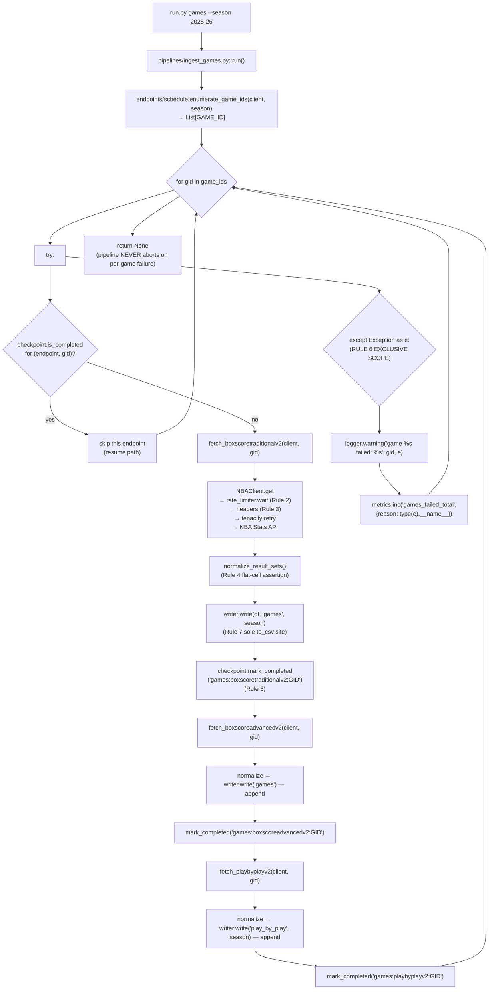

# Feature F-011 — Games Pipeline

## 1. Feature Summary

| Attribute | Value |
|---|---|
| **Feature ID** | F-011 |
| **Feature Name** | Games Pipeline |
| **Domain** | Games (per-game box scores and play-by-play event streams) |
| **Implementing files** | `pipelines/ingest_games.py`, `endpoints/games.py` |
| **Consumes (cross-pipeline)** | `endpoints/schedule.py::enumerate_game_ids(client, season) -> List[str]` — produced by F-013 Schedule per AAP §0.4.5 |
| **Destination CSV(s)** | `output/games.csv`, `output/play_by_play.csv` |
| **Operational rules enforced** | Rule 1, Rule 2, Rule 3, Rule 4, Rule 5, **Rule 6 (EXCLUSIVE SCOPE — this is the ONLY pipeline that applies Rule 6)**, Rule 7 |
| **Validation gates** | Gate 1 (end-to-end live smoke), **Gate 8 (live games smoke + zero 429s + resume determinism — UNIQUELY tied to this pipeline)**, Gate 9, Gate 13 |
| **Test files** | `tests/unit/pipelines/test_ingest_games.py`, `tests/unit/endpoints/test_games.py`, `tests/integration/test_gate8_games_resume.py` |
| **CLI subcommand** | `python run.py games --season <season>` (standalone) and `python run.py all --season <season>` (second in dispatch order, after `schedule`) |
| **Runtime cost** | ~1,230 games × 3 per-game endpoints × ≥ 1.0s rate-limit floor ≈ **at least 3,690 seconds (~62 minutes) of mandatory waits** per full regular season |

This is the MOST COMPLEX pipeline in the entire project and the ONLY pipeline that applies **Rule 6 fail-safe game iteration** (decisions D-012 and D-016 in [`../DECISIONS.md`](../DECISIONS.md)). It is also the ONLY pipeline with a mandatory cross-pipeline dependency — it consumes `enumerate_game_ids` from F-013 Schedule. See §3 "Cross-dependency: F-013 → F-011" and §6 "Why Rule 6 exists" for the two subsections that are unique to this document.

## 2. Purpose

The Games pipeline is the backbone of game-level analytics in the NBA Data Ingestion Pipeline. It iterates every `GAME_ID` for a season, fetches per-game box scores (traditional and advanced) plus the full play-by-play event stream, and emits two flat CSV artifacts:

- **`output/games.csv`** — player-level and team-level box scores per game (one row per player-game), joining `scoreboardv2`, `boxscoretraditionalv2`, and `boxscoreadvancedv2` responses into a single flat artifact keyed by `(GAME_ID, PLAYER_ID)`.
- **`output/play_by_play.csv`** — event-level narrative of every game (one row per game event), sourced from `playbyplayv2` and keyed by `(GAME_ID, EVENTNUM)`.

Together these artifacts are the analytics substrate for:

- **Game-story reports** — join `games.csv` to `schedule.csv` on `GAME_ID` to produce per-date narratives with box-score context.
- **Clutch-moment analysis** — filter `play_by_play.csv` by `PERIOD` and game-clock values to isolate late-game possessions and cross-reference with `boxscoreadvancedv2` efficiency metrics.
- **Event sequence modeling** — use `play_by_play.csv` rows ordered by `EVENTNUM` to train possession-level models, including expected-points-per-possession and transition-defense analyses.
- **Lineup-state attribution** — pair `play_by_play.csv` substitution events with `lineups.csv` (F-012) to reconstruct the on-court five for every moment of every game.

Because live game data is large (≈ 3,690 HTTP calls per season, ≈ 500,000 play-by-play rows) and occasionally malformed (the NBA Stats API intermittently emits incomplete rows for individual `GAME_IDs`), this pipeline is the ONLY one in the project that applies **Rule 6** fail-safe per-game iteration. See §6 "Why Rule 6 exists" for the full rationale.

## 3. Interface Contract

`pipelines/ingest_games.py` exposes the standard pipeline entry point shared by every domain pipeline:

```python
def run(
    client: NBAClient,
    writer: BaseWriter,
    checkpoint: CheckpointManager,
    season: str,
) -> None
```

**Parameters:** identical to every other pipeline (see [`./players.md`](./players.md) §3 for the full collaborator contract table). `client` is the singleton `NBAClient` from `api/nba_client.py` (Rule 1); `writer` is a `CSVWriter` instance from `storage/csv_writer.py` (Rule 7); `checkpoint` is a `CheckpointManager` from `utils/checkpoint.py` (Rule 5); `season` is the `YYYY-YY` season string (default `"2025-26"`).

**Side effects:**

- **Enumerates** `GAME_IDs` for the season via `endpoints/schedule.enumerate_game_ids(client, season) -> List[str]` at the top of `run()` — see "Cross-dependency: F-013 → F-011" subsection below.
- **Writes** `output/games.csv` by concatenating per-game box-score DataFrames (traditional + advanced) across all successfully-processed games, via `writer.write(df, "games", season)`.
- **Writes** `output/play_by_play.csv` by concatenating per-game play-by-play DataFrames, via `writer.write(df, "play_by_play", season)`.
- **Writes** one checkpoint key per `(endpoint, GAME_ID)` tuple to `output/checkpoint.json` (see §7).
- **On a per-`GAME_ID` failure**, logs a WARNING, increments the `games_failed_total` metric (labeled `reason`), and CONTINUES iteration (Rule 6).
- **Emits** structured log records at INFO on entry/exit and DEBUG for per-game timing. Every record carries the correlation ID from `utils/correlation.py`.

**Returns:** `None`. The pipeline NEVER raises out of the per-`GAME_ID` loop — this is the exact distinction from every other pipeline (Rule 6, exclusive scope).

**Idempotency:** if a checkpoint key is already present for a given `(endpoint, GAME_ID)` tuple, the pipeline skips that work unit without issuing an HTTP request. A resumed run picks up exactly where the prior run stopped, making Gate 8 resume-determinism achievable.

### Cross-dependency: F-013 → F-011

The Games pipeline has the ONLY mandatory cross-pipeline dependency in the project. It depends on F-013 Schedule for `GAME_ID` enumeration (AAP §0.4.5). The contract has four explicit clauses:

1. **Inside `pipelines/ingest_games.py::run()`**, the FIRST action after INFO-level entry logging is a call to `endpoints/schedule.enumerate_game_ids(client, season) -> List[str]`. This helper issues a single `leaguegamefinder` HTTP request, normalizes the response, and returns a deduplicated, sorted list of `GAME_IDs` for the season. The Games pipeline then iterates this list in order.

2. **The `run.py all` subcommand** dispatches pipelines in dependency order: `schedule → games → teams → players → lineups` (decision **D-008** in [`../DECISIONS.md`](../DECISIONS.md)). Schedule-first ensures `schedule.csv` is materialized before Games begins, which provides operator-visible progress and a fallback analytics anchor in case the Games pipeline is interrupted.

3. **Standalone `python run.py games --season <season>`** works without a prior `schedule` invocation. When Games is invoked alone, `ingest_games::run()` calls `enumerate_game_ids` directly against the live NBA Stats API — there is NO precondition on `schedule.csv` existing for a standalone Games run. The operator experience is: "I want games for 2024-25" → `python run.py games --season 2024-25` → it works, regardless of whether Schedule has ever been produced for that season.

4. **No cross-pipeline file coupling exists.** The dependency is expressed PURELY through the shared `enumerate_game_ids` function call — Games never reads `schedule.csv` from disk, and Schedule never reads any Games artifact. This preserves the module boundary, keeps each pipeline a pure CLI citizen, and means that Gate 13 (CLI subcommand invokes pipeline) is satisfied independently for both `schedule` and `games` subcommands.

See [`./schedule.md`](./schedule.md) §"Cross-dependency: F-013 → F-011" for the producer side of this contract.

## 4. Endpoints Called

| Endpoint | Scope | Invocation Frequency | Catalog Reference |
|---|---|---|---|
| `scoreboardv2` | Daily scoreboard for game-of-day verification and optional enumeration supplementation (some implementations use it to sanity-check `enumerate_game_ids` against the date-level view) | Per date (optional) | [../api/endpoints_catalog.md#scoreboardv2](../api/endpoints_catalog.md#scoreboardv2) |
| `boxscoretraditionalv2` | Per-game traditional box score (per-player and per-team rows: PTS, REB, AST, STL, BLK, FGM/FGA, 3PM/3PA, FTM/FTA, TOV, PF, PLUS_MINUS) | Once per `GAME_ID` | [../api/endpoints_catalog.md#boxscoretraditionalv2](../api/endpoints_catalog.md#boxscoretraditionalv2) |
| `boxscoreadvancedv2` | Per-game advanced box score (TS%, USG%, ORtg, DRtg, PACE, NetRtg, AST%, TOV%, OREB%, DREB%, REB%) | Once per `GAME_ID` | [../api/endpoints_catalog.md#boxscoreadvancedv2](../api/endpoints_catalog.md#boxscoreadvancedv2) |
| `playbyplayv2` | Per-game event stream (every possession, shot, foul, rebound, timeout, substitution; carries `EVENTNUM`, `EVENTMSGTYPE`, `PERIOD`, game-clock fields, and free-form description columns) | Once per `GAME_ID` | [../api/endpoints_catalog.md#playbyplayv2](../api/endpoints_catalog.md#playbyplayv2) |

Plus **indirect consumption** of `endpoints/schedule.py::enumerate_game_ids` which calls `leaguegamefinder` once per season to build the `GAME_IDs` iteration set. See §3 "Cross-dependency: F-013 → F-011" above.

Thin wrapper functions live in `endpoints/games.py`:

- `fetch_scoreboardv2(client, game_date, **kwargs)`
- `fetch_boxscoretraditionalv2(client, game_id, **kwargs)`
- `fetch_boxscoreadvancedv2(client, game_id, **kwargs)`
- `fetch_playbyplayv2(client, game_id, **kwargs)`

Each wrapper constructs the `params` dict and delegates to `client.get(endpoint, params)`. No wrapper contains any HTTP logic (Rule 1), any normalization (deferred to `utils/schema_normalizer`), or any I/O (deferred to `storage/csv_writer`). Parameter names MUST be sourced from [`../api/endpoints_catalog.md`](../api/endpoints_catalog.md) — this document does not duplicate the parameter reference to avoid drift.

### Runtime budget

For a full NBA regular season of ~1,230 games × 3 per-game endpoints × ≥ 1.0s rate-limit floor ≈ **at least 3,690 seconds (~62 minutes) of mandatory waits** before factoring in per-request latency, retry backoff, or normalization/write overhead. This is the single-largest driver of pipeline wall-clock time in the entire project and is accepted per AAP §0.6.2.3 (no parallelism is introduced in this phase). Operators planning a first Gate 8 run should expect ~60–90 minutes wall-clock time for a complete regular-season ingestion, and should use the checkpoint mechanism aggressively to amortize this cost across multiple invocations.

## 5. Data Flow



The `try/except` block wraps the entire per-game work unit (all three endpoints plus normalization and writes for that `GAME_ID`). A failure on one `GAME_ID` does not affect iteration over any other `GAME_ID`. This is the structural manifestation of **Rule 6** and is verified by `tests/unit/pipelines/test_ingest_games.py`.

## 6. Operational Rules

| Rule | Scope | Enforcement Site | Notes |
|---|---|---|---|
| Rule 1 — Single HTTP client | Transitive | `api/nba_client.py` | No `requests.*` import appears in `endpoints/games.py` or `pipelines/ingest_games.py`; verified by `tests/invariants/test_rule1_sole_http_client.py` |
| Rule 2 — ≥ 1.0s inter-request floor | Transitive | `utils/rate_limiter.wait()` invoked inside `NBAClient.get` | CRITICAL for Gate 8 zero-429 clause; at ~3,690 calls per full season, even a brief rate-limit misstep compounds quickly into upstream throttling |
| Rule 3 — Required headers | Transitive | `requests.Session.headers` populated from `config.REQUIRED_HEADERS` (`Referer`, `User-Agent`) at session construction | Games inherits the session-level headers like every other endpoint |
| Rule 4 — Flat CSV | Direct | `utils/schema_normalizer.normalize_result_sets()` asserts no cell is `dict` or `list` before returning | Especially important for `playbyplayv2`, which can carry per-event nested coordinate structures upstream for shot-location data; these MUST be flattened or dropped by the normalizer |
| Rule 5 — Checkpoint after every pull | Direct | `pipelines/ingest_games.py` calls `checkpoint.mark_completed` after EVERY successful per-endpoint per-game write | A resumed run continues exactly where the prior run stopped — this is what makes Gate 8 resume-determinism achievable |
| **Rule 6 — Fail-safe game iteration** | **EXCLUSIVE to this pipeline** | `pipelines/ingest_games.py` per-game `try/except Exception` | See "Why Rule 6 exists" subsection below; authoritative rationale in decision log entry **D-012** and scope boundary in **D-016** in [`../DECISIONS.md`](../DECISIONS.md) |
| Rule 7 — Pluggable storage | Direct | Pipeline calls `writer.write(df, name, season)` — never `df.to_csv(...)` directly | `grep "\.to_csv(" pipelines/ingest_games.py` returns zero matches; verified by `tests/invariants/test_rule7_basewriter_only.py` |

### Why Rule 6 exists

Rule 6 is the most consequential operational constraint on this pipeline, and its exclusive-to-Games scope is the most important architectural decision documented in this file. Rule 6 applies to `pipelines/ingest_games.py` ONLY (decisions **D-012** and **D-016** in [`../DECISIONS.md`](../DECISIONS.md)). The five reasons for this design are:

1. **Live-game data quality is uneven.** The NBA Stats API is a public, unauthenticated service designed primarily for the consumer-facing `stats.nba.com` website rather than machine ingestion. In practice, some `GAME_IDs` returned by `leaguegamefinder` produce malformed or incomplete responses when queried from the per-game endpoints — for example, `playbyplayv2` occasionally returns a response with missing `EVENTNUM` values, and `boxscoreadvancedv2` may omit a player row mid-response. These upstream glitches are recoverable only by the upstream API fixing its own data, not by anything this pipeline can do. The only rational local response is "log, skip, move on" — which is exactly Rule 6.

2. **Aborting on one bad game would waste prior API progress.** A full NBA season requires roughly 1,230 games × 3 per-game endpoints ≈ 3,690 HTTP calls at the ≥ 1.0s rate-limit floor, for at least 62 minutes of mandatory-wait wall-clock time (see §4 "Runtime budget"). Discarding an in-flight run because of one malformed `GAME_ID` would cost dozens of minutes of completed pulls, all of which would have to be re-fetched on the next invocation. With checkpoint-per-pull (Rule 5) already guaranteeing that completed work is not re-fetched, the fail-safe-loop choice is essentially free upside.

3. **The fail-safe loop preserves checkpoint progress.** Every successful per-game per-endpoint pull writes a checkpoint key immediately (Rule 5). A Rule 6 catch ensures the loop advances past a bad game WITHOUT rolling back any prior checkpoint. A subsequent invocation of `python run.py games --season <season>` retries only the unchecked keys — including the previously-failed game, in case the upstream condition has since resolved (which is the common outcome). This is the exact mechanism that Gate 8's resume-determinism property exercises.

4. **Trade-off explicitly accepted: "slightly incomplete but re-runnable".** `games.csv` and `play_by_play.csv` may be slightly incomplete after a single run if some `GAME_IDs` failed across all retries and then failed again under Rule 6. BUT the pipeline completes, emits artifacts, and is fully re-runnable — the next invocation retries only the failed games. This is explicitly preferable to the "fail fast, nothing at all" alternative and is consistent with the product-brief success criterion (`docs/New_Product_Prompt_20260418.md` §"Games"): "failed game IDs are logged and skipped (not fatal)". An operator can compare `output/checkpoint.json`'s games-scoped key count against the `enumerate_game_ids` output to detect gaps, and can re-run the pipeline to close them.

5. **Exclusive scope to this pipeline.** No other pipeline catches `Exception` at the orchestration level. Players (F-009), Teams (F-010), Lineups (F-012), and Schedule (F-013) all propagate exceptions upward because their failure units are atomic — one endpoint call produces one table, and a failure there is either a code bug, an upstream schema change, or an environmental problem, each of which deserves immediate operator attention. Only Games has a unit-of-failure granularity (per `GAME_ID`) that makes a fail-safe loop meaningful. A grep of `pipelines/` for `except Exception` MUST match exactly one file: `ingest_games.py`. This is the scope boundary enshrined in decision **D-016** in [`../DECISIONS.md`](../DECISIONS.md).

The Rule 6 pattern in code is exactly:

```python
for gid in game_ids:
    try:
        # fetch traditional, advanced, play-by-play
        # normalize each response
        # write to games.csv / play_by_play.csv
        # mark_completed after each successful write
        ...
    except Exception as e:
        logger.warning("game %s failed: %s", gid, e)
        metrics.inc("games_failed_total", {"reason": type(e).__name__})
        continue  # CRITICAL: iteration continues past the failed GAME_ID
```

This pattern is documented as decision **D-012** in [`../DECISIONS.md`](../DECISIONS.md) and as the sixth operational rule in [`../New_Product_Prompt_20260418.md`](../New_Product_Prompt_20260418.md). Verification: `tests/unit/pipelines/test_ingest_games.py` injects a failure on ONE mocked `GAME_ID` and asserts that (a) the pipeline completes for every other `GAME_ID`, (b) the failure was logged at WARNING, (c) `games_failed_total` was incremented with the `reason` label set to the exception type name, and (d) no checkpoint key was written for the failed game (so it will be retried on the next invocation).


## 7. Checkpoint Key Schema

The Games pipeline writes the largest number of checkpoint keys of any pipeline in the system — up to `3 × |GAME_IDs|` keys per full NBA regular season, which is approximately **3,690 keys per season** before counting the one-off enumeration checkpoint. This is a direct consequence of Rule 5 (checkpoint after every successful pull) combined with the three per-game endpoints (`boxscoretraditionalv2`, `boxscoreadvancedv2`, `playbyplayv2`).

| Endpoint | Checkpoint Key Format | Granularity | Approximate Count (Full Season) |
|---|---|---|---|
| Schedule enumeration (indirect) | `games:enumerate_game_ids:<season>` | One key per season | 1 |
| `boxscoretraditionalv2` | `games:boxscoretraditionalv2:<GAME_ID>` | One key per game | ~1,230 |
| `boxscoreadvancedv2` | `games:boxscoreadvancedv2:<GAME_ID>` | One key per game | ~1,230 |
| `playbyplayv2` | `games:playbyplayv2:<GAME_ID>` | One key per game | ~1,230 |
| `scoreboardv2` (optional supplement) | `games:scoreboardv2:<YYYY-MM-DD>` | One key per game-date, if the implementation supplements enumeration with per-date scoreboard pulls | ~180 (one per NBA calendar date) |

`output/checkpoint.json` carries thousands of keys after a full run. Operators tracking progress can inspect the manifest directly:

```bash
# Total completed keys across all pipelines
jq '.completed | length' output/checkpoint.json

# Games-specific progress
jq '.completed | map(select(startswith("games:"))) | length' output/checkpoint.json

# Count of games completed for each per-game endpoint
jq '.completed | map(select(startswith("games:boxscoretraditionalv2:"))) | length' output/checkpoint.json
jq '.completed | map(select(startswith("games:boxscoreadvancedv2:"))) | length' output/checkpoint.json
jq '.completed | map(select(startswith("games:playbyplayv2:"))) | length' output/checkpoint.json

# Identify GAME_IDs that failed under Rule 6 (present in enumeration, absent from per-endpoint keys)
comm -23 \
  <(jq -r '.completed | map(select(startswith("games:boxscoretraditionalv2:"))) | map(sub("games:boxscoretraditionalv2:"; "")) | sort[]' output/checkpoint.json) \
  <(jq -r '.completed | map(select(startswith("games:playbyplayv2:"))) | map(sub("games:playbyplayv2:"; "")) | sort[]' output/checkpoint.json)
```

**Resuming an aborted or partial run:** simply re-invoke `python run.py games --season <season>`. The pipeline reads `output/checkpoint.json`, asks `CheckpointManager.is_completed(key)` before each per-endpoint per-game pull, and skips every `(GAME_ID, endpoint)` pair already present. Games that failed under **Rule 6** during the previous run are NOT checkpointed (their keys are absent), so they are retried automatically on the next invocation. This is the resume-determinism property that Gate 8 verifies.

## 8. Output Artifacts

The Games pipeline emits TWO CSV artifacts to `output/`. Both are plain UTF-8 with a header row on the first line, written by `storage/csv_writer.CSVWriter.write()` (Rule 7 — no other code path writes these files).

### `output/games.csv`

- **Content:** player-level box scores per game, combining traditional stats (points, rebounds, assists, minutes, shooting splits) from `boxscoretraditionalv2` and advanced stats (TS%, USG%, ORtg, DRtg, PIE) from `boxscoreadvancedv2`.
- **Approximate row count (full season):** 1,230 games × ~25 player rows per game ≈ **~30,000 rows**. Depending on implementation choice, traditional and advanced may be persisted as separate tagged sections appended to this file, or joined into a single wide row per `(GAME_ID, PLAYER_ID)`.
- **Primary key:** `(GAME_ID, PLAYER_ID)`.
- **Joinability:**
  - Joins to `output/schedule.csv` on `GAME_ID` for game-level metadata (date, home/away teams, season type).
  - Joins to `output/players.csv` on `PLAYER_ID` for player-level season stats and biographical data.
  - Joins to `output/teams.csv` on `TEAM_ID` for team-level season stats.
  - Joins to `output/play_by_play.csv` on `GAME_ID` for event-level narrative tied to the same game.
- **Cell constraint:** every cell is a scalar (string, int, float, or null) — NO `dict` or `list` cells (Rule 4, verified by `tests/invariants/test_rule4_no_nested_cells.py`).

### `output/play_by_play.csv`

- **Content:** event-level narrative stream for every game — every possession, shot, foul, timeout, substitution, and turnover, with period, clock, home/away score, the players involved, and the description string.
- **Approximate row count (full season):** 1,230 games × ~400–500 events per game ≈ **~500,000+ rows**. This is the **largest CSV produced by the pipeline by row count** and the single largest file in the entire `output/` directory.
- **Primary key:** `(GAME_ID, EVENTNUM)`.
- **Joinability:**
  - Joins to `output/games.csv` on `GAME_ID` for game-level context (final score, player aggregates).
  - Joins to `output/schedule.csv` on `GAME_ID` for date and teams context.
- **Cell constraint:** every cell is a scalar (Rule 4). The upstream `resultSets` envelope for `playbyplayv2` can include coordinate arrays for shot events (e.g., `LOCATION_X`, `LOCATION_Y`, or a nested shot-chart structure) that MUST be flattened into separate columns or dropped entirely by `utils/schema_normalizer.normalize_result_sets()` before the write. This is the highest-risk Rule 4 site in the entire project because the event structure is the richest and most polymorphic upstream payload.

Both `games.csv` and `play_by_play.csv` are overwritten per season per invocation on success; there is no incremental append semantics across seasons. Operators intending to preserve historical seasons should copy or rename the files between runs, or run the pipeline into different working directories per season.

## 9. Validation Gate Participation

The Games pipeline participates in four validation gates and is the pipeline most directly tied to the live-API acceptance criteria.

| Gate | How This Pipeline Satisfies It | Verification Command |
|---|---|---|
| **Gate 1** — End-to-end live smoke | `python run.py all --season 2025-26` produces non-empty `games.csv` AND non-empty `play_by_play.csv` alongside every other domain CSV | `python -m pytest tests/integration/test_gate1_all_live.py -v` |
| **Gate 8** — Live games smoke + zero 429s + resume determinism | `python run.py games --season 2025-26` produces `games.csv` with `rowcount > 0` and encounters ZERO HTTP 429 responses throughout the full run (Rule 2's ≥ 1.0s floor is sufficient); an interrupted run resumed via the same command produces bit-for-bit deterministic output relative to an uninterrupted run | `python -m pytest tests/integration/test_gate8_games_resume.py -v` |
| **Gate 9** — Endpoint wrappers reachable from pipeline | `endpoints/games.py` wrapper functions (`fetch_scoreboardv2`, `fetch_boxscoretraditionalv2`, `fetch_boxscoreadvancedv2`, `fetch_playbyplayv2`) are the sole callers of the four Games NBA Stats endpoints, and `pipelines/ingest_games.py` is the only caller of those wrappers (registration/invocation pairing) | Verified by static analysis and by `tests/unit/pipelines/test_ingest_games.py` which mocks the `endpoints/games` module |
| **Gate 13** — CLI subcommand invokes pipeline | `run.py games` dispatches to `pipelines.ingest_games.run(client, writer, checkpoint, season)`; `run.py all` includes `games` in its dispatch order per decision **D-008** (schedule → games → teams → players → lineups) | `python -m pytest tests/unit/test_cli.py::test_games_subcommand -v` |

**Gate 8 is UNIQUELY tied to this pipeline** because it is the only pipeline with enough per-run API-call volume (~3,690 calls) to meaningfully exercise rate-limit compliance against the live service. A successful Gate 8 run implicitly validates:

- **Rule 2** (≥ 1.0s inter-request floor) — zero 429s across ~3,690 calls proves the rate limiter is actually enforced on the critical path.
- **Rule 5** (checkpoint after every pull) — resume determinism is achievable only if every successful pull wrote a checkpoint key synchronously before the interrupt.
- **Rule 6** (fail-safe iteration) — any per-game failure during the live run is observed, logged, and counted without aborting the pipeline.

No other pipeline has comparable Gate 8 coverage. Players, Teams, Lineups, and Schedule are too small (a handful of calls each) to stress-test the rate limiter, and their atomic-failure granularity makes resume-determinism trivially satisfied rather than meaningfully exercised.


## 10. Error Handling

Error handling in the Games pipeline is a layered responsibility, with distinct behaviors at the HTTP transport layer (`api/nba_client.py` + `tenacity`), the normalizer layer (`utils/schema_normalizer.py`), and the orchestration layer (`pipelines/ingest_games.py` — the Rule 6 site). The table below enumerates every error class the pipeline can encounter and exactly where and how it is handled.

| Error Class | Where Caught | Outcome |
|---|---|---|
| Transient HTTP (429, 5xx, timeouts, connection errors) | `api/nba_client.py` via `tenacity.retry` | Retry with exponential backoff + jitter up to `config.RETRY_ATTEMPTS` (default 5) / `config.RETRY_MAX_WAIT` (default 60s); on exhaustion the exception bubbles out of `NBAClient.get` and into the Rule 6 `except` block in `ingest_games.py` |
| Permanent HTTP (non-429 4xx, e.g., 404 for a non-existent `GAME_ID`) | `tenacity` does NOT retry (non-retry-eligible by `retry_if_exception_type`); caught by the Rule 6 except block | Logged at WARNING with the failing `GAME_ID` and the exception repr; `metrics.inc("games_failed_total", {"reason": type(e).__name__})` — for a 4xx this is typically `HTTPError`; iteration continues to the next `GAME_ID` |
| Normalizer assertion failure (Rule 4 violation, e.g., `resultSets` payload contained a `dict` cell) | Raises `AssertionError` from `utils/schema_normalizer.normalize_result_sets()`; caught by the Rule 6 except block | Logged at WARNING; `games_failed_total{reason="AssertionError"}` incremented; iteration continues. This outcome signals an upstream schema change and an operator should inspect `logs/pipeline.log` and file a defect against `utils/schema_normalizer.py` (likely a new nested field that needs a flattening rule) |
| Malformed JSON (`requests.Response.json()` raises) | Caught by the Rule 6 except block (`json.JSONDecodeError` is a subclass of `Exception`) | Logged at WARNING; `games_failed_total{reason="JSONDecodeError"}` incremented; iteration continues |
| Missing expected column in the response (e.g., `KeyError` during per-event normalization) | Caught by the Rule 6 except block | Logged at WARNING; `games_failed_total{reason="KeyError"}` incremented; iteration continues |
| Writer I/O error (disk full, permission denied, path not writable) | **NOT caught by Rule 6** — propagates as fatal | These are environmental failures, not per-game failures, and retrying other games without fixing the environment is pointless. The pipeline aborts, preserving whatever checkpoint state was successfully written before the disk failure |
| Checkpoint I/O error (write to `output/checkpoint.json` fails) | **NOT caught by Rule 6** — propagates as fatal | Rule 5 integrity requires that a successful pull is never silently un-checkpointed. If the manifest cannot be persisted, the run must abort rather than leave `output/games.csv` in a state that cannot be resumed |
| Configuration error (e.g., `config.RATE_LIMIT_SECONDS` missing or non-numeric) | **NOT caught by Rule 6** — raised at pipeline startup before the per-game loop begins | Pipeline aborts immediately; operator fixes `config.py` and re-runs |
| `KeyboardInterrupt` / `SystemExit` | **NOT caught** (Rule 6 catches `Exception`, NOT `BaseException`) | Propagates immediately, allowing operator-initiated abort via Ctrl-C; the checkpoint manifest preserves all prior-successful per-game keys so a subsequent invocation resumes cleanly |

**Why `except Exception` and not `except BaseException`.** The bare `except Exception` form is the exactly-specified Rule 6 pattern and is NOT a casual shortcut. It is carefully chosen to catch every runtime error class (`HTTPError`, `KeyError`, `AssertionError`, `JSONDecodeError`, arbitrary upstream-library exceptions) while explicitly NOT swallowing `KeyboardInterrupt` and `SystemExit`, both of which inherit from `BaseException` but NOT from `Exception` in Python 3. This gives operators a clean Ctrl-C path at any point during a multi-hour run. The choice is recorded in decision **D-016** in [`../DECISIONS.md`](../DECISIONS.md).

**Logged correlation.** Every WARNING emitted from the Rule 6 except block carries the run's correlation ID (injected by `utils/logger.py` via `utils/correlation.py`), so an operator grepping `logs/pipeline.log` for a correlation ID can reconstruct the full narrative of a partial run — which games were attempted, which succeeded, and which were skipped under Rule 6 — with all other log records interleaved.

## 11. Testing Strategy

The Games pipeline has the most extensive test coverage of any pipeline in the project, reflecting its unique complexity (Rule 6, cross-dependency on F-013, Gate 8 anchor role). Tests are split into unit, integration, and invariant tiers as follows.

### Unit tests

- **`tests/unit/pipelines/test_ingest_games.py`** — the most detailed pipeline test in the project. Exercises `pipelines.ingest_games.run()` with:
  - Mocked `NBAClient` (whose `get` method returns pre-recorded `resultSets` fixtures).
  - Mocked `CSVWriter` (an in-memory `BaseWriter` subclass that collects written DataFrames).
  - Mocked `CheckpointManager` (backed by a dict rather than a file).
  - Mocked `endpoints.schedule.enumerate_game_ids` returning a short fixture list such as `["0022500001", "0022500002", "0022500003"]`.
  - **Rule 6 failure-injection scenario:** `mock.side_effect` configured to raise `RuntimeError("simulated upstream glitch")` on exactly the second `GAME_ID`'s `boxscoretraditionalv2` call. Assertions:
    - The pipeline completes without raising — `run()` returns `None`.
    - The pipeline completed for `0022500001` and `0022500003` — their checkpoint keys are all present in the manager.
    - A WARNING log record was emitted containing the substring `"0022500002"` and the substring `"simulated upstream glitch"`.
    - The `games_failed_total` counter in `utils/metrics` was incremented exactly once, with label `reason="RuntimeError"`.
    - **No checkpoint key** was written for the failed `GAME_ID` `0022500002` — neither `games:boxscoretraditionalv2:0022500002` nor `games:boxscoreadvancedv2:0022500002` nor `games:playbyplayv2:0022500002` appears in the manager. This ensures the failed game will be retried on the next invocation.
  - **Normal-path scenario:** no failures injected. Assertions:
    - `mark_completed` is called for every `(GAME_ID, endpoint)` pair.
    - `writer.write` is called for every successful pull.
    - The writer received DataFrames tagged `"games"` and `"play_by_play"` the expected number of times.
    - `enumerate_game_ids` was called **exactly once** per `run()` invocation — the pipeline does NOT re-enumerate mid-run.
  - **Idempotency scenario:** `CheckpointManager.is_completed` pre-configured to return `True` for `0022500001`'s keys. Assertions:
    - The mock `NBAClient.get` is never called for any of `0022500001`'s three per-game endpoints.
    - The pipeline proceeds to process `0022500002` and `0022500003` normally.

- **`tests/unit/endpoints/test_games.py`** — asserts each wrapper function (`fetch_scoreboardv2`, `fetch_boxscoretraditionalv2`, `fetch_boxscoreadvancedv2`, `fetch_playbyplayv2`) calls `NBAClient.get(endpoint, params)` with the correct endpoint string and the correct params dict. Parameter expectations include `GameID` for the box-score and play-by-play wrappers and `GameDate` for `scoreboardv2`. Assertions use `mock.call_args_list`.

### Integration tests

- **`tests/integration/test_gate8_games_resume.py`** — the MOST CRITICAL integration test in the entire project. Marked `@pytest.mark.integration` and therefore skipped under `pytest -m "not integration"`. Two phases:
  1. **Phase A (interrupt):** invoke the Games pipeline for a small predetermined `GAME_ID` subset (e.g., 5 known game IDs from a prior season verified by the test fixture), deliberately abort after the second `GAME_ID` completes all three endpoints, and assert that `output/checkpoint.json` contains exactly `2 × 3 = 6` games-scoped checkpoint keys.
  2. **Phase B (resume):** re-invoke the same pipeline against the same 5-game subset. Assert that:
     - The remaining `3 × 3 = 9` keys are added, bringing the total to 15.
     - The previously-completed 6 keys are NOT re-fetched — verified by wrapping `NBAClient.get` in a spy and asserting its call count for Phase B is exactly 9 (not 15).
     - The final `games.csv` and `play_by_play.csv` contents are bit-for-bit deterministic relative to a single uninterrupted run performed separately in a control directory.
  - **Zero-429 assertion:** throughout both phases, the test inspects `tenacity`'s internal retry counter (or equivalently the `utils/metrics` `nba_retries_total` counter with a 429 label) and asserts it remained zero. This is the Rule 2 verification clause of Gate 8.
  - This is the `test_gate8_games_resume` test referenced throughout this document and in the decision log; it is the single most authoritative live-API test in the repository.

- **`tests/integration/test_gate1_all_live.py`** — the end-to-end Gate 1 smoke test. Invokes `python run.py all --season <season>` (via the `click.testing.CliRunner`) and asserts both `output/games.csv` and `output/play_by_play.csv` are created and non-empty. Marked `@pytest.mark.integration`.

### Invariant tests

- **`tests/invariants/test_rule1_sole_http_client.py`** — a grep-based invariant test that asserts `pipelines/ingest_games.py` and `endpoints/games.py` contain zero matches for `requests.get`, `requests.post`, or `requests.Session`. Enforces **Rule 1** for the Games code path.
- **`tests/invariants/test_rule4_no_nested_cells.py`** — runs `df.applymap(lambda x: isinstance(x, (dict, list))).any().any()` against normalized Games DataFrames built from representative `resultSets` fixtures and asserts the result is `False`. Enforces **Rule 4** for games and especially for play-by-play, where coordinate arrays are the highest-risk input.
- **`tests/invariants/test_rule7_basewriter_only.py`** — grep-based invariant test that asserts `pipelines/ingest_games.py` contains zero matches for `.to_csv(`. Enforces **Rule 7** for the Games code path.

### Run the Games-scoped slice

Unit tests plus invariants, skipping all live-API tests (safe to run offline with no external dependency):

```bash
python -m pytest \
  tests/unit/pipelines/test_ingest_games.py \
  tests/unit/endpoints/test_games.py \
  tests/invariants/ \
  -m "not integration" -v
```

Gate 8 live run (requires internet, respects the ≥ 1.0s rate-limit floor, takes several minutes even on a small subset):

```bash
python -m pytest tests/integration/test_gate8_games_resume.py -v
```

Gate 1 live run (full end-to-end, takes ~62+ minutes for a full season):

```bash
python -m pytest tests/integration/test_gate1_all_live.py -v
```

## 12. Cross-References

- [`../TRACEABILITY.md`](../TRACEABILITY.md) — the F-011 row in the feature matrix lists all implementing and verifying files for this pipeline; the Rule 6 row maps uniquely to `pipelines/ingest_games.py`; the Gate 8 row maps to `tests/integration/test_gate8_games_resume.py`.
- [`../DECISIONS.md`](../DECISIONS.md) — authoritative rationale for this pipeline's non-obvious design choices. Relevant entries:
  - **D-008** — "Dispatch the `all` subcommand in the order schedule → games → teams → players → lineups" (sequencing rationale).
  - **D-012** — "Catch `Exception` only inside `pipelines/ingest_games.py`" (Rule 6 scope rationale).
  - **D-016** — "Apply Rule 6 fail-safe iteration only to the Games pipeline" (Exception vs BaseException distinction and exclusive-scope rationale).
- [`../OBSERVABILITY.md`](../OBSERVABILITY.md) — specifications for the `games_failed_total` counter (including the `reason` label), the WARNING log record shape for Rule 6 skips, and correlation-ID propagation across the per-game iteration loop.
- [`../api/endpoints_catalog.md`](../api/endpoints_catalog.md) — authoritative parameter reference for the four Games endpoints (`scoreboardv2`, `boxscoretraditionalv2`, `boxscoreadvancedv2`, `playbyplayv2`) and for the `leaguegamefinder` endpoint consumed indirectly via `endpoints/schedule.py::enumerate_game_ids`.
- [`../ONBOARDING.md`](../ONBOARDING.md) — common pitfalls around interrupted Games runs, checkpoint inspection via `jq`, rate-limit misconfiguration, and play-by-play coordinate-flattening debugging.
- [`./schedule.md`](./schedule.md) — **F-013 Schedule** — the PRODUCER side of the cross-dependency. Read this document to understand where the `GAME_ID` list originates and how `enumerate_game_ids` is implemented on the Schedule side.
- [`./players.md`](./players.md) — peer feature deep dive for F-009 Players.
- [`./teams.md`](./teams.md) — peer feature deep dive for F-010 Teams.
- [`./lineups.md`](./lineups.md) — peer feature deep dive for F-012 Lineups.

