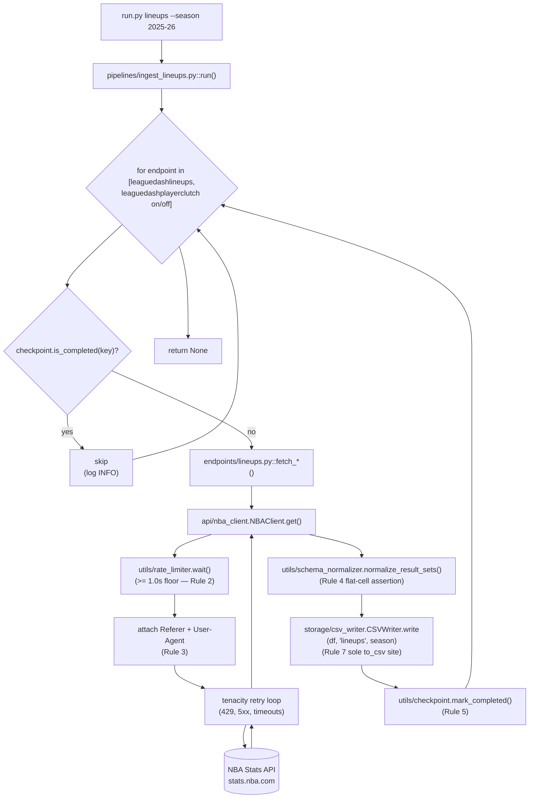

# Feature F-012 — Lineups Pipeline

## 1. Feature Summary

| Attribute | Value |
|---|---|
| **Feature ID** | F-012 |
| **Feature Name** | Lineups Pipeline |
| **Domain** | Lineups (five-man on-court unit statistics and on/off-court impact splits) |
| **Implementing files** | `pipelines/ingest_lineups.py`, `endpoints/lineups.py` |
| **Destination CSV(s)** | `output/lineups.csv` |
| **Operational rules enforced** | Rule 1, Rule 2, Rule 3, Rule 4, Rule 5, Rule 7 |
| **Operational rules NOT applicable** | Rule 6 (fail-safe iteration scoped to Games only — see [`./games.md`](./games.md) §6 and D-012 in [`../DECISIONS.md`](../DECISIONS.md)) |
| **Validation gates** | Gate 1, Gate 9, Gate 13 |
| **Test files** | `tests/unit/pipelines/test_ingest_lineups.py`, `tests/unit/endpoints/test_lineups.py` |
| **CLI subcommand** | `python run.py lineups --season <season>` (standalone) and `python run.py all --season <season>` (LAST in the dispatch order `schedule → games → teams → players → lineups`, per D-008 in [`../DECISIONS.md`](../DECISIONS.md)) |
| **Runtime cost** | 2 HTTP requests × ≥ 1.0s rate-limit floor ≈ **~2 seconds of mandatory waits** per invocation — the shortest of the five domain pipelines |

This is the SMALLEST domain pipeline by endpoint count (2 endpoints) but it carries a subtle disambiguation responsibility: the `leaguedashplayerclutch` endpoint is invoked by BOTH this pipeline (F-012, with the on/off-court measure variant) AND the Players pipeline (F-009, with the clutch-time splits variant). Sections 4 and 7 address that disambiguation explicitly so that a reader encountering the endpoint for the second time does not assume it is duplicated work. Because its short runtime also means low blast radius on failure, Lineups is the LAST pipeline invoked by `run.py all` — its failure cannot block any upstream artifact.

## 2. Purpose

The Lineups pipeline produces five-man on-court lineup statistics for every unique player grouping observed in a season, along with on/off-court impact splits that complement the Players-pipeline clutch views. It is the analytics substrate for:

- **Lineup-level plus/minus analysis** — per-unit offensive and defensive ratings computed over every combination of five players who logged minutes together during the season.
- **Rotation optimization** — pairing `lineups.csv` with `games.csv` (F-011) to identify which five-man units outperformed expectation in specific game contexts (e.g., home vs. away, clutch periods, quarters).
- **Coaching-decision evaluation** — combining on/off-court splits from this pipeline with the clutch-time splits from F-009 Players to measure individual impact independent of lineup context.
- **Event attribution** — joining `lineups.csv` with `play_by_play.csv` (F-011) on `GAME_ID` and substitution events to reconstruct which of the ~5,000–15,000 seasonal five-man units was on the court for every moment of every game.

One CSV artifact is produced: `lineups.csv`, joining `leaguedashlineups` aggregates with the `leaguedashplayerclutch` on/off variant. The single-CSV design follows D-009 (per-domain dedicated pipelines with one primary artifact per pipeline where possible) and keeps the cross-join pattern between the two endpoints inside the pipeline, not downstream analytics code. See Section 8 for the exact output shape and primary key.

In operator terms: `lineups.csv` answers the question "who was out there together, and what happened while they were on the court?" — and because its runtime cost is ~2 seconds of mandatory waits plus normalization and one CSV write, it is a convenient end-to-end smoke-test target during development.

## 3. Interface Contract

`pipelines/ingest_lineups.py` exposes the standard pipeline entry point shared by every domain pipeline:

```python
def run(
    client: NBAClient,
    writer: BaseWriter,
    checkpoint: CheckpointManager,
    season: str,
) -> None
```

**Parameters:** identical to every other pipeline (see [`./players.md`](./players.md) §3 for the full collaborator contract table). `client` is the singleton `NBAClient` from `api/nba_client.py` (Rule 1); `writer` is a `CSVWriter` instance from `storage/csv_writer.py` (Rule 7); `checkpoint` is a `CheckpointManager` from `utils/checkpoint.py` (Rule 5); `season` is the `YYYY-YY` season string (default `"2025-26"`).

**Side effects:**

- Writes `output/lineups.csv` after merging or sequentially appending the normalized responses from `leaguedashlineups` and the on/off-splits variant of `leaguedashplayerclutch`, via `writer.write(df, "lineups", season)` (Rule 7).
- Writes up to two checkpoint keys to `output/checkpoint.json` (see Section 7) — one per endpoint, each written synchronously after its successful CSV write (Rule 5).
- Emits structured log records at INFO on entry/exit and DEBUG for per-endpoint timing. Every record carries the correlation ID from `utils/correlation.py` so the entire per-run workflow is greppable in the log file.

**Returns:** `None`. Failures propagate; no exception suppression (Rule 6 does not apply to Lineups — see Section 6).

**Idempotency:** if either checkpoint key is already present, the pipeline short-circuits that endpoint after logging a single INFO line and does not issue the corresponding HTTP request. The two endpoints are independently resumable: an invocation that succeeds on `leaguedashlineups` but fails on the clutch on/off variant will, on retry, skip `leaguedashlineups` and retry only the failed endpoint.

## 4. Endpoints Called

| Endpoint | Scope | Invocation Frequency | Catalog Reference |
|---|---|---|---|
| `leaguedashlineups` | Per-lineup (five-man unit) season-level aggregate statistics | Once per season | [`../api/endpoints_catalog.md#leaguedashlineups`](../api/endpoints_catalog.md#leaguedashlineups) |
| `leaguedashplayerclutch` (on/off splits variant) | Per-player on-court / off-court impact splits | Once per season | [`../api/endpoints_catalog.md#leaguedashplayerclutch`](../api/endpoints_catalog.md#leaguedashplayerclutch) |

Thin wrapper functions live in `endpoints/lineups.py`. The conventional shape is:

- `fetch_leaguedashlineups(client, season, **kwargs)` — constructs the `params` dict and delegates to `client.get("leaguedashlineups", params)`.
- `fetch_leaguedashplayerclutch_onoff(client, season, **kwargs)` — constructs the `params` dict with the on/off-splits `MeasureType` variant and delegates to `client.get("leaguedashplayerclutch", params)`. The function name embeds `_onoff` explicitly to disambiguate from the F-009 Players-pipeline usage of the same endpoint.

Each wrapper accepts `(client, season, **kwargs)`, constructs the `params` dict, and delegates to `client.get(endpoint, params)`. No wrapper contains any HTTP logic (Rule 1), no normalization (deferred to `utils/schema_normalizer`), and no I/O (deferred to `storage/csv_writer`). Parameter names MUST be sourced from [`../api/endpoints_catalog.md`](../api/endpoints_catalog.md) — this document does not duplicate the parameter reference to avoid drift. In particular, the exact `MeasureType` string that selects the on/off-splits variant is defined in the catalog, not here.

### Note on endpoint reuse — `leaguedashplayerclutch`

`leaguedashplayerclutch` is invoked from BOTH the Players pipeline (F-009) and the Lineups pipeline (F-012):

- **In F-009 Players**, it is used for **clutch-time per-player splits** — i.e., aggregated player statistics filtered to "clutch" game situations (typically the last N minutes of close games, as parameterized by the endpoint).
- **In F-012 Lineups**, it is used with the **on/off-court measure type** to derive lineup-context impact — i.e., differential player statistics attributable to the player's on-court vs. off-court periods, used to quantify lineup dependence.

The two invocations differ by **request parameters, not by endpoint**. Because parameters drive the response shape, the two normalized DataFrames are distinct and the pipelines write to different CSVs (`players.csv` for F-009, `lineups.csv` for F-012). Each pipeline also writes its own distinctly-namespaced checkpoint key (see Section 7), so the calls are independently resumable and will not collide in `output/checkpoint.json`.

This is NOT a case of duplicated work. It is a deliberate use of a single upstream endpoint for two distinct analytics questions, consistent with the "Immutable upstream interface" constraint in AAP §0.1.2: the pipeline does not abstract or proxy the NBA Stats API, so the same endpoint name appearing in two pipelines is expected whenever two pipelines need two different parameter slices of the same upstream resource. See [`../api/endpoints_catalog.md#leaguedashplayerclutch`](../api/endpoints_catalog.md#leaguedashplayerclutch) for the authoritative parameter reference that spells out the two variants.

#### Key-level parameter delta between the two variants

Although the two variants differ semantically (clutch-time splits vs. on/off-court splits), the key-level difference between the two `params` dicts is **narrow and single-key**. This is expected because NBA Stats API endpoints generally accept a superset of filter parameters and interpret the response shape by which filters are populated — not by a dedicated mode flag. Operators and test authors should be aware of the exact key delta:

| Variant | Wrapper function | Endpoint string | Key count | Includes `TwoWay`? |
|---|---|---|---|---|
| Clutch-time splits (F-009 Players) | `endpoints.players.fetch_leaguedashplayerclutch` | `leaguedashplayerclutch` | 38 | **No** — the `TwoWay` key is OMITTED |
| On/off-court splits (F-012 Lineups) | `endpoints.lineups.fetch_leaguedashplayerclutch_onoff` | `leaguedashplayerclutch` | 39 | **Yes** — the `TwoWay` key is PRESENT (value `"0"`) |

The **sole key-level difference is the presence (Lineups) or absence (Players) of the `TwoWay` key** (13 clutch/player-filter keys — `College`, `Country`, `DraftPick`, `DraftYear`, `Height`, `Weight`, `PlayerExperience`, `PlayerPosition`, `StarterBench`, `Conference`, `ClutchTime`, `AheadBehind`, `PointDiff` — are shared between both variants with identical values). Shared values by themselves do not cause a collision because:

1. **Endpoint string identity** — both wrappers call the same upstream `leaguedashplayerclutch`, so upstream-side deduplication is not meaningful.
2. **Wrapper function identity** — the two wrappers are distinct Python objects with distinct names (`fetch_leaguedashplayerclutch` vs. `fetch_leaguedashplayerclutch_onoff`). Call sites cannot confuse them at the Python level.
3. **Checkpoint key namespacing** — see Section 7. The Lineups pipeline writes `lineups:leaguedashplayerclutch_onoff:<season>`; the Players pipeline writes `players:leaguedashplayerclutch:<season>`. These do not collide even though the underlying endpoint string is identical.

Test coverage for this disambiguation is enforced by `tests/unit/endpoints/test_lineups.py` (the `TestDisambiguation` class) which verifies (a) both wrappers call the same upstream endpoint string, (b) the wrappers are distinct Python function objects, (c) the Players variant has 38 keys and omits `TwoWay`, (d) the Lineups variant has 39 keys and includes `TwoWay`, (e) the keyset-symmetric-difference equals exactly `{"TwoWay"}`, and (f) the 13 shared clutch/player-filter keys carry identical values in both variants. Future contributors changing either variant MUST also update these assertions to keep the delta explicit.

## 5. Data Flow



The loop is strictly serial — no concurrency, no asyncio, no threadpool. With only two endpoints, the Lineups pipeline is the shortest of the five domain pipelines in wall-clock time: 2 × ≥ 1.0s rate-limit floor ≈ 2 seconds of mandatory waits, plus normalization and two CSV writes (the second of which may be an append or merge depending on whether the two endpoints produce a single unified DataFrame or two logically distinct DataFrames sharing the `GROUP_ID`/`SEASON_ID` key space).

The critical invariants encoded by this diagram:

- Every HTTP egress goes through `NBAClient.get` (Rule 1) — `endpoints/lineups.py` contains no `requests` import.
- Every request is preceded by `rate_limiter.wait()` (Rule 2) — the 1.0-second floor is enforced inside `NBAClient.get`, not inside the pipeline.
- Every request carries `Referer` and a browser-like `User-Agent` (Rule 3) — attached at the `requests.Session` level, not per request.
- Every response is normalized through `schema_normalizer.normalize_result_sets()` which asserts no cell contains `dict` or `list` (Rule 4).
- Every successful CSV write is followed by `checkpoint.mark_completed(key)` BEFORE the loop advances (Rule 5).
- The single `to_csv` call in the production codebase lives inside `storage/csv_writer.py::CSVWriter.write` (Rule 7) — neither `endpoints/lineups.py` nor `pipelines/ingest_lineups.py` contains a direct pandas-to-disk call.

## 6. Operational Rules

| Rule | Scope | Enforcement Site | Notes |
|---|---|---|---|
| Rule 1 — Single HTTP client | Transitive | `api/nba_client.py` | The endpoint wrappers delegate every HTTP call to `NBAClient.get`; no `requests.*` import appears in `endpoints/lineups.py` or `pipelines/ingest_lineups.py` |
| Rule 2 — ≥ 1.0s inter-request floor | Transitive | `utils/rate_limiter.wait()` invoked inside `NBAClient.get` | Two calls per invocation; floor is ≥ 2 seconds total wall-clock, measured via `time.monotonic()`. Tunable via `config.RATE_LIMIT_SECONDS` |
| Rule 3 — Required headers | Transitive | `requests.Session.headers` populated from `config.REQUIRED_HEADERS` (`Referer`, `User-Agent`) at session construction | Lineups inherits headers like every other endpoint; no per-endpoint header overrides |
| Rule 4 — Flat CSV | Direct | `utils/schema_normalizer.normalize_result_sets()` asserts no cell is `dict` or `list` before returning | `GROUP_ID` is emitted as a colon-delimited STRING of five `PLAYER_IDs` — never as a Python list — so the assertion holds by construction (see Section 8) |
| Rule 5 — Checkpoint after every pull | Direct | `pipelines/ingest_lineups.py` calls `checkpoint.mark_completed(key)` immediately after each `writer.write(...)` returns successfully | Up to two keys per season — one per endpoint. Each is written synchronously to `output/checkpoint.json` before iteration advances |
| Rule 7 — Pluggable storage | Direct | Pipeline calls `writer.write(df, "lineups", season)` — never `df.to_csv(...)` directly | `grep "\.to_csv(" pipelines/ingest_lineups.py` returns zero matches; verified by `tests/invariants/test_rule7_basewriter_only.py` |
| Rule 6 — Fail-safe game iteration | **NOT APPLICABLE** | `pipelines/ingest_games.py` only | Rule 6 is scoped exclusively to per-`GAME_ID` iteration in the Games pipeline. See [`./games.md`](./games.md) §6 "Why Rule 6 exists" and decision **D-012** in [`../DECISIONS.md`](../DECISIONS.md) for the scoping rationale |

Exceptions propagate upward from `pipelines/ingest_lineups.py` — no `try: ... except Exception:` block wraps the fetch-normalize-write-checkpoint sequence. This is deliberate and aligned with the same behavior in F-009, F-010, and F-013. A failure aborts the Lineups pipeline; the checkpoint preserves prior progress so the next invocation resumes from the failed endpoint.

### Why Rule 6 does NOT apply here

Rule 6 exists to prevent a single malformed `GAME_ID` in the ~1,230-game iteration of F-011 from aborting an expensive ~62-minute run. The Lineups pipeline has no per-entity iteration with that blast radius: its two endpoints are each a single season-level call, not a per-`GAME_ID` fan-out. If one of the two endpoints fails after all retries are exhausted, the correct operator response is to investigate the failure (likely an API contract change or an upstream schema drift), not to silently skip and continue. A resumed invocation will pick up exactly where the prior one stopped because the other endpoint's checkpoint key is already written. See [`../DECISIONS.md`](../DECISIONS.md) D-012 for the decision log entry that codifies the "Rule 6 is Games-only" scope.

The following anti-patterns MUST NOT appear in `pipelines/ingest_lineups.py`:

- `try: ... except Exception:` around the HTTP/normalize/write block (would violate the Rule 6 scope boundary)
- `df.to_csv(...)` or any other direct pandas-to-disk call (violates Rule 7)
- `import requests` or `requests.get(...)` / `requests.Session(...)` (violates Rule 1)
- Any read of `output/lineups.csv` from disk within the pipeline (the pipeline is write-only w.r.t. its primary output)

## 7. Checkpoint Key Schema

| Endpoint | Checkpoint Key Format | Granularity |
|---|---|---|
| `leaguedashlineups` | `lineups:leaguedashlineups:<season>` | One key per season |
| `leaguedashplayerclutch` (on/off) | `lineups:leaguedashplayerclutch_onoff:<season>` | One key per season |

Both keys are namespaced with the `lineups:` prefix to distinguish them from the Players-pipeline clutch key (`players:leaguedashplayerclutch:<season>`) so the two independent pulls can coexist in `output/checkpoint.json` without collision. This namespacing is what makes the endpoint-reuse disambiguation in Section 4 operationally safe: the checkpoint reader can unambiguously determine which pipeline completed which pull.

The key schema for the two pipelines invoking `leaguedashplayerclutch` therefore looks like this after a successful `run.py all` invocation:

```json
{
  "completed": [
    "players:leaguedashplayerclutch:2025-26",
    "lineups:leaguedashlineups:2025-26",
    "lineups:leaguedashplayerclutch_onoff:2025-26"
  ]
}
```

Note the two `leaguedashplayerclutch` keys coexist — one per consuming pipeline — as expected from the disambiguation contract.

### Surgical checkpoint editing

To force a fresh Lineups pull without touching any other domain's progress:

```bash
jq '.completed |= map(select(. | startswith("lineups:") | not))' output/checkpoint.json > output/checkpoint.json.tmp \
  && mv output/checkpoint.json.tmp output/checkpoint.json
```

To force re-fetch of ONLY the on/off-splits endpoint while preserving the `leaguedashlineups` progress:

```bash
jq '.completed |= map(select(. != "lineups:leaguedashplayerclutch_onoff:2025-26"))' output/checkpoint.json > output/checkpoint.json.tmp \
  && mv output/checkpoint.json.tmp output/checkpoint.json
```

See [`../ONBOARDING.md`](../ONBOARDING.md) for the full operator playbook on surgical checkpoint edits, including safe-edit patterns and rollback.

Each key is written AFTER the corresponding `writer.write(...)` returns successfully, guaranteeing that a crash mid-write leaves the key unset and the next run will re-fetch and re-write that endpoint's slice. This ordering is Rule 5 integrity-critical and is verified by `tests/unit/pipelines/test_ingest_lineups.py` via `unittest.mock.Mock.mock_calls` call-order assertions.

## 8. Output Artifact

### `output/lineups.csv`

- **Approximate row count (full season):** 5,000–15,000 rows — one per unique five-man lineup observed during the season, typically filtered to a minimum-minutes threshold when present in the upstream `leaguedashlineups` response. The exact count depends on the `MinutesMin` parameter and whether the on/off-splits rows are appended or cross-joined with the lineup rows.
- **Primary key:** `(GROUP_ID, SEASON_ID)`.
- **Related natural keys:**
  - `GROUP_ID` is a colon-delimited concatenation of five `PLAYER_IDs` as emitted natively by the NBA Stats API (e.g., `"1629029-1630173-201939-202691-203110"`).
  - Joinable to `players.csv` (F-009) by decomposing `GROUP_ID` into its constituent five `PLAYER_ID` components in downstream analytics code. The pipeline does NOT pre-decompose the `GROUP_ID` — Rule 4 demands a single scalar cell, and storing five columns of component `PLAYER_IDs` would bloat the row width without analytical value (consumers who need the decomposition can derive it lazily with a single pandas `.str.split(':')` call).
  - Joinable to `games.csv` (F-011) indirectly via `play_by_play.csv` substitution events — pair `play_by_play.csv` `EVENTNUM` substitution rows with `lineups.csv` `GROUP_ID` to reconstruct the on-court five at every event of every game.
- **Cell constraint:** scalar cells only (Rule 4 — enforced by `utils/schema_normalizer.normalize_result_sets()`). This is especially important for `GROUP_ID`: even though the concept is "five players", the storage shape is a SINGLE STRING, never a Python list or a nested JSON array. Verified by `tests/invariants/test_rule4_no_nested_cells.py`.
- **Supporting columns:** the native `leaguedashlineups` payload returns per-unit `MIN`, `PTS`, `FGM`, `FGA`, `FG_PCT`, `PLUS_MINUS`, `OFF_RATING`, `DEF_RATING`, `NET_RATING`, pace, and the usual efficiency aggregates; the on/off-splits variant of `leaguedashplayerclutch` contributes the differential columns attributable to the on/off measure type. The normalizer preserves upstream column names verbatim per the "Immutable upstream interface" constraint in AAP §0.1.2.
- **Encoding:** UTF-8 exclusively.
- **Line terminators:** platform default preserved by pandas (`\n` on POSIX, `\r\n` on Windows).

Because `lineups.csv` is consumed for rotation analysis and play-by-play reconstruction, the exact column set is important to downstream analytics. Any renaming of columns WILL break consumers. The native NBA Stats API column names are therefore preserved verbatim by the normalizer.

**Why one CSV instead of two:** the pipeline emits a single `lineups.csv` because both endpoints share the `GROUP_ID`/`SEASON_ID` key space (the on/off-splits variant of `leaguedashplayerclutch` produces rows with the same primary-key shape when the lineup context is applied). If a future design needs to break them apart — e.g., to expose the on/off splits as `lineups_onoff.csv` — the pipeline can be refactored to issue two `writer.write` calls with different `name` arguments, and D-009 (per-domain dedicated pipelines with one primary artifact where possible) already sanctions that approach.

## 9. Validation Gate Participation

| Gate | How This Pipeline Satisfies It | Verification Command |
|---|---|---|
| Gate 1 — End-to-end live smoke | `python run.py all --season 2025-26` produces a non-empty `lineups.csv` at `output/lineups.csv` | `python -m pytest tests/integration/test_gate1_all_live.py -v` |
| Gate 9 — Integration wiring | `endpoints/lineups.py` wrappers are the sole callers of the two lineups endpoint variants via `NBAClient.get`; `pipelines/ingest_lineups.py` is the only caller of those wrappers; the pipeline is reachable from `run.py` via both the `lineups` subcommand and the `all` subcommand | Verified by `tests/unit/test_cli.py` and by manual trace `run.py all → ingest_lineups.run → fetch_leaguedashlineups / fetch_leaguedashplayerclutch_onoff → NBAClient.get` |
| Gate 13 — CLI registration-invocation pairing | `run.py lineups` dispatches to `pipelines.ingest_lineups.run(...)`; `run.py all` invokes the same function as the LAST step of its dispatch sequence | `python -m pytest tests/unit/test_cli.py::test_lineups_subcommand -v` |

Gates 2 (zero-warning build + clean lint), 10 (pytest exit 0), and 12 (config propagation tracing) are satisfied at the repository level and are not pipeline-specific. Gate 8 (live games smoke + resume determinism) is satisfied by F-011 Games and does not apply to Lineups — see [`./games.md`](./games.md) §9 for Gate 8's Games-specific semantics.

**Why Lineups sits LAST in the `run.py all` dispatch order:** per D-008 in [`../DECISIONS.md`](../DECISIONS.md), the sequence is `schedule → games → teams → players → lineups`. Lineups is the LAST pipeline invoked because:

1. It has no downstream dependents — no other pipeline reads `lineups.csv` or imports anything from `pipelines/ingest_lineups.py`.
2. Its runtime cost is the lowest, so running it last means a failure discovered in an earlier (more expensive) pipeline aborts the `all` sequence before paying the Lineups cost — maximizing feedback speed when something upstream is broken.
3. Its failure would not block any upstream artifact from reaching disk — `schedule.csv`, `games.csv`, `teams.csv`, `players.csv`, and `player_tracking.csv` are all produced before Lineups runs, so an operator encountering a Lineups failure still has four complete domain outputs on disk to work with.

## 10. Error Handling

| Error Class | Where Caught | Outcome |
|---|---|---|
| Transient HTTP (429, 5xx, connection errors, timeouts) | `api/nba_client.py` via `tenacity.retry` | Retry with exponential backoff (max attempts from `config.RETRY_ATTEMPTS`); after exhaustion, exception propagates out of `NBAClient.get` |
| Permanent HTTP (non-429 4xx) | Not caught | Propagates; Lineups pipeline aborts; operator must investigate (likely an API contract change or an invalid `Season`/`MeasureType` parameter) |
| Normalizer assertion failure (Rule 4 violation) | Not caught | Propagates; signals upstream schema change (a `resultSets` cell newly contains a nested structure — e.g., `GROUP_ID` emitted as a JSON array instead of a colon-delimited string) — treat as a defect requiring normalizer update, not a retryable error |
| Writer I/O error (disk full, permission denied) | Not caught | Propagates; operator-environment issue; checkpoint key NOT written because `mark_completed` comes AFTER `write` |
| Checkpoint I/O error | Not caught | Propagates as fatal — Rule 5 integrity cannot be compromised; operator must fix the filesystem condition and re-run |
| Any other exception (e.g., `KeyError` on a missing `GROUP_ID` column) | Not caught (Rule 6 does not apply) | Propagates; operator investigates — likely a normalizer bug or upstream schema drift |

**Resume semantics:** aborted invocations can be resumed by re-running `run.py lineups --season <season>`. Completed endpoints (whose checkpoint keys are present) are skipped; failed-or-not-yet-attempted endpoints are re-fetched. The two endpoints are independently resumable — a failure on the on/off-splits variant after a successful `leaguedashlineups` pull does NOT cause `leaguedashlineups` to be re-fetched on the next invocation.

**Important non-behavior:** Lineups does NOT wrap any block in `try: ... except Exception:`. Rule 6 is scoped to per-`GAME_ID` iteration in the Games pipeline ONLY. Adding a broad exception handler in Lineups would silence defects that should surface immediately and would blur the otherwise-sharp Rule 6 scope boundary.

**Observability on failure:** every exception that propagates out of `pipelines/ingest_lineups.run()` is captured by the caller (`run.py`), which logs the exception at ERROR with the correlation ID and the triggering subcommand name, increments the appropriate failure counter in `utils/metrics` (e.g., `pipeline_failures_total{pipeline="ingest_lineups"}`), and exits with a non-zero status code. See [`../OBSERVABILITY.md`](../OBSERVABILITY.md) for the full failure-logging and metrics contract.

## 11. Testing Strategy

### Unit tests

- **`tests/unit/pipelines/test_ingest_lineups.py`** — exercises `run()` with mocked `client`, `writer`, and `checkpoint` collaborators injected via pytest fixtures from `tests/conftest.py`. Asserts:
  - `mark_completed` is called after every successful `write` (call-order verification via `unittest.mock.Mock.mock_calls` ensuring `write` precedes `mark_completed`).
  - An already-completed checkpoint key short-circuits the corresponding `client.get` call (zero HTTP invocations when `is_completed` returns `True` for that endpoint).
  - Skipped endpoints do not call `client.get` — the skip is complete, not partial.
  - Exceptions raised by `client.get` propagate (no `except` swallowing them); the checkpoint is NOT marked completed on failure.
  - The checkpoint key schema matches the table in Section 7 (keys namespaced with `lineups:` prefix).
  - INFO-level log records are emitted on entry and exit, each carrying the correlation ID from `utils/correlation.py`.
- **`tests/unit/endpoints/test_lineups.py`** — asserts:
  - `fetch_leaguedashlineups(client, season)` calls `client.get("leaguedashlineups", params)` with the correct `params` dict (exact values verified against [`../api/endpoints_catalog.md`](../api/endpoints_catalog.md)).
  - `fetch_leaguedashplayerclutch_onoff(client, season)` calls `client.get("leaguedashplayerclutch", params)` with the on/off `MeasureType` variant in the params (the exact `MeasureType` string is asserted against the catalog, not hardcoded in the test, so future catalog changes do not orphan the test).
  - Neither wrapper imports `requests` (invariant enforced at module-level; a test `grep` confirms).

### Integration tests

- **`tests/integration/test_gate1_all_live.py`** — marked `@pytest.mark.integration`; hits the live NBA Stats API; verifies that `lineups.csv` exists, is non-empty, and its cells satisfy Rule 4 (`df.applymap(lambda x: isinstance(x, (dict, list))).any().any() == False`). Also asserts that `GROUP_ID` is a string column, not an object column containing lists, which is the most likely place Rule 4 could silently regress.

### Invariant tests

The following repository-level invariant tests verify rules that Lineups transitively depends on:

- `tests/invariants/test_rule1_sole_http_client.py` — grep assertion that `endpoints/lineups.py` and `pipelines/ingest_lineups.py` contain zero matches for `requests\.(get|post|Session)`.
- `tests/invariants/test_rule4_no_nested_cells.py` — DataFrame-level assertion on a representative normalized Lineups payload.
- `tests/invariants/test_rule7_basewriter_only.py` — grep assertion that `pipelines/ingest_lineups.py` contains zero matches for `\.to_csv(`.

### Run the Lineups-scoped slice

```bash
python -m pytest \
    tests/unit/pipelines/test_ingest_lineups.py \
    tests/unit/endpoints/test_lineups.py \
    tests/invariants/ \
    -v
```

### Run Lineups plus its endpoint-sharing peer (F-009 Players)

```bash
python -m pytest \
    tests/unit/pipelines/test_ingest_lineups.py \
    tests/unit/pipelines/test_ingest_players.py \
    tests/unit/endpoints/test_lineups.py \
    tests/unit/endpoints/test_players.py \
    -v
```

This second command is the recommended pre-commit check when modifying either Players-pipeline or Lineups-pipeline wrappers for `leaguedashplayerclutch`, because both wrappers target the same endpoint (with different `MeasureType` parameters) and a breaking change to one parameter contract must be evaluated against both call sites simultaneously.

### Fast local smoke

Because Lineups runs ~2 seconds of mandatory waits plus normalization, it is the fastest live end-to-end smoke target:

```bash
python run.py lineups --season 2025-26  # completes in ~5-10 seconds including network and disk I/O
```

This is useful during development as a fast check that the Rule 1 / Rule 2 / Rule 3 / Rule 4 / Rule 5 / Rule 7 composition is intact end-to-end without paying the ~62-minute cost of a full `run.py games` smoke (Gate 8).

## 12. Cross-References

- [`../TRACEABILITY.md`](../TRACEABILITY.md) — F-012 row lists all implementing and verifying files (pipelines, endpoints, tests, invariants).
- [`../DECISIONS.md`](../DECISIONS.md) — **D-008** (dispatch order `schedule → games → teams → players → lineups`, with Lineups LAST), **D-009** (per-domain dedicated pipelines with one primary artifact where possible), **D-012** (Rule 6 scope limited to Games — the reason Lineups does not apply Rule 6).
- [`../OBSERVABILITY.md`](../OBSERVABILITY.md) — log format, correlation-ID mechanism, metrics exposition (`pipeline_rows_written_total{pipeline="ingest_lineups"}`, `nba_requests_total{endpoint="leaguedashlineups"}`, `nba_requests_total{endpoint="leaguedashplayerclutch"}`).
- [`../api/endpoints_catalog.md`](../api/endpoints_catalog.md) — authoritative parameter reference for `leaguedashlineups` and `leaguedashplayerclutch`. This document does NOT duplicate the catalog — all parameter names (including the exact `MeasureType` value that selects the on/off-splits variant) MUST be read from the catalog.
- [`../ONBOARDING.md#extend`](../ONBOARDING.md) — "Add a new endpoint" extension pattern (useful if Lineups ever grows a third endpoint, e.g., a tracking-stats lineup variant).
- [`./players.md`](./players.md) — **F-009 Players** — the peer pipeline that also invokes `leaguedashplayerclutch` (with the clutch-time splits variant, distinct from the on/off variant used here). See Section 4 of this file for the disambiguation.
- [`./teams.md`](./teams.md) — **F-010 Teams** — peer feature deep dive.
- [`./games.md`](./games.md) — **F-011 Games** — the ONLY pipeline where Rule 6 applies. See [`./games.md`](./games.md) §6 "Why Rule 6 exists" and D-012 in [`../DECISIONS.md`](../DECISIONS.md) for the scoping rationale that excludes Lineups from Rule 6.
- [`./schedule.md`](./schedule.md) — **F-013 Schedule** — peer feature deep dive and the FIRST pipeline in the `run.py all` dispatch order (Lineups is LAST).

### Endpoint reuse note — `leaguedashplayerclutch`

`leaguedashplayerclutch` is invoked by BOTH this pipeline (F-012, on/off-splits variant) and [`./players.md`](./players.md) (F-009, clutch-time splits variant). The two calls differ by request parameters, write to different CSVs, and use distinctly-namespaced checkpoint keys (`players:leaguedashplayerclutch:<season>` vs `lineups:leaguedashplayerclutch_onoff:<season>`). See Section 4 "Note on endpoint reuse" and Section 7 "Checkpoint Key Schema" of this file, plus the corresponding sections of [`./players.md`](./players.md), for the bidirectional documentation of this shared endpoint.
