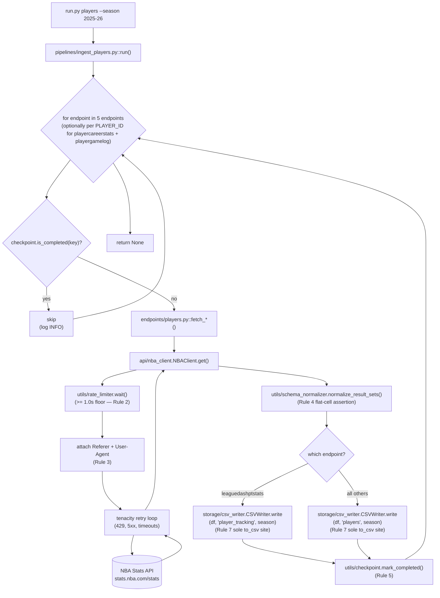

# Feature F-009 — Players Pipeline

## 1. Feature Summary

| Attribute | Value |
|---|---|
| **Feature ID** | F-009 |
| **Feature Name** | Players Pipeline |
| **Domain** | Players (per-player season-level aggregates, clutch splits, career totals, per-game logs, and tracking metrics) |
| **Implementing files** | `pipelines/ingest_players.py`, `endpoints/players.py` |
| **Destination CSV(s)** | `output/players.csv`, `output/player_tracking.csv` |
| **Operational rules enforced** | Rule 1 (single HTTP client), Rule 2 (rate limit ≥ 1.0s), Rule 3 (required headers), Rule 4 (flat CSV), Rule 5 (checkpoint after every pull), Rule 7 (pluggable storage) |
| **Operational rules NOT applicable** | Rule 6 (fail-safe iteration is scoped to Games only — see [`./games.md`](./games.md) §6 and decision log entry **D-012** in [`../DECISIONS.md`](../DECISIONS.md)) |
| **Validation gates** | Gate 1 (end-to-end live smoke), Gate 9 (endpoint reachable from pipeline), Gate 13 (CLI subcommand invokes pipeline) |
| **Test files** | `tests/unit/pipelines/test_ingest_players.py`, `tests/unit/endpoints/test_players.py` |
| **CLI subcommand** | `python run.py players --season <season>` (standalone) and `python run.py all --season <season>` (FOURTH in the dispatch order `schedule → games → teams → players → lineups`, per **D-008** in [`../DECISIONS.md`](../DECISIONS.md)) |
| **Runtime cost (aggregate shape)** | 5 HTTP requests × ≥ 1.0s rate-limit floor ≈ **~5 seconds of mandatory waits** per invocation |
| **Runtime cost (per-player shape)** | Up to 3 season-level + 2 × ~500 per-player ≈ 1,003 HTTP requests × ≥ 1.0s floor ≈ **~17 minutes of mandatory waits** per invocation |

The Players pipeline is the largest of the five per-domain pipelines by endpoint count (five endpoints) and is the ONLY pipeline besides Games that writes TWO CSV artifacts (`players.csv` and `player_tracking.csv`). Its implementation is more subtle than Teams or Lineups because two of its five endpoints — `playercareerstats` and `playergamelog` — expose both an aggregate league-wide form AND a per-player-per-season form; the shape the pipeline adopts is an implementation-time tradeoff between fidelity (per-player) and runtime (aggregate). Rule 6 does NOT apply here — if any endpoint fails, the Players pipeline propagates the exception and Rule 5 resume semantics preserve prior progress for the next invocation.

## 2. Purpose

The Players pipeline produces per-player season-level statistics, clutch-time splits, career totals, game-level logs, and player-tracking metrics for every active NBA player in a configured season. It is the analytics substrate for:

- **Player-comparison reports** — side-by-side offensive, defensive, and efficiency splits keyed on `PLAYER_ID`, sourced from `leaguedashplayerstats` (traditional + advanced measure types) and `leaguedashplayerclutch` (clutch-time splits).
- **MVP and award modeling** — season-level aggregates from `leaguedashplayerstats` joined to game-by-game context from `playergamelog` power the statistical scaffolding for award-voting models (WAR, VORP, Box Plus/Minus replacements for operators without access to proprietary stats services).
- **Draft-prospect valuation against active-roster benchmarks** — career totals from `playercareerstats` provide the comparables distribution against which a prospect's projected career arc is evaluated; combined with `leaguedashplayerstats` for current-season context.
- **Roster-construction analysis** — clutch splits, tracking metrics (speed, distance, touches, defensive matchup counts), and per-game logs combine to evaluate fit and durability patterns when building or modifying an NBA roster.
- **Player-tracking diagnostics** — tracking metrics from `leaguedashptstats` (speed, distance, touches, average defender distance, defensive rim protection counts) are the basis for the kind of physical-profile analysis that traditional box-score stats cannot capture; `player_tracking.csv` is a deliberate second artifact because these metrics have a different primary-key structure than the traditional-stats bundle.

Two CSV artifacts are produced:

- **`players.csv`** — combines the traditional, clutch, and career/log signals into a single per-player-per-season flat file. The exact merge strategy (join-on-`PLAYER_ID` vs. concatenate-and-tag-by-source) is documented in Section 8 and is consistent with the single-CSV-per-primary-dashboard design that D-009 in [`../DECISIONS.md`](../DECISIONS.md) establishes.
- **`player_tracking.csv`** — keeps player-tracking metrics (speed, distance, touches, defensive-matchup counts) in a dedicated file because these metrics come from a distinct upstream endpoint (`leaguedashptstats`) and are loaded on-demand by tracking-specific downstream analyses. The AAP §0.5.1.9 and the README key-columns table list `player_tracking.csv` as an independent deliverable keyed on `(season, player_id, team_id)`.

In operator terms: `players.csv` answers the question "what is the season-shape of every active player, across traditional, clutch, and career lenses?" while `player_tracking.csv` answers "what do movement and touch patterns look like per player this season?" — two related but distinct questions that downstream analytics often treat separately.

## 3. Interface Contract

`pipelines/ingest_players.py` exposes the standard pipeline entry point shared by every domain pipeline:

```python
def run(
    client: NBAClient,
    writer: BaseWriter,
    checkpoint: CheckpointManager,
    season: str,
) -> None
```

**Parameters:**

| Parameter | Type | Source | Notes |
|---|---|---|---|
| `client` | `NBAClient` | `api/nba_client.py` (singleton, constructed in `run.py`) | The pipeline NEVER constructs its own `NBAClient` or imports `requests` directly (Rule 1). All HTTP calls are delegated through `client.get(endpoint, params) -> dict`. |
| `writer` | `BaseWriter` | `storage/csv_writer.py` | In this phase always a concrete `CSVWriter`, injected from `run.py`. The pipeline NEVER calls `DataFrame.to_csv(...)` directly (Rule 7) — every disk write goes through `writer.write(df, name, season) -> Path`. |
| `checkpoint` | `CheckpointManager` | `utils/checkpoint.py` | Shared manifest backed by `output/checkpoint.json`. The pipeline calls `checkpoint.is_completed(key)` before every HTTP fetch and `checkpoint.mark_completed(key)` immediately after every successful `writer.write(...)` (Rule 5). |
| `season` | `str` | CLI flag `--season` or `config.DEFAULT_SEASON` | NBA season string in `YYYY-YY` format, e.g. `"2025-26"`. Validation is the caller's responsibility — malformed season strings propagate to the API, which typically returns an empty `rowSet` rather than a 4xx error (see [`../ONBOARDING.md`](../ONBOARDING.md) Pitfall 3). |

**Side effects:**

- Writes `output/players.csv` after merging the normalized responses from `leaguedashplayerstats`, `leaguedashplayerclutch`, and the aggregated `playercareerstats` / `playergamelog` responses. The exact merge strategy (join-on-`PLAYER_ID` vs. concatenate-and-tag-by-source with a `SOURCE` column) is an implementation choice of `pipelines/ingest_players.py` and is documented in that module's docstring; Section 8 captures both shapes.
- Writes `output/player_tracking.csv` from the normalized `leaguedashptstats` response.
- Writes up to five checkpoint keys (aggregate shape) or up to roughly 1,003 checkpoint keys (per-player shape) to `output/checkpoint.json` — one key per successful endpoint pull — each written synchronously after its successful CSV write (Rule 5). See Section 7 for the key-format schema.
- Emits structured log records at INFO on entry and exit and at DEBUG for per-endpoint request timing. Every record carries the correlation ID from `utils/correlation.py` so the entire per-run workflow is greppable in the log file at `logs/pipeline.log` (see [`../OBSERVABILITY.md`](../OBSERVABILITY.md)).

**Returns:** `None`. Failures propagate; no exception suppression (Rule 6 does not apply to Players — see Section 6).

**Idempotency:** if any checkpoint key is already present, the pipeline short-circuits that endpoint (or that per-player fetch, in the per-player shape) after logging a single INFO line and does not issue the corresponding HTTP request. The five endpoints are independently resumable: an invocation that succeeds on `leaguedashplayerstats` but fails on `leaguedashplayerclutch` will, on retry, skip `leaguedashplayerstats` and retry only the failed endpoint (and any `playercareerstats` / `playergamelog` / `leaguedashptstats` work that has not yet completed).

## 4. Endpoints Called

| Endpoint | Scope | Invocation Frequency | Catalog Reference |
|---|---|---|---|
| `leaguedashplayerstats` | Per-player season-level aggregate (traditional, advanced, misc measure types) | Once per season | [`../api/endpoints_catalog.md#leaguedashplayerstats`](../api/endpoints_catalog.md#leaguedashplayerstats) |
| `leaguedashplayerclutch` | Per-player clutch-time splits (last 5 min, margin ≤ 5, etc.) | Once per season | [`../api/endpoints_catalog.md#leaguedashplayerclutch`](../api/endpoints_catalog.md#leaguedashplayerclutch) |
| `playercareerstats` | Career totals per player | Once per season (aggregate shape) OR once per player × ~500 active players (per-player shape) | [`../api/endpoints_catalog.md#playercareerstats`](../api/endpoints_catalog.md#playercareerstats) |
| `playergamelog` | Game-level player logs for the season | Once per season (aggregate shape) OR once per player × ~500 active players (per-player shape) | [`../api/endpoints_catalog.md#playergamelog`](../api/endpoints_catalog.md#playergamelog) |
| `leaguedashptstats` | Player tracking statistics (speed, distance, touches, defensive matchup counts) | Once per season, possibly once per `PtMeasureType` slice | [`../api/endpoints_catalog.md#leaguedashptstats`](../api/endpoints_catalog.md#leaguedashptstats) |

Thin wrapper functions live in `endpoints/players.py`. The conventional shape is:

- `fetch_leaguedashplayerstats(client, season, **kwargs)` — constructs the `params` dict and delegates to `client.get("leaguedashplayerstats", params)`.
- `fetch_leaguedashplayerclutch(client, season, **kwargs)` — constructs the `params` dict (including clutch-time parameter defaults) and delegates to `client.get("leaguedashplayerclutch", params)`.
- `fetch_playercareerstats(client, player_id=None, **kwargs)` — constructs the `params` dict (optionally including `PlayerID` for the per-player shape) and delegates to `client.get("playercareerstats", params)`.
- `fetch_playergamelog(client, season, player_id=None, **kwargs)` — constructs the `params` dict (optionally including `PlayerID` for the per-player shape) and delegates to `client.get("playergamelog", params)`.
- `fetch_leaguedashptstats(client, season, **kwargs)` — constructs the `params` dict (including `PtMeasureType` when the caller wants a specific tracking slice) and delegates to `client.get("leaguedashptstats", params)`.

Each wrapper accepts `(client, season, **kwargs)` — or `(client, player_id, **kwargs)` for `playercareerstats` — constructs the `params` dict, and delegates to `client.get(endpoint, params)`. No wrapper contains any HTTP logic (Rule 1), no normalization (deferred to `utils/schema_normalizer`), and no I/O (deferred to `storage/csv_writer`). Parameter names MUST be sourced from [`../api/endpoints_catalog.md`](../api/endpoints_catalog.md) — this document does not duplicate the parameter reference to avoid drift. In particular, the exact spellings of `Season`, `SeasonType`, `MeasureType`, `PerMode`, `LeagueID`, `ClutchTime`, `AheadBehind`, `PointDiff`, `PtMeasureType`, and any other endpoint-specific parameter keys are defined in the catalog, not here.

### Note on aggregate vs. per-player shape

The NBA Stats API exposes `playercareerstats` and `playergamelog` in BOTH an aggregate league-wide form (when called without `PlayerID`, one call returns rows for every player) AND a per-player form (when called with `PlayerID`, one call returns rows for that single player only). The pipeline can be implemented in either shape:

- **Aggregate shape (5 total HTTP calls):** a single call each to `leaguedashplayerstats`, `leaguedashplayerclutch`, `playercareerstats`, `playergamelog`, and `leaguedashptstats` without per-player enumeration. Minimum runtime ~5 seconds of mandatory waits. Recommended default for full-season production runs where the aggregate payload is sufficient.
- **Per-player shape (up to ~1,003 total HTTP calls):** three season-level calls (`leaguedashplayerstats`, `leaguedashplayerclutch`, `leaguedashptstats`) plus ~500 each for `playercareerstats` and `playergamelog` (one per active player). Minimum runtime ~17 minutes of mandatory waits. Useful when the aggregate forms return a reduced column set, or when per-player career arcs must be materialized as separately-checkpointed units for resume granularity.

The exact shape chosen is an implementation detail of `pipelines/ingest_players.py`; the endpoint wrapper signatures (`player_id=None`) accommodate both shapes. Which shape the default implementation uses MUST be documented in the pipeline docstring and cross-referenced from [`../api/endpoints_catalog.md`](../api/endpoints_catalog.md). Checkpoint-key formats for both shapes are given in Section 7.

## 5. Data Flow



The loop is strictly serial (no parallelism per AAP §0.6.2.3) and every iteration writes the checkpoint synchronously immediately after a successful write (Rule 5). Four observations about the diagram:

1. **No cross-pipeline arrow.** Unlike [`./games.md`](./games.md) §5 (which shows a dashed arrow from Games to Schedule's `enumerate_game_ids`), Players has no cross-pipeline dependency. It is a self-contained pipeline that can be invoked standalone at any time without any precondition on other CSV artifacts.
2. **The `ROUTE` node is the two-CSV fan-out.** This is the one place where Players deviates from Teams, Lineups, and Schedule: four endpoints contribute to `players.csv` while `leaguedashptstats` contributes to `player_tracking.csv`. The routing decision is made after normalization, so both files receive flat, Rule-4-compliant DataFrames.
3. **The `LOOP` node is conditional on shape.** In the aggregate shape, the loop iterates five endpoints exactly. In the per-player shape, the loop iterates three aggregate endpoints + two × ~500 per-player endpoints ≈ 1,003 iterations. Either way the checkpoint check precedes every HTTP request, so a partially-completed run resumes exactly where it stopped.
4. **The rate-limit and retry subgraph is identical to every other pipeline.** `NBAClient.get` is the single enforcement point for Rules 1, 2, and 3, regardless of which pipeline initiated the call. Players inherits this transitively (see Section 6).

## 6. Operational Rules

| Rule | Scope | Enforcement Site | Notes |
|---|---|---|---|
| Rule 1 — Single HTTP client | Transitive | `api/nba_client.py` | The five endpoint wrappers delegate every HTTP call to `NBAClient.get`; no `requests.*` import appears in `endpoints/players.py` or `pipelines/ingest_players.py`. Verified by `tests/invariants/test_rule1_sole_http_client.py` |
| Rule 2 — ≥ 1.0s inter-request floor | Transitive | `utils/rate_limiter.RateLimiter.wait()` invoked inside `NBAClient.get` | Tunable via `config.RATE_LIMIT_SECONDS`; 5 calls (aggregate shape) or up to ~1,003 calls (per-player shape), each blocking on `time.monotonic()` |
| Rule 3 — Required headers | Transitive | `requests.Session.headers` populated from `config.REQUIRED_HEADERS` (`Referer`, `User-Agent`) at session construction | Players inherits headers like every other endpoint; the headers are set once per-session in `api/nba_client.py::__init__`, not per-request |
| Rule 4 — Flat CSV | Direct | `utils/schema_normalizer.normalize_result_sets()` asserts no cell is `dict` or `list` before returning | `PLAYER_ID`, `PLAYER_NAME`, `TEAM_ID`, `TEAM_ABBREVIATION`, and all numeric measure columns are scalar by construction; verified by `tests/invariants/test_rule4_no_nested_cells.py` on representative Players payloads |
| Rule 5 — Checkpoint after every pull | Direct | `pipelines/ingest_players.py` calls `checkpoint.mark_completed(key)` immediately after each `writer.write(df, name, season)` returns successfully | One key per successful endpoint pull (aggregate shape: up to 5 keys; per-player shape: up to ~1,003 keys); synchronous JSON write to `output/checkpoint.json` |
| Rule 7 — Pluggable storage | Direct | Pipeline calls `writer.write(df, "players", season)` or `writer.write(df, "player_tracking", season)` — never `df.to_csv(...)` directly | `grep "\.to_csv(" pipelines/ingest_players.py` returns zero matches; verified by `tests/invariants/test_rule7_basewriter_only.py` |
| Rule 6 — Fail-safe game iteration | **NOT APPLICABLE** | `pipelines/ingest_games.py` only | See [`./games.md`](./games.md) §6 "Why Rule 6 exists" and decision log entry **D-012** in [`../DECISIONS.md`](../DECISIONS.md) (restated in **D-016**) for the scoping rationale |

The Players pipeline propagates exceptions upward. A failure aborts remaining pulls for the current invocation; the checkpoint preserves prior progress, so the next invocation resumes exactly where it stopped (see Section 10 and Section 7).

The following anti-patterns MUST NOT appear in `pipelines/ingest_players.py` or `endpoints/players.py`:

- `try: ... except Exception:` around the HTTP/normalize/write block — this would violate the Rule 6 scope boundary (Rule 6 is Games-specific, per D-012 and D-016 in [`../DECISIONS.md`](../DECISIONS.md)). A broad exception handler in Players would silence defects (schema drift, normalizer regressions, writer I/O issues) that should surface immediately.
- `df.to_csv(...)` or any other direct pandas-to-disk call — violates Rule 7 (pluggable storage); all disk writes go through the injected `BaseWriter` / `CSVWriter`.
- `import requests` or `requests.get(...)` / `requests.Session(...)` — violates Rule 1 (single HTTP client); all HTTP is funneled through `api/nba_client.NBAClient.get`.


## 7. Checkpoint Key Schema

The Players pipeline writes checkpoint keys into `output/checkpoint.json` under a top-level `"completed"` array (or equivalent set-valued structure — see [`../DECISIONS.md`](../DECISIONS.md) **D-007** for the manifest shape). Keys are colon-delimited strings following the canonical `<domain>:<endpoint>[:<scope>]:<season>` format shared by all pipelines. Players uses the `players` domain prefix exclusively — no other pipeline writes keys under that prefix (the Lineups pipeline uses `lineups:leaguedashplayerclutch_onoff:<season>` for its on/off split, distinct from Players' `players:leaguedashplayerclutch:<season>`).

### Key format table

| Endpoint | Aggregate-Shape Key | Per-Player-Shape Key | Key Count per Invocation |
|---|---|---|---|
| `leaguedashplayerstats` | `players:leaguedashplayerstats:<season>` | (same — endpoint only supports aggregate form) | 1 |
| `leaguedashplayerclutch` | `players:leaguedashplayerclutch:<season>` | (same — endpoint only supports aggregate form) | 1 |
| `playercareerstats` | `players:playercareerstats:<season>` | `players:playercareerstats:<player_id>:<season>` | 1 OR N (≈ 500) |
| `playergamelog` | `players:playergamelog:<season>` | `players:playergamelog:<player_id>:<season>` | 1 OR N (≈ 500) |
| `leaguedashptstats` | `players:leaguedashptstats:<season>` | (same — endpoint only supports aggregate form) | 1 OR K per `PtMeasureType` slice |

Concrete examples for `season="2025-26"`:

- Aggregate shape: `players:leaguedashplayerstats:2025-26`, `players:leaguedashplayerclutch:2025-26`, `players:playercareerstats:2025-26`, `players:playergamelog:2025-26`, `players:leaguedashptstats:2025-26` — exactly 5 keys per fresh full invocation.
- Per-player shape: 3 aggregate keys (`leaguedashplayerstats`, `leaguedashplayerclutch`, `leaguedashptstats`) + up to ~500 keys of the form `players:playercareerstats:201939:2025-26` (where `201939` is Stephen Curry's `PLAYER_ID`) + up to ~500 keys of the form `players:playergamelog:201939:2025-26` — up to ~1,003 keys per fresh full invocation.

### Write ordering (Rule 5 invariant)

The pipeline calls `checkpoint.mark_completed(key)` **after** `writer.write(df, name, season)` returns successfully and **before** the loop advances. This ordering is load-bearing: if a crash happens during `writer.write`, the key is NOT marked completed, and the next run will re-fetch and re-write that endpoint — guaranteeing no data loss. Conversely, if a crash happens during `checkpoint.mark_completed` (disk full, permission denied), the write has already succeeded but the key is absent; the next run will re-fetch the same endpoint and the writer will overwrite the existing CSV with identical data — an idempotent no-op from the operator's perspective. The trade-off accepted here (occasional redundant re-writes over missed checkpointing) is recorded in [`../DECISIONS.md`](../DECISIONS.md) **D-007**.

### Resume semantics

On every invocation, before calling `endpoints/players.py::fetch_*`, the pipeline calls `checkpoint.is_completed(key)`. If the key is present in the manifest, the fetch is skipped and a log record is emitted at INFO:

```
<timestamp> INFO corr=<uuid> pipelines.ingest_players skip endpoint=leaguedashplayerstats season=2025-26 reason=checkpointed
```

This means:

1. Re-running `python run.py players --season 2025-26` after a successful completion is a no-op (all 5 keys are already present). The CSV files on disk are NOT touched.
2. Re-running after a partial crash resumes from the next uncompleted key. Prior CSVs are preserved unchanged; only the missing endpoint is fetched and its rows merged into the appropriate output file via `CSVWriter.write`.
3. To force a fresh full re-run, the operator deletes `output/checkpoint.json` (or a specific key from the manifest). See [`../ONBOARDING.md#pitfall-2-checkpoint-skips-endpoints`](../ONBOARDING.md#pitfall-2-checkpoint-skips-endpoints) for the canonical recipe.

### Merge semantics within a single CSV

Four endpoints (`leaguedashplayerstats`, `leaguedashplayerclutch`, `playercareerstats`, `playergamelog`) feed `players.csv`. If the implementation uses the per-player shape, the checkpoint granularity is finer than the output-artifact granularity — i.e., 500 per-player `playergamelog` keys map to a single `players.csv` file. The write strategy the pipeline employs MUST either (a) accumulate DataFrames in memory and call `CSVWriter.write` once per endpoint, or (b) call `CSVWriter.write` in append mode after each per-player fetch. Option (a) is the default because it yields an atomic overwrite of `players.csv` per endpoint contribution; option (b) would require an append-aware writer and is deferred to the future `ParquetWriter` sketched in [`../DECISIONS.md`](../DECISIONS.md) **D-010**.

## 8. Output Artifacts

### `output/players.csv`

- **Format:** UTF-8 CSV with header row; plain `,` separator; platform-default line terminator; no compression (per AAP §0.6.2.2).
- **Approximate row count (full 2025-26 season):** ~500–600 rows in aggregate shape (one row per active player), expanding to 30K+ rows if per-player `playergamelog` is merged in game-level form.
- **Primary key:** `(PLAYER_ID, SEASON_ID)` for season-aggregated rows; `(PLAYER_ID, GAME_ID)` when per-game rows from `playergamelog` are included. See [`../api/endpoints_catalog.md`](../api/endpoints_catalog.md) for the authoritative column list.
- **Key columns (canonical):** `PLAYER_ID`, `PLAYER_NAME`, `TEAM_ID`, `TEAM_ABBREVIATION`, `SEASON_ID`, `AGE`, `GP`, `W`, `L`, `MIN`, plus the full set of traditional (`PTS`, `REB`, `AST`, `STL`, `BLK`, `TOV`, `FG_PCT`, `FG3_PCT`, `FT_PCT`), advanced (`OFF_RATING`, `DEF_RATING`, `NET_RATING`, `USG_PCT`, `TS_PCT`, `PIE`), and clutch-prefixed measures. Exact column names and emission order follow the upstream `resultSets.headers` array from each endpoint, preserved verbatim by `utils/schema_normalizer`.
- **Joinability:**
  - Join to `output/teams.csv` on `TEAM_ID` for team context (franchise name, city, division).
  - Join to `output/games.csv` on `(PLAYER_ID, GAME_ID)` when per-game rows are present — enables per-game lineup context reconstruction.
  - Join to `output/player_tracking.csv` on `(PLAYER_ID, SEASON_ID)` to augment traditional stats with tracking metrics.
  - Join to `output/lineups.csv` via `TEAM_ID` then dissolving the lineup `GROUP_ID` tuple to find players on dominant rotations.
  - Join to `output/schedule.csv` via `GAME_ID` (when per-game shape is present) for schedule context (date, home/away flag, matchup string).
- **Flat-cell guarantee:** every cell is a Python scalar (`int`, `float`, `str`, `bool`, or `None`/NaN). No nested `dict` or `list` (Rule 4); verified by `tests/invariants/test_rule4_no_nested_cells.py` and asserted at normalize-time by `utils/schema_normalizer`.
- **Overwrite semantics:** `CSVWriter.write(df, "players", season)` overwrites `output/players.csv` atomically by writing to a temporary file and replacing the destination (per AAP §0.4.2.2). Idempotent re-runs produce byte-identical output, modulo upstream changes to the NBA Stats API payload.

### `output/player_tracking.csv`

- **Format:** UTF-8 CSV with header row; identical writer configuration as `players.csv`.
- **Approximate row count (full 2025-26 season):** ~500–600 rows in aggregate shape (one per player). If the implementation fans out over `PtMeasureType` slices (`SpeedDistance`, `Rebounding`, `Possessions`, `CatchShoot`, `PullUpShot`, `Defense`, `Drives`, `Passing`, `ElbowTouch`, `PostTouches`, `PaintTouches`), the row count can scale by the number of slices merged into a single wide output. The exact fan-out is an implementation detail; see [`../api/endpoints_catalog.md#leaguedashptstats`](../api/endpoints_catalog.md#leaguedashptstats) for the supported measure types.
- **Primary key:** `(PLAYER_ID, SEASON_ID)` when slices are horizontally merged into one wide row per player; `(PLAYER_ID, SEASON_ID, PT_MEASURE_TYPE)` when slices are stacked vertically (long form). Default preference is wide form for analyst ergonomics; the chosen form is documented in the pipeline docstring.
- **Key columns (canonical):** `PLAYER_ID`, `PLAYER_NAME`, `TEAM_ID`, `TEAM_ABBREVIATION`, `GP`, `W`, `L`, `MIN`, plus tracking-specific metrics: `DIST_MILES`, `DIST_MILES_OFF`, `DIST_MILES_DEF`, `AVG_SPEED`, `AVG_SPEED_OFF`, `AVG_SPEED_DEF`, `TOUCHES`, `FRONT_CT_TOUCHES`, `TIME_OF_POSS`, `AVG_SEC_PER_TOUCH`, `AVG_DRIB_PER_TOUCH`, `PTS_PER_TOUCH`, `ELBOW_TOUCHES`, `POST_TOUCHES`, `PAINT_TOUCHES`, `PTS_PER_ELBOW_TOUCH`, `PTS_PER_POST_TOUCH`, `PTS_PER_PAINT_TOUCH`, etc. Exact columns follow the `resultSets.headers` array from `leaguedashptstats`.
- **Analytical use:** `player_tracking.csv` is the ONLY artifact in the project that exposes physical-intensity metrics (distance, speed) and possession-granularity touch metrics. Questions it uniquely answers:
  - Which players have declining average speed year-over-year (load management / injury indicator)?
  - How does defensive distance correlate with `DEF_RATING` in `players.csv`?
  - What is the touch-to-pass ratio by position, and which players score most efficiently per elbow touch?
- **Joinability:** the primary join target is `output/players.csv` on `(PLAYER_ID, SEASON_ID)` — `player_tracking.csv` is designed to be merged side-by-side with the traditional/advanced/clutch stats in `players.csv` to produce a complete per-player dashboard. Secondary joins are to `teams.csv` on `TEAM_ID` (team tracking averages) and, indirectly via `players.csv`, to `games.csv`.
- **Flat-cell guarantee:** identical to `players.csv` — every cell is a scalar (Rule 4).
- **Overwrite semantics:** identical to `players.csv`.

### Why two CSVs instead of one wide merged artifact?

Players is the only pipeline besides Games that produces two CSV artifacts. The rationale is documented in [`../DECISIONS.md`](../DECISIONS.md) **D-009** (per-domain pipelines with clear artifact boundaries):

1. **Schema boundary.** Traditional/advanced/clutch stats come from `leaguedashplayerstats` / `leaguedashplayerclutch` / `playercareerstats` / `playergamelog`, each with ~30–80 columns. Tracking stats come from `leaguedashptstats`, with an additional ~30–60 columns (and variable column sets per `PtMeasureType`). Merging all of them would produce a ~200+ column wide CSV that is unwieldy in spreadsheet tools and hard to diff.
2. **Upstream availability guarantees differ.** `leaguedashplayerstats` is rock-solid back to the 1996-97 season; `leaguedashptstats` only extends back to 2013-14 (when SportVU cameras were deployed). Keeping them as separate artifacts lets analysts request a historical `players.csv` without encountering NaN-filled tracking columns for pre-2013 seasons.
3. **Checkpoint granularity.** A single artifact would force one write of a wide merged DataFrame after all 5 endpoints completed, making Rule 5's "checkpoint after every pull" harder to honor. Two artifacts allow four endpoints to contribute to `players.csv` and one endpoint to contribute exclusively to `player_tracking.csv`, keeping the write-then-checkpoint ordering simple.

## 9. Validation Gate Participation

| Gate | How This Pipeline Satisfies It | Verification Command |
|---|---|---|
| Gate 1 — End-to-end live smoke | `python run.py all --season 2025-26` produces non-empty `output/players.csv` AND non-empty `output/player_tracking.csv`. Both files contain > 0 data rows, a header row, and only scalar cells. | `python -m pytest tests/integration/test_gate1_all_live.py -v -m integration` |
| Gate 2 — Zero-warning compile, clean lint | `pipelines/ingest_players.py` and `endpoints/players.py` compile without `py_compile` warnings and pass `flake8` with zero violations at the project's `max-line-length = 120` configuration. | `python -m py_compile pipelines/ingest_players.py endpoints/players.py && python -m flake8 pipelines/ingest_players.py endpoints/players.py` |
| Gate 9 — Every pipeline is invoked from `run.py` | The `players` subcommand in `run.py` dispatches to `pipelines.ingest_players.run(client, writer, checkpoint, season)`; the registration-and-invocation pair is symmetric (click-registered + called exactly once). | `python -m pytest tests/unit/test_cli.py::test_players_subcommand -v` |
| Gate 10 — `pytest` exit code 0 | All Players-scoped unit and invariant tests pass without errors. | `python -m pytest tests/unit/pipelines/test_ingest_players.py tests/unit/endpoints/test_players.py tests/invariants/ -v` |
| Gate 12 — Config propagation tracing | `pipelines/ingest_players.py` consumes `config.DEFAULT_SEASON` (indirectly via the CLI `--season` default), and the transitive consumers (`NBAClient`, `CSVWriter`, `CheckpointManager`) consume `config.API_BASE_URL`, `config.OUTPUT_DIR`, `config.CHECKPOINT_PATH`, `config.RATE_LIMIT_SECONDS`, `config.REQUEST_TIMEOUT_SECONDS`, `config.RETRY_ATTEMPTS`, `config.RETRY_MULTIPLIER`, `config.RETRY_MAX_WAIT`, `config.REQUIRED_HEADERS`. | `python -m pytest tests/unit/test_config.py -v` |
| Gate 13 — CLI subcommand invokes pipeline | `click`'s `CliRunner` verifies `python run.py players --season 2025-26` causes exactly one call to `pipelines.ingest_players.run` with the correct season and collaborators. | `python -m pytest tests/unit/test_cli.py::test_players_subcommand -v` |

Gates 8 (games resume determinism) and 11 (out-of-scope item numbering) are Games-specific or not applicable to Players. Gate 8 is documented in [`./games.md`](./games.md) §9.

### Gate 1 row-count lower bound

For the 2025-26 season, the integration test asserts:

- `output/players.csv` contains at least 300 data rows (minimum expectation — mid-season, every active player has played at least one game and appears in `leaguedashplayerstats`).
- `output/player_tracking.csv` contains at least 300 data rows, matching the `players.csv` population on `(PLAYER_ID, SEASON_ID)` within a reasonable tolerance (SportVU tracking occasionally lags traditional box-score availability by ~24 hours for games played that night).
- Both files have > 1 column (i.e., `normalize_result_sets` did not return a degenerate single-column DataFrame).
- Both files pass the Rule 4 flat-cell assertion when re-read by pandas: `pd.read_csv(path).applymap(lambda x: isinstance(x, (dict, list))).any().any() == False`.

These thresholds are intentionally lenient; they are designed to catch catastrophic upstream regressions (total endpoint deprecation, empty `rowSet`) rather than exact row-count drift.


## 10. Error Handling

The Players pipeline uses the project's standard error taxonomy. With Rule 6 **not applicable**, the pipeline does NOT contain any `try: ... except Exception:` block — every error propagates unless a narrower `except` clause is explicitly justified.

| Error Class | Where Caught | Outcome | Rationale |
|---|---|---|---|
| Transient HTTP (429, 500, 502, 503, 504, `ConnectionError`, `Timeout`) | `api/nba_client.NBAClient.get` via `tenacity.retry` | Retried with exponential backoff + jitter up to `config.RETRY_ATTEMPTS`. After exhaustion, the exception propagates out of `NBAClient.get`, up through the endpoint wrapper, and up through `pipelines/ingest_players.py::run`. | Rate-limit and transient-server failures are expected at the transport boundary; the retry loop is the only acceptable layer to absorb them. |
| Permanent HTTP (400, 401, 403, 404, 422) | Not caught | Propagates immediately. Pipeline aborts; checkpoint preserves prior endpoint progress. | Permanent 4xx errors indicate a defect (wrong endpoint name, malformed `params`, revoked access) that retry cannot fix. Silencing them would hide defects. |
| Normalizer assertion failure (Rule 4 violation — a cell contains `dict` or `list`) | Not caught | Propagates as `AssertionError`; pipeline aborts. | An `AssertionError` from `utils/schema_normalizer` signals an upstream `resultSets` schema change; the correct response is to investigate, not to continue writing bad data. |
| Writer I/O error (`PermissionError`, `OSError`, `FileNotFoundError` for missing output dir) | Not caught | Propagates; pipeline aborts before `checkpoint.mark_completed` is called, so the failed endpoint is retried on the next run. | Disk-level failures are environment issues (operator laptop, container, CI runner); they demand operator intervention, not retry. |
| Checkpoint I/O error (`json.JSONDecodeError` reading corrupted manifest, `OSError` writing manifest) | Not caught | Propagates as fatal. | Rule 5's durability guarantee depends on the checkpoint being writable; if it isn't, the pipeline cannot honor its contract and must fail loudly. |
| `KeyboardInterrupt` (operator sends SIGINT during a long per-player loop) | Not caught | Propagates; Python's default handling terminates the process. The checkpoint preserves progress up to the last completed endpoint. | Ctrl-C is a deliberate stop signal; the next run resumes transparently. This is the operator-friendly interaction tested in [`./games.md`](./games.md) §9 Gate 8. |
| Any other exception inside the per-endpoint loop | Not caught (Rule 6 does NOT apply to Players) | Propagates; no `except Exception` exists in this pipeline. | A broad `except Exception` would violate the Rule 6 scope boundary (D-012, D-016 in [`../DECISIONS.md`](../DECISIONS.md)) and mask defects. |

### Resume semantics under partial failure

Assume the pipeline is invoked with `python run.py players --season 2025-26` in the aggregate shape. Suppose it:

1. Completes `leaguedashplayerstats` — writes `players.csv` (partial), writes `players:leaguedashplayerstats:2025-26` to the manifest.
2. Completes `leaguedashplayerclutch` — merges into `players.csv` (overwrite), writes `players:leaguedashplayerclutch:2025-26` to the manifest.
3. Attempts `playercareerstats` — NBA Stats API returns HTTP 429 six times in a row despite `tenacity` retry; after the 5th retry (config.RETRY_ATTEMPTS = 5), the last `HTTPError` propagates.

The pipeline aborts. The manifest contains two keys (`leaguedashplayerstats`, `leaguedashplayerclutch`) for the 2025-26 season. `output/players.csv` reflects the merged output of those two endpoints. `output/player_tracking.csv` does not yet exist.

The operator resolves the underlying issue (wait out a rate-limit exceedance, fix a firewall rule, update credentials — usually just "wait and retry" for 429s), then re-runs `python run.py players --season 2025-26`. The pipeline:

- Skips `leaguedashplayerstats` (key present).
- Skips `leaguedashplayerclutch` (key present).
- Re-attempts `playercareerstats`, `playergamelog`, `leaguedashptstats` in order.
- On success, `players.csv` is overwritten with all four endpoints' contributions, `player_tracking.csv` is created, and three more keys are added to the manifest.

No data loss; no duplicate rows; no manual intervention beyond `run.py players` re-invocation.

### Logging on error

Before any exception propagates out of the endpoint-wrapper call, `pipelines/ingest_players.py` logs at ERROR with the endpoint name, the season, and the exception class (but NOT the full traceback at that level — the traceback is logged at DEBUG only, because tracebacks can contain header values or retry parameters that are noisy at INFO/ERROR). Example:

```
<timestamp> ERROR corr=<uuid> pipelines.ingest_players endpoint=playercareerstats season=2025-26 error_class=HTTPError
<timestamp> DEBUG corr=<uuid> pipelines.ingest_players traceback=Traceback (most recent call last):...
```

This pattern is consistent across all five pipelines and is documented in [`../OBSERVABILITY.md`](../OBSERVABILITY.md). The correlation ID (`corr=<uuid>`) is generated once per CLI invocation by `utils/correlation.py` and propagated to every log record via `contextvars`.

### Metrics on error

On every failure inside the per-endpoint loop, `pipelines/ingest_players.py` increments the counter `pipeline_endpoint_failures_total{pipeline="ingest_players", endpoint="<endpoint_name>"}` via `utils/metrics.inc(...)`. On success, it increments `pipeline_endpoint_successes_total{pipeline="ingest_players", endpoint="<endpoint_name>"}` and `pipeline_rows_written_total{pipeline="ingest_players", artifact="<players|player_tracking>"}` with the row count. These counters are exposed via `python run.py metrics` per [`../OBSERVABILITY.md`](../OBSERVABILITY.md).

Note: there is no `games_failed_total` equivalent for Players. That counter is specific to `pipelines/ingest_games.py`'s Rule 6 per-game skip semantics; Players does not have skip semantics (failures abort), so the equivalent counter would always be 0.

## 11. Testing Strategy

The Players pipeline is covered by four layers of tests, each with a distinct purpose. All tests live under `tests/` and mirror the production module tree (see AAP §0.5.1.8).

### Unit tests

**`tests/unit/pipelines/test_ingest_players.py`** — exercises `run()` with fully mocked collaborators (`NBAClient`, `CSVWriter`, `CheckpointManager`). Assertions include:

- **Call sequencing.** For each endpoint in the expected iteration order, `client.get` is called with the correct endpoint name, followed by `writer.write` with the correct CSV name (`"players"` for 4 endpoints, `"player_tracking"` for `leaguedashptstats`), followed by `checkpoint.mark_completed` with the correct key.
- **Rule 5 ordering invariant.** `mark_completed` is called strictly AFTER `write` returns — verified with a `MagicMock` side-effect order-capture.
- **Skip-on-checkpoint.** When `checkpoint.is_completed(key)` returns `True`, `client.get` is NOT called for that endpoint, and neither are `writer.write` and `checkpoint.mark_completed`. The next iteration proceeds unhindered.
- **Exception propagation.** When `client.get` raises (simulating transport exhaustion), the exception propagates out of `run()`. No `except Exception` catch is present anywhere in the call graph.
- **Config consumption.** The pipeline's read-sites for `config.DEFAULT_SEASON` (indirect via CLI) and any pipeline-level config are traced.
- **Two-CSV routing.** `leaguedashptstats` writes to `player_tracking`, the other four to `players` — verified by asserting the `name` argument of each `writer.write` mock call.

**`tests/unit/endpoints/test_players.py`** — exercises the five wrapper functions (`fetch_leaguedashplayerstats`, `fetch_leaguedashplayerclutch`, `fetch_playercareerstats`, `fetch_playergamelog`, `fetch_leaguedashptstats`) with a mocked `NBAClient`. Assertions include:

- Each wrapper calls `client.get(endpoint_name, params)` with the exact endpoint name string expected by the upstream API.
- Each wrapper includes the required `params` keys (`Season`, `SeasonType`, `LeagueID`, etc. — per the catalog) and passes through caller-supplied `**kwargs` unchanged.
- `fetch_playercareerstats` and `fetch_playergamelog` accept an optional `player_id` parameter; when provided, the resulting `params` dict contains `"PlayerID"` with that value; when omitted, `"PlayerID"` is absent or `""`.
- No wrapper imports `requests` (verified by AST inspection in addition to the invariant test in the next subsection).

### Integration tests

**`tests/integration/test_gate1_all_live.py`** — marked `@pytest.mark.integration`, skipped by default via `pytest -m "not integration"`. Executes `run.py all --season <current_season>` (typically `2025-26` during the season) against the live NBA Stats API. For the Players section of the test, asserts:

- `output/players.csv` exists and has > 0 data rows.
- `output/player_tracking.csv` exists and has > 0 data rows.
- Both files are readable by `pandas.read_csv` without dtype warnings.
- Both files satisfy the Rule 4 flat-cell assertion.
- `output/checkpoint.json` contains keys matching the `players:*` prefix, one per endpoint pulled.

This test is the authoritative Gate 1 verification for Players.

### Invariant tests (grep-based and fixture-based)

- **`tests/invariants/test_rule1_sole_http_client.py`** — runs `subprocess.run(["grep", "-rn", "requests\\.", "endpoints/players.py", "pipelines/ingest_players.py"])` and asserts zero matches. Also greps for `import requests` directly.
- **`tests/invariants/test_rule4_no_nested_cells.py`** — loads a fixture `resultSets` payload representative of Players endpoints, runs `normalize_result_sets`, and asserts the resulting DataFrames pass `df.applymap(lambda x: isinstance(x, (dict, list))).any().any() == False`.
- **`tests/invariants/test_rule7_basewriter_only.py`** — greps `pipelines/ingest_players.py` for `.to_csv(` and asserts zero matches.

### Fixtures

`tests/conftest.py` provides shared fixtures that the Players unit tests consume:

- `sample_leaguedashplayerstats_payload` — a trimmed `resultSets` dict with ~3 representative players.
- `sample_leaguedashplayerclutch_payload` — analogous clutch-split dict.
- `sample_playercareerstats_payload` — career-totals dict for a single player.
- `sample_playergamelog_payload` — game-log dict for a single player with ~5 rows.
- `sample_leaguedashptstats_payload` — tracking-metrics dict with ~3 players.
- `mock_nba_client` — `MagicMock` with `get` configured to return fixture payloads by endpoint name.
- `mock_writer` — `MagicMock` subclass of `BaseWriter` that records `write` calls.
- `mock_checkpoint` — `MagicMock` subclass of `CheckpointManager` with configurable `is_completed` return values.

### Run the Players-scoped test slice

To validate every Players-related test in one invocation:

```bash
python -m pytest \
    tests/unit/pipelines/test_ingest_players.py \
    tests/unit/endpoints/test_players.py \
    tests/invariants/test_rule1_sole_http_client.py \
    tests/invariants/test_rule4_no_nested_cells.py \
    tests/invariants/test_rule7_basewriter_only.py \
    -v
```

To include the live integration test (requires network and the NBA Stats API being reachable):

```bash
python -m pytest \
    tests/unit/pipelines/test_ingest_players.py \
    tests/unit/endpoints/test_players.py \
    tests/invariants/ \
    tests/integration/test_gate1_all_live.py \
    -v -m "integration or not integration"
```

Both commands are expected to exit with code 0 (Gate 10). Failures in the unit slice are blocking for any code change to `pipelines/ingest_players.py` or `endpoints/players.py`; failures in the integration slice may indicate a transient upstream issue and should be re-run before being treated as a Players defect.

## 12. Cross-References

### Peer feature documents

- [`./schedule.md`](./schedule.md) — F-013, invoked FIRST in the `run.py all` dispatch order (D-008). Provides `GAME_ID` enumeration consumed by `./games.md`, not by this pipeline.
- [`./games.md`](./games.md) — F-011, the MOST complex pipeline; the only pipeline where Rule 6 applies. Referenced here for contrast in Sections 6 and 10.
- [`./teams.md`](./teams.md) — F-010, immediately upstream of Players in the dispatch order. Similar structure (no Rule 6, multi-endpoint aggregation) but single-artifact output (`teams.csv`).
- [`./lineups.md`](./lineups.md) — F-012, invoked LAST in the dispatch order. Shares the `leaguedashplayerclutch` family of endpoints via the on/off split variant — see [`./lineups.md`](./lineups.md) §4 for the distinct `leaguedashplayerclutch_onoff` wrapper.

### Project-level documents

- [`../TRACEABILITY.md`](../TRACEABILITY.md) — bidirectional matrix. The F-009 row lists every file implementing this pipeline (`pipelines/ingest_players.py`, `endpoints/players.py`, `storage/csv_writer.py`, `utils/schema_normalizer.py`, `utils/checkpoint.py`, `utils/rate_limiter.py`, `api/nba_client.py`) and every test verifying it (enumerated in Section 11 above).
- [`../DECISIONS.md`](../DECISIONS.md) — Markdown decision log. Entries directly relevant to Players:
  - **D-007** — JSON checkpoint manifest shape and write-ordering trade-off (rationale for the write-then-checkpoint invariant in Section 7).
  - **D-008** — `run.py all` dispatch order `schedule → games → teams → players → lineups`; Players is fourth.
  - **D-009** — Per-domain pipelines as dedicated modules; motivation for two CSV artifacts (Section 8).
  - **D-010** — Pluggable `BaseWriter` extension point; future `ParquetWriter` sketch referenced in Section 7.
  - **D-011** — Explicit dependency injection, no DI container; motivation for the `run(client, writer, checkpoint, season)` signature in Section 3.
  - **D-012** — `try: except Exception:` is only permitted inside `pipelines/ingest_games.py`; canonical source for the Rule 6 scope boundary stated in Sections 6 and 10.
  - **D-016** — Rule 6 applies only to the Games pipeline; restatement of D-012 specifically framed around Rule 6.
- [`../OBSERVABILITY.md`](../OBSERVABILITY.md) — logging format, correlation ID mechanism, metrics catalog, health/readiness surface, dashboard template. Players-specific metrics:
  - `pipeline_rows_written_total{pipeline="ingest_players", artifact="players"}` — incremented with the row count after each successful `players.csv` write.
  - `pipeline_rows_written_total{pipeline="ingest_players", artifact="player_tracking"}` — incremented with the row count after each successful `player_tracking.csv` write.
  - `pipeline_endpoint_successes_total{pipeline="ingest_players", endpoint="<name>"}` — incremented after each successful endpoint pull.
  - `pipeline_endpoint_failures_total{pipeline="ingest_players", endpoint="<name>"}` — incremented on endpoint failure.
  - `nba_requests_total{endpoint="<name>"}` — incremented per HTTP call inside `NBAClient.get`.
  - `nba_retries_total{endpoint="<name>"}` — incremented per `tenacity` retry attempt.
- [`../api/endpoints_catalog.md`](../api/endpoints_catalog.md) — authoritative endpoint-parameter reference. ALL parameter names (`Season`, `SeasonType`, `MeasureType`, `PerMode`, `LeagueID`, `ClutchTime`, `AheadBehind`, `PointDiff`, `PtMeasureType`, `PlayerID`, `TeamID`, etc.) are sourced from this catalog. Deep links used in this document:
  - [`../api/endpoints_catalog.md#leaguedashplayerstats`](../api/endpoints_catalog.md#leaguedashplayerstats)
  - [`../api/endpoints_catalog.md#leaguedashplayerclutch`](../api/endpoints_catalog.md#leaguedashplayerclutch)
  - [`../api/endpoints_catalog.md#playercareerstats`](../api/endpoints_catalog.md#playercareerstats)
  - [`../api/endpoints_catalog.md#playergamelog`](../api/endpoints_catalog.md#playergamelog)
  - [`../api/endpoints_catalog.md#leaguedashptstats`](../api/endpoints_catalog.md#leaguedashptstats)
- [`../ONBOARDING.md`](../ONBOARDING.md) — clean-machine setup guide, domain context, common pitfalls, extension patterns. Players-specific cross-references:
  - [`../ONBOARDING.md#pitfall-2-checkpoint-skips-endpoints`](../ONBOARDING.md#pitfall-2-checkpoint-skips-endpoints) — how to force a fresh Players re-run by deleting `output/checkpoint.json` (Section 7).
  - "How to extend — add a new endpoint" pattern applies directly if the NBA Stats API adds a sixth Players endpoint (e.g., a new shot-chart summary).
  - "Suggested next tasks" includes per-player shape parallelization (out of scope today per AAP §0.6.2.3) and the historical-multi-season backfill subcommand (out of scope per AAP §0.6.2.1).

### Source documents

- [`../New_Product_Prompt_20260418.md`](../New_Product_Prompt_20260418.md) — authoritative product brief. Players section confirms the five endpoints and the two CSV artifacts. Rule 6 scoping is derived from §5 of the brief.

### Implementation files (to be created per AAP §0.5.1)

- `config.py` — `API_BASE_URL`, `DEFAULT_SEASON`, `OUTPUT_DIR`, `CHECKPOINT_PATH`, `RATE_LIMIT_SECONDS`, `REQUEST_TIMEOUT_SECONDS`, `RETRY_ATTEMPTS`, `RETRY_MULTIPLIER`, `RETRY_MAX_WAIT`, `REQUIRED_HEADERS`, `LOG_LEVEL`, `LOG_FILE`.
- `run.py` — CLI entry point registering the `players` subcommand.
- `api/nba_client.py` — `NBAClient` class; single HTTP transport; Rules 1, 2, 3 enforcement.
- `endpoints/players.py` — five thin wrapper functions for the Players endpoints.
- `pipelines/ingest_players.py` — `run(client, writer, checkpoint, season)` orchestrator described throughout this document.
- `storage/csv_writer.py` — `BaseWriter` ABC and `CSVWriter` concrete; Rule 7 sole `to_csv` site.
- `utils/schema_normalizer.py` — `normalize_result_sets`; Rule 4 assertion.
- `utils/checkpoint.py` — `CheckpointManager`; Rule 5 manifest.
- `utils/rate_limiter.py` — `RateLimiter.wait()`; Rule 2.
- `utils/logger.py`, `utils/correlation.py`, `utils/metrics.py`, `utils/health.py` — observability stack referenced in Sections 10 and 12.

