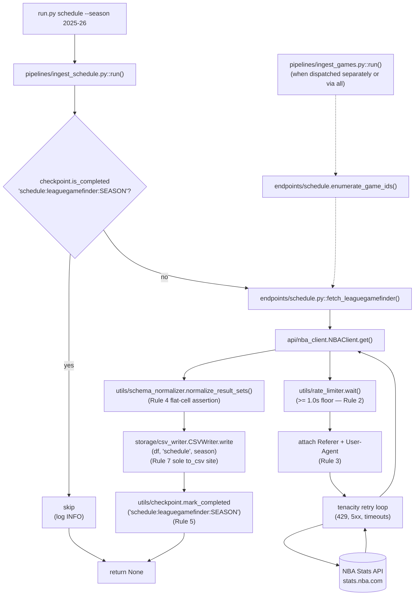

# Feature F-013 — Schedule Pipeline

## 1. Feature Summary

| Attribute | Value |
|---|---|
| **Feature ID** | F-013 |
| **Feature Name** | Schedule Pipeline |
| **Domain** | Schedule (season-level game enumeration) |
| **Implementing files** | `pipelines/ingest_schedule.py`, `endpoints/schedule.py` |
| **Destination CSV(s)** | `output/schedule.csv` |
| **Also provides** | `endpoints.schedule.enumerate_game_ids(client, season) -> List[str]` — consumed by the Games pipeline (F-011) |
| **Operational rules enforced** | Rule 1, Rule 2, Rule 3, Rule 4, Rule 5, Rule 7 |
| **Operational rules NOT applicable** | Rule 6 (fail-safe iteration scoped to Games only) |
| **Validation gates** | Gate 1, Gate 9, Gate 13 |
| **Test files** | `tests/unit/pipelines/test_ingest_schedule.py`, `tests/unit/endpoints/test_schedule.py` |
| **CLI subcommand** | `python run.py schedule --season <season>` (standalone) and `python run.py all --season <season>` (first in dispatch order) |
| **Runtime cost** | ~1 HTTP request per invocation + 1 × `RATE_LIMIT_SECONDS` floor (≈ 1 second of mandatory wait) |

This is the SMALLEST pipeline by endpoint count in the entire project but — because it supplies the `GAME_IDs` list consumed by F-011 Games — it has the largest downstream impact. Schedule is the FIRST pipeline invoked by `run.py all` (per decision D-008 in [`../DECISIONS.md`](../DECISIONS.md)).

## 2. Purpose

The Schedule pipeline produces the season-level game schedule — every regular-season, preseason, and playoff game identified by `GAME_ID`, `GAME_DATE`, `TEAM_ID`, `MATCHUP`, and `SEASON_ID`. It is the foundational reference dataset for the rest of the pipeline:

- `schedule.csv` serves as the analytics anchor for date-based joins across every other domain output.
- The `enumerate_game_ids(client, season)` helper function is the exact mechanism by which the Games pipeline (F-011) learns which `GAME_ID`s to iterate for per-game box scores and play-by-play, per AAP §0.4.5.
- This producer role makes Schedule the first pipeline invoked by `run.py all`.

In operator terms: if `schedule.csv` is missing or incomplete, downstream joins and F-011 enumeration both fail cleanly, so Schedule's correctness is load-bearing for the whole deliverable.

## 3. Interface Contract

`pipelines/ingest_schedule.py` exposes the standard pipeline entry point shared by every domain pipeline:

```python
def run(
    client: NBAClient,
    writer: BaseWriter,
    checkpoint: CheckpointManager,
    season: str,
) -> None
```

**Parameters:** identical to every other pipeline (see [`./players.md`](./players.md) §3 for the full collaborator contract table).

**Side effects:**

- Writes `output/schedule.csv` from the `leaguegamefinder` response, via `writer.write(df, "schedule", season)` (Rule 7).
- Writes one checkpoint key `schedule:leaguegamefinder:<season>` to `output/checkpoint.json` immediately after a successful write (Rule 5).
- Emits structured log records at INFO on entry and exit; DEBUG records for request/response summaries. Every record carries the correlation ID from `utils/correlation.py`.

**Returns:** `None`.

**Idempotency:** if the checkpoint key is already present, the pipeline short-circuits after logging a single INFO line and does not issue any HTTP request.

Additionally, `endpoints/schedule.py` exposes a helper function that is NOT part of the pipeline interface but IS consumed by F-011:

```python
def enumerate_game_ids(client: NBAClient, season: str) -> List[str]:
    """
    Issue a single `leaguegamefinder` request, normalize the response,
    and return a deduplicated, sorted list of GAME_ID strings for the season.
    Shared by `pipelines/ingest_schedule.py` (to emit schedule.csv) and
    `pipelines/ingest_games.py` (to drive per-game iteration, per AAP §0.4.5).
    """
```

The helper is pure: it does not write CSVs, does not touch the checkpoint, and does not mutate any global state. This purity is the contract F-011 relies on so that invoking `enumerate_game_ids` from inside `ingest_games` does not create confusing cross-pipeline side effects in `schedule.csv` or the checkpoint manifest.

## 4. Endpoints Called

| Endpoint | Scope | Invocation Frequency | Catalog Reference |
|---|---|---|---|
| `leaguegamefinder` | Season-level schedule enumeration (every game with `GAME_ID`, `GAME_DATE`, `TEAM_ID`, `MATCHUP`, `SEASON_ID`) | Once per season | [../api/endpoints_catalog.md#leaguegamefinder](../api/endpoints_catalog.md#leaguegamefinder) |

The thin wrapper in `endpoints/schedule.py` — `fetch_leaguegamefinder(client, season, **kwargs)` — constructs the `params` dict (including `LeagueID` and `Season` at minimum, plus any operator-supplied overrides via `**kwargs`) and delegates to `client.get("leaguegamefinder", params)`. It contains no HTTP logic of its own (Rule 1), no normalization (deferred to `utils/schema_normalizer`), and no I/O (deferred to `storage/csv_writer`). Parameter names MUST be sourced from [`../api/endpoints_catalog.md`](../api/endpoints_catalog.md) — this document does not duplicate the parameter reference to avoid drift.

The derived helper `enumerate_game_ids(client, season) -> List[str]`:

- Calls the `fetch_leaguegamefinder` wrapper once.
- Calls `utils/schema_normalizer.normalize_result_sets()` on the response.
- Extracts the `GAME_ID` column from the resulting DataFrame.
- Deduplicates (a single game produces two rows — one per team — in `leaguegamefinder`, so deduplication is essential to avoid double-iteration in F-011).
- Sorts the `GAME_ID` list ascending for deterministic ordering across runs (supports Gate 8 resume-determinism property).
- Returns the resulting `List[str]`.

Because one `leaguegamefinder` call enumerates every game in a season, the Schedule pipeline is the SHORTEST of the five in wall-clock time (≈ 1 HTTP call + 1 rate-limit floor = ~1 second of mandatory wait, plus normalization and CSV write). This is why Schedule appearing first in `run.py all` has negligible scheduling cost while unblocking the most expensive pipeline (F-011 Games).

## 5. Data Flow



The solid arrows show the Schedule-pipeline happy path: CLI → pipeline → checkpoint check → endpoint wrapper → HTTP client → rate limiter → headers → retry loop → normalizer → writer → checkpoint update.

The dashed arrows show the F-011 consumer path: the Games pipeline calls `enumerate_game_ids` which internally invokes the same `fetch_leaguegamefinder` wrapper. The two call sites do NOT share in-memory state — each invocation pays the ≥ 1.0s rate-limit cost (Rule 2) and reads/writes its own checkpoint entries. This keeps the module boundary clean and allows Games to be invoked standalone without any Schedule precondition.

## 6. Operational Rules

| Rule | Scope | Enforcement Site | Notes |
|---|---|---|---|
| Rule 1 — Single HTTP client | Transitive | `api/nba_client.py` | The endpoint wrapper delegates every HTTP call to `NBAClient.get`; no `requests.*` import appears in `endpoints/schedule.py` or `pipelines/ingest_schedule.py` |
| Rule 2 — ≥ 1.0s inter-request floor | Transitive | `utils/rate_limiter.wait()` invoked inside `NBAClient.get` | One call per invocation; floor is 1 second total, measured via `time.monotonic()` |
| Rule 3 — Required headers | Transitive | `requests.Session.headers` populated from `config.REQUIRED_HEADERS` (`Referer`, `User-Agent`) at session construction | Schedule inherits headers like every other endpoint |
| Rule 4 — Flat CSV | Direct | `utils/schema_normalizer.normalize_result_sets()` asserts no cell is `dict` or `list` before returning | `MATCHUP` strings and `GAME_DATE` values are scalar by construction |
| Rule 5 — Checkpoint after every pull | Direct | `pipelines/ingest_schedule.py` calls `checkpoint.mark_completed('schedule:leaguegamefinder:<season>')` immediately after `writer.write(...)` returns successfully | One key per season; synchronous JSON write to `output/checkpoint.json` |
| Rule 7 — Pluggable storage | Direct | Pipeline calls `writer.write(df, "schedule", season)` — never `df.to_csv(...)` directly | `grep "\.to_csv(" pipelines/ingest_schedule.py` returns zero matches |
| Rule 6 — Fail-safe game iteration | **NOT APPLICABLE** | `pipelines/ingest_games.py` only | See [`./games.md`](./games.md) §6 "Why Rule 6 exists" and decision log entry D-012 in [`../DECISIONS.md`](../DECISIONS.md) for the scoping rationale |

The Schedule pipeline propagates exceptions upward (no `except Exception` around per-request work). A failure aborts the pipeline; the next invocation retries the single endpoint from scratch, since the checkpoint key is only written after a successful CSV write.

The following anti-patterns MUST NOT appear in `pipelines/ingest_schedule.py`:

- `try: ... except Exception:` around the HTTP/normalize/write block (would violate the Rule 6 scope boundary — Rule 6 is Games-specific)
- `df.to_csv(...)` or any other direct pandas-to-disk call (violates Rule 7)
- `import requests` or `requests.get(...)` / `requests.Session(...)` (violates Rule 1)

## 7. Checkpoint Key Schema

| Endpoint | Checkpoint Key Format | Granularity |
|---|---|---|
| `leaguegamefinder` | `schedule:leaguegamefinder:<season>` | One key per season |

This is the simplest checkpoint schema in the entire project: a single key per invocation. The checkpoint key is only written AFTER `writer.write(df, "schedule", season)` returns successfully, guaranteeing that if the pipeline crashes mid-write the key will not be present and the next run will re-fetch and re-write.

To force a fresh schedule pull, either delete `output/checkpoint.json` entirely (affects all domains) or remove only the Schedule-scoped key via:

```bash
jq '.completed |= map(select(. | startswith("schedule:") | not))' output/checkpoint.json > output/checkpoint.json.tmp \
  && mv output/checkpoint.json.tmp output/checkpoint.json
```

See [`../ONBOARDING.md`](../ONBOARDING.md) for the operator playbook on surgical checkpoint edits.

**Note on interaction with F-011 enumeration:** when `pipelines/ingest_games.py` calls `endpoints/schedule.enumerate_game_ids(client, season)`, the helper does NOT read or write the Schedule-pipeline checkpoint key. The Games pipeline is responsible for its own checkpoint bookkeeping (see [`./games.md`](./games.md) §7). On a normal `run.py all` invocation, `run.py` dispatches `schedule` before `games`, so by the time `games` begins, `schedule.csv` is already on disk and the `leaguegamefinder` response is still "warm" in the NBA Stats API's upstream cache — but the implementation makes no assumption about upstream caching and re-issues the request when Games needs the `GAME_IDs` list. Rule 2 is honored on both calls.

## 8. Output Artifact

### `output/schedule.csv`

- **Approximate row count (full season):** ~2,460 rows (1,230 regular-season games × 2 rows per game — one per participating team — in the native `leaguegamefinder` response shape). The implementation MAY deduplicate to one row per `GAME_ID` for ~1,230 rows, depending on the chosen normalization strategy; [`../api/endpoints_catalog.md`](../api/endpoints_catalog.md) authoritatively describes the native shape and the preferred deduplication policy for `schedule.csv`.
- **Primary key:** `GAME_ID` (after deduplication) OR `(GAME_ID, TEAM_ID)` if per-team rows are preserved.
- **Key columns:** `GAME_ID`, `GAME_DATE`, `TEAM_ID`, `MATCHUP`, `SEASON_ID`.
- **Supporting columns:** typically `TEAM_ABBREVIATION`, `TEAM_NAME`, `WL`, `MIN`, `PTS`, and the box-score-lite fields that `leaguegamefinder` returns natively. These are carried through by the normalizer without renaming.
- **Joinability:**
  - Joins to `games.csv` on `GAME_ID` — this is the MOST IMPORTANT join in the entire dataset, because it gives every player-row in `games.csv` its game-date and team-of-record context.
  - Joins to `play_by_play.csv` on `GAME_ID`.
  - Joins to `teams.csv` on `TEAM_ID`.
  - Joins to `players.csv` indirectly via `games.csv` → `schedule.csv` (two-step join).
- **Cell constraint:** scalar cells only (Rule 4 — enforced by `utils/schema_normalizer.normalize_result_sets()`).
- **Encoding:** UTF-8 exclusively.
- **Line terminators:** platform default preserved by pandas (`\n` on POSIX, `\r\n` on Windows).

Because `schedule.csv` is consumed as the analytics anchor by downstream analyses, any renaming of columns WILL break consumers. The `leaguegamefinder` column names are therefore preserved verbatim as returned by the upstream API, matching the published "Immutable upstream interface" constraint in AAP §0.1.2.

## 9. Validation Gate Participation

| Gate | How This Pipeline Satisfies It | Verification Command |
|---|---|---|
| Gate 1 — End-to-end live smoke | `python run.py all --season 2025-26` produces a non-empty `schedule.csv` at `output/schedule.csv` | `python -m pytest tests/integration/test_gate1_all_live.py -v` |
| Gate 9 — Integration wiring | `endpoints/schedule.py::fetch_leaguegamefinder` is the sole caller of `leaguegamefinder` via `NBAClient.get`; `pipelines/ingest_schedule.py` is the primary caller of that wrapper (with the helper `enumerate_game_ids` being the secondary caller used by F-011); both paths are reachable from `run.py` | Verified by `tests/unit/test_cli.py` and by manual trace `run.py all → ingest_schedule.run → fetch_leaguegamefinder → NBAClient.get` |
| Gate 13 — CLI registration-invocation pairing | `run.py schedule` dispatches to `pipelines.ingest_schedule.run(...)`; `run.py all` invokes the same function as the first step of its dispatch sequence | `python -m pytest tests/unit/test_cli.py::test_schedule_subcommand -v` |

Gates 2 (zero-warning build + clean lint), 10 (pytest exit 0), and 12 (config propagation tracing) are satisfied at the repository level and are not pipeline-specific. Gate 8 (live games smoke + resume determinism) is satisfied primarily by F-011 Games but depends on F-013 Schedule for `GAME_IDs`; see the Cross-dependency subsection in Section 12.

## 10. Error Handling

| Error Class | Where Caught | Outcome |
|---|---|---|
| Transient HTTP (429, 5xx, connection errors, timeouts) | `api/nba_client.py` via `tenacity.retry` | Retry with exponential backoff (max attempts from `config.RETRY_ATTEMPTS`); after exhaustion, exception propagates out of `NBAClient.get` |
| Permanent HTTP (non-429 4xx) | Not caught | Propagates; Schedule pipeline aborts; operator must investigate (likely an API contract change or invalid `Season` parameter) |
| Normalizer assertion failure (Rule 4 violation) | Not caught | Propagates; signals upstream schema change (a `resultSets` cell newly contains a nested structure) — treat as a defect that requires normalizer update, not a retryable error |
| Writer I/O error (disk full, permission denied) | Not caught | Propagates; operator-environment issue; checkpoint key NOT written because `mark_completed` comes AFTER `write` |
| Checkpoint I/O error | Not caught | Propagates as fatal — Rule 5 integrity cannot be compromised; operator must fix the filesystem condition and re-run |
| Any other exception (e.g., `KeyError` on a missing `GAME_ID` column) | Not caught (Rule 6 does not apply) | Propagates; operator investigates — likely a normalizer bug or upstream schema drift |

Because the Schedule pipeline is a prerequisite for the Games pipeline when invoked via `run.py all` (per D-008 dispatch order), a Schedule failure SHOULD abort the `all` dispatch sequence before Games begins. This is the desirable behavior because Games cannot proceed without a `GAME_IDs` list — even though Games re-enumerates internally when invoked standalone (see Cross-dependency subsection in Section 12), a failure mode detected in Schedule almost certainly also affects `enumerate_game_ids` and there is no value in masking it.

**Important non-behavior:** Schedule does NOT wrap any block in `try: ... except Exception:`. Rule 6 is scoped to per-`GAME_ID` iteration in the Games pipeline ONLY. Adding a broad exception handler in Schedule would silence defects that should surface immediately.

## 11. Testing Strategy

### Unit tests

- `tests/unit/pipelines/test_ingest_schedule.py` — exercises `run()` with mocked `client`, `writer`, and `checkpoint` collaborators injected via pytest fixtures from `tests/conftest.py`. Asserts:
  - `mark_completed('schedule:leaguegamefinder:<season>')` is called exactly once, AFTER the successful `write` (call-order verification via `unittest.mock.Mock.mock_calls`).
  - An already-completed checkpoint short-circuits the `client.get` call (zero HTTP invocations when `is_completed` returns `True`).
  - Exceptions raised by `client.get` propagate (no `except` swallowing them); the checkpoint is NOT marked completed on failure.
  - The INFO-level log records are emitted on entry and exit with the correlation ID present in the log record's extra fields.
- `tests/unit/endpoints/test_schedule.py` — asserts:
  - `fetch_leaguegamefinder(client, season)` calls `client.get("leaguegamefinder", params)` with the correct `params` dict (including `Season` and `LeagueID` at minimum; exact values verified against the endpoints catalog).
  - `enumerate_game_ids(client, season)` calls the underlying `fetch_leaguegamefinder` wrapper exactly once.
  - `enumerate_game_ids` returns a `List[str]` (not `List[int]`, not `pd.Series`) — type verification via `isinstance(result, list) and all(isinstance(x, str) for x in result)`.
  - `enumerate_game_ids` produces a deduplicated, sorted output — the fixture supplies a `resultSets` payload with duplicate rows (two rows per game per the native shape) and the test asserts the returned list has no duplicates and is in ascending sort order.

### Integration tests

- `tests/integration/test_gate1_all_live.py` — marked `@pytest.mark.integration`; hits the live NBA Stats API; verifies that `schedule.csv` exists, is non-empty, and its cells satisfy Rule 4 (`applymap(lambda x: isinstance(x, (dict, list))).any().any() == False`).

### Invariant tests

The following repository-level invariant tests verify rules that Schedule transitively depends on:

- `tests/invariants/test_rule1_sole_http_client.py` — grep assertion that `endpoints/schedule.py` and `pipelines/ingest_schedule.py` contain zero matches for `requests\.(get|post|Session)`.
- `tests/invariants/test_rule4_no_nested_cells.py` — DataFrame-level assertion on a representative normalized Schedule payload.
- `tests/invariants/test_rule7_basewriter_only.py` — grep assertion that `pipelines/ingest_schedule.py` contains zero matches for `\.to_csv(`.

### Run the Schedule-scoped slice

```bash
python -m pytest \
    tests/unit/pipelines/test_ingest_schedule.py \
    tests/unit/endpoints/test_schedule.py \
    tests/invariants/ \
    -v
```

### Run Schedule + its consumer (F-011) together

```bash
python -m pytest \
    tests/unit/pipelines/test_ingest_schedule.py \
    tests/unit/pipelines/test_ingest_games.py \
    tests/unit/endpoints/test_schedule.py \
    tests/unit/endpoints/test_games.py \
    -v
```

This second command is the recommended pre-commit check when modifying `endpoints/schedule.py::enumerate_game_ids`, because that helper is the API surface shared with F-011 and both test suites exercise it.

## 12. Cross-References

- [`../TRACEABILITY.md`](../TRACEABILITY.md) — F-013 row lists all implementing and verifying files (pipelines, endpoints, tests, invariants).
- [`../DECISIONS.md`](../DECISIONS.md) — D-008 (dispatch order `schedule → games → teams → players → lineups`), D-009 (per-domain dedicated pipelines), D-012 (Rule 6 scope limited to Games).
- [`../OBSERVABILITY.md`](../OBSERVABILITY.md) — log format, correlation-ID mechanism, metrics exposition (`pipeline_rows_written_total{pipeline="ingest_schedule"}`, `nba_requests_total{endpoint="leaguegamefinder"}`).
- [`../api/endpoints_catalog.md`](../api/endpoints_catalog.md) — authoritative `leaguegamefinder` parameter reference (parameter names, types, and required/optional status). This document does NOT duplicate the catalog.
- [`../ONBOARDING.md#extend`](../ONBOARDING.md) — "Add a new endpoint" extension pattern (useful if Schedule ever needs a second endpoint, e.g., a preseason-only variant).
- [`./games.md`](./games.md) — **F-011 Games** — the consumer side of the F-013 → F-011 cross-dependency.
- [`./players.md`](./players.md), [`./teams.md`](./teams.md), [`./lineups.md`](./lineups.md) — peer feature deep dives for the other four domain pipelines.

### Cross-dependency: F-013 → F-011

F-013 Schedule is the PRODUCER of the `GAME_IDs` list that F-011 Games CONSUMES per AAP §0.4.5. The contract has five explicit clauses:

1. **`run.py all` dispatch order (D-008):** `schedule → games → teams → players → lineups`. Schedule runs first so that when Games begins, `schedule.csv` is already on disk and the `enumerate_game_ids` helper's response to the `leaguegamefinder` endpoint is fresh in the operator's workspace. This ordering is encoded in `run.py` and is covered by `tests/unit/test_cli.py::test_all_subcommand_dispatch_order`.

2. **Standalone `python run.py games --season <season>`** still works without a prior `schedule` invocation. When Games is invoked alone, `pipelines/ingest_games.py::run()` calls `endpoints/schedule.enumerate_game_ids(client, season)` at the top of its execution, which fetches `leaguegamefinder` fresh against the live NBA Stats API. There is NO precondition on `schedule.csv` existing for a standalone Games run. The operator experience is: "I want games for 2024-25" → `python run.py games --season 2024-25` → it works, regardless of whether `schedule.csv` has ever been produced for that season.

3. **Design intent:** this bidirectional flexibility keeps Games independently runnable (operator can invoke `python run.py games --season 2025-26` on its own for quick experiments or re-runs) while letting `all` amortize the enumeration cost (Schedule already made the call; the same in-process `NBAClient` session could serve the `enumerate_game_ids` invocation with warm TCP/TLS state, though the implementation must still honor Rule 2's rate-limit floor between calls).

4. **No shared file state:** `pipelines/ingest_games.py` does NOT read `schedule.csv`. The dependency between F-013 and F-011 is expressed purely through the shared `enumerate_game_ids(client, season)` function call, preserving the module boundary. This is a deliberate design choice — reading `schedule.csv` would create an implicit filesystem contract between the two pipelines, making standalone `python run.py games` brittle against any filesystem anomaly that Schedule's CSV emission might encounter.

5. **Propagation of failures:**
   - If Schedule fails under `run.py all`, the dispatcher aborts before Games runs. Games never starts. This is safe because Games cannot proceed without a `GAME_IDs` list.
   - If Games fails standalone because `leaguegamefinder` failed inside `enumerate_game_ids`, the exception propagates. This failure mode is NOT covered by Rule 6 — Rule 6 only covers per-`GAME_ID` iteration failures (after the enumeration step completes), not the preceding enumeration itself. An operator seeing this failure mode should inspect the `leaguegamefinder` response and the NBA Stats API upstream status, not file a bug against Rule 6.
   - If `enumerate_game_ids` returns an empty list (season not yet started, or API temporarily empty), Games completes immediately with zero rows written and zero exceptions raised. This is correct behavior, not a failure.

See [`./games.md`](./games.md) §3 "Cross-dependency: F-013 → F-011" for the consumer-side perspective on this same contract — a reader comparing the two sections can verify bidirectional documentation coverage of the producer↔consumer relationship.
