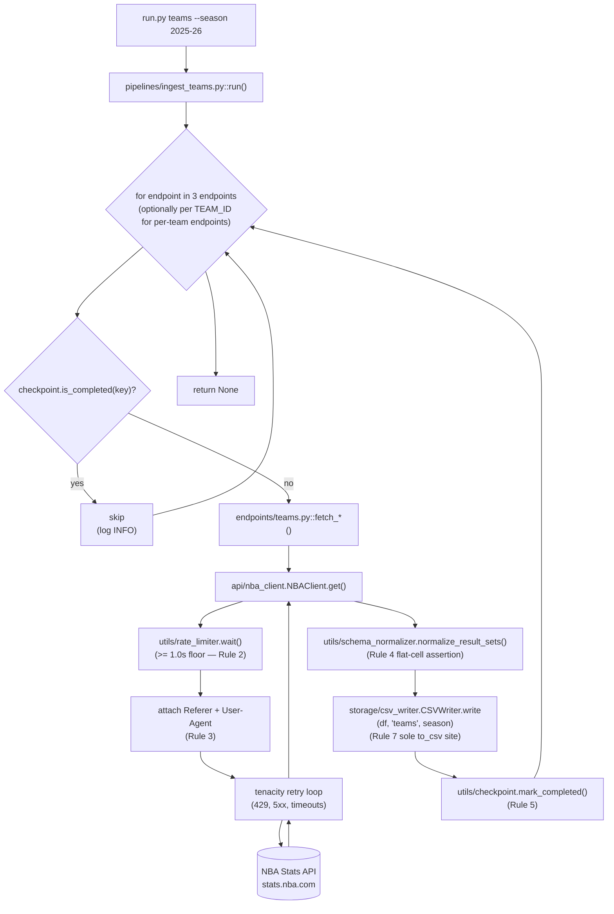

# Feature F-010 — Teams Pipeline

## 1. Feature Summary

| Attribute | Value |
|---|---|
| **Feature ID** | F-010 |
| **Feature Name** | Teams Pipeline |
| **Domain** | Teams (per-franchise season-level aggregates, game-by-game logs, and general splits) |
| **Implementing files** | `pipelines/ingest_teams.py`, `endpoints/teams.py` |
| **Destination CSV(s)** | `output/teams.csv` |
| **Operational rules enforced** | Rule 1, Rule 2, Rule 3, Rule 4, Rule 5, Rule 7 |
| **Operational rules NOT applicable** | Rule 6 (fail-safe iteration scoped to Games only — see [`./games.md`](./games.md) §6 and D-012 in [`../DECISIONS.md`](../DECISIONS.md)) |
| **Validation gates** | Gate 1, Gate 9, Gate 13 |
| **Test files** | `tests/unit/pipelines/test_ingest_teams.py`, `tests/unit/endpoints/test_teams.py` |
| **CLI subcommand** | `python run.py teams --season <season>` (standalone) and `python run.py all --season <season>` (THIRD in the dispatch order `schedule → games → teams → players → lineups`, per D-008 in [`../DECISIONS.md`](../DECISIONS.md)) |
| **Runtime cost (aggregate shape)** | 3 HTTP requests × ≥ 1.0s rate-limit floor ≈ **~3 seconds of mandatory waits** per invocation |
| **Runtime cost (per-team shape)** | Up to 3 season-level + 2 × 30 per-team = 63 HTTP requests × ≥ 1.0s floor ≈ **~63 seconds of mandatory waits** per invocation |

The Teams pipeline is the SIMPLEST per-domain pipeline after Schedule: three endpoints, one output CSV, no cross-pipeline dependency, and — because Rule 6 is scoped exclusively to the Games pipeline — straightforward failure-propagation semantics. Its analytical value is disproportionate to its implementation complexity: `teams.csv` is the JOIN anchor for team-level roll-ups across every other domain output (`players.csv`, `games.csv`, `schedule.csv`) via the `TEAM_ID` foreign key.

## 2. Purpose

The Teams pipeline produces per-team season-level aggregate statistics for all 30 NBA franchises, augmented by game-by-game logs and general splits (home/away, month, wins vs. losses). It is the analytics substrate for:

- **Team-comparison dashboards** — side-by-side offensive/defensive/pace ratings keyed on `TEAM_ID`, sourced from `leaguedashteamstats` traditional and advanced measure types.
- **Pace and efficiency modeling** — per-team season totals combined with per-game logs to derive pace-adjusted efficiency differentials (Offensive Rating − Defensive Rating) and identify positive/negative deviation from expectation.
- **Schedule strength analysis** — joining `teams.csv` aggregates with `schedule.csv` opponents to compute strength-of-schedule by opponent W/L and opponent Net Rating.
- **General-level roll-ups** — home/away splits, month-by-month splits, and wins-vs-losses splits from `teamdashboardbygeneralsplits` that power coaching-decision evaluation (e.g., "does this rotation perform differently at home?").
- **Downstream joins with player and game data** — `teams.csv` provides the canonical team-name, team-abbreviation, and team-identity columns keyed on `TEAM_ID` that every other CSV references but does not itself define.

One CSV artifact is produced: `teams.csv`, combining traditional, per-game (`teamgamelog`), and general-splits (`teamdashboardbygeneralsplits`) dashboards. The single-CSV design follows D-009 (per-domain dedicated pipelines with one primary artifact per pipeline where possible) and keeps the team-level roll-up surface contained within one file — analytics consumers load `teams.csv` once and have every team-identity column plus the three dashboards available for downstream joins.

In operator terms: `teams.csv` answers the question "what is the season-shape of each franchise, broken down by general splits and game-by-game detail?" — and because Teams costs ~3 seconds in the aggregate shape (3 HTTP calls × ≥ 1.0s rate-limit floor), it is a reasonable end-to-end smoke-test target second only to Lineups for fast live-API verification during development.

## 3. Interface Contract

`pipelines/ingest_teams.py` exposes the standard pipeline entry point shared by every domain pipeline:

```python
def run(
    client: NBAClient,
    writer: BaseWriter,
    checkpoint: CheckpointManager,
    season: str,
) -> None
```

**Parameters:** identical to every other pipeline (see [`./players.md`](./players.md) §3 for the full collaborator contract table). `client` is the singleton `NBAClient` from `api/nba_client.py` (Rule 1); `writer` is a `CSVWriter` instance from `storage/csv_writer.py` (Rule 7); `checkpoint` is a `CheckpointManager` from `utils/checkpoint.py` (Rule 5); `season` is the `YYYY-YY` season string (default `"2025-26"`).

**Side effects:**

- Writes `output/teams.csv` after merging or sequentially appending the normalized responses from `leaguedashteamstats`, `teamgamelog`, and `teamdashboardbygeneralsplits`, via `writer.write(df, "teams", season)` (Rule 7). The exact merge strategy (join-on-`TEAM_ID` vs. concatenate-and-tag-by-source) is documented in Section 8 and is consistent with the single-CSV constraint declared by D-009.
- Writes up to three checkpoint keys (aggregate shape) or up to sixty-three checkpoint keys (per-team shape) to `output/checkpoint.json` — one key per successful endpoint pull — each written synchronously after its successful CSV write (Rule 5). See Section 7 for the key-format schema.
- Emits structured log records at INFO on entry/exit and DEBUG for per-endpoint timing. Every record carries the correlation ID from `utils/correlation.py` so the entire per-run workflow is greppable in the log file at `logs/pipeline.log`.

**Returns:** `None`. Failures propagate; no exception suppression (Rule 6 does not apply to Teams — see Section 6).

**Idempotency:** if any checkpoint key is already present, the pipeline short-circuits that endpoint (or that per-team fetch, in the per-team shape) after logging a single INFO line and does not issue the corresponding HTTP request. The three endpoints are independently resumable: an invocation that succeeds on `leaguedashteamstats` but fails on `teamgamelog` will, on retry, skip `leaguedashteamstats` and retry only the failed endpoint (and any `teamdashboardbygeneralsplits` work that has not yet completed).

## 4. Endpoints Called

| Endpoint | Scope | Invocation Frequency | Catalog Reference |
|---|---|---|---|
| `leaguedashteamstats` | Per-team season-level aggregate (traditional, advanced, misc measure types) | Once per season | [`../api/endpoints_catalog.md#leaguedashteamstats`](../api/endpoints_catalog.md#leaguedashteamstats) |
| `teamgamelog` | Per-team game-by-game log for the season | Once per season (aggregate shape) OR once per team × 30 teams (per-team shape) | [`../api/endpoints_catalog.md#teamgamelog`](../api/endpoints_catalog.md#teamgamelog) |
| `teamdashboardbygeneralsplits` | Per-team general splits (home/away, month, wins/losses) | Once per season (aggregate shape) OR once per team × 30 teams (per-team shape) | [`../api/endpoints_catalog.md#teamdashboardbygeneralsplits`](../api/endpoints_catalog.md#teamdashboardbygeneralsplits) |

Thin wrapper functions live in `endpoints/teams.py`. The conventional shape is:

- `fetch_leaguedashteamstats(client, season, **kwargs)` — constructs the `params` dict and delegates to `client.get("leaguedashteamstats", params)`.
- `fetch_teamgamelog(client, season, team_id=None, **kwargs)` — constructs the `params` dict (optionally including `TeamID` for the per-team shape) and delegates to `client.get("teamgamelog", params)`.
- `fetch_teamdashboardbygeneralsplits(client, season, team_id=None, **kwargs)` — constructs the `params` dict (optionally including `TeamID` for the per-team shape) and delegates to `client.get("teamdashboardbygeneralsplits", params)`.

Each wrapper accepts `(client, season, **kwargs)`, constructs the `params` dict (including `TeamID` where required), and delegates to `client.get(endpoint, params)`. No wrapper contains any HTTP logic (Rule 1), no normalization (deferred to `utils/schema_normalizer`), and no I/O (deferred to `storage/csv_writer`). Parameter names MUST be sourced from [`../api/endpoints_catalog.md`](../api/endpoints_catalog.md) — this document does not duplicate the parameter reference to avoid drift. In particular, the exact spellings of `MeasureType`, `PerMode`, `SeasonType`, and any other endpoint-specific parameter keys are defined in the catalog, not here.

### Note on aggregate vs. per-team shape

The NBA Stats API exposes `teamgamelog` and `teamdashboardbygeneralsplits` BOTH in an aggregate league-wide form (one call returns rows for every team) AND in a per-team form (one call returns rows for a single `TeamID`). The pipeline can be implemented in either shape:

- **Aggregate shape (3 total HTTP calls):** a single call each to `leaguedashteamstats`, `teamgamelog`, and `teamdashboardbygeneralsplits` without `TeamID`. Minimum runtime ~3 seconds of mandatory waits. Recommended default for full-season production runs.
- **Per-team shape (up to 63 total HTTP calls):** one call to `leaguedashteamstats` plus 30 calls each to `teamgamelog` and `teamdashboardbygeneralsplits` (one per franchise). Minimum runtime ~63 seconds of mandatory waits. Useful when the aggregate form returns a reduced column set for those endpoints and the operator needs the full per-team payload.

The exact shape chosen is an implementation detail of `pipelines/ingest_teams.py`; the endpoint wrapper signatures (`team_id=None`) accommodate both shapes. Which shape the default implementation uses MUST be documented in the pipeline docstring and cross-referenced from [`../api/endpoints_catalog.md`](../api/endpoints_catalog.md).

## 5. Data Flow



The loop is strictly serial (no parallelism per AAP §0.6.2.3). `teamgamelog` and `teamdashboardbygeneralsplits` may be enumerated per `TEAM_ID` (30 teams), in which case the ≥ 1.0s rate-limit floor dominates the total runtime (~60 seconds of mandatory waits for the per-team shape, plus normalization and CSV-append cost).

Two observations about the diagram:

1. **No cross-pipeline arrow.** Unlike [`./games.md`](./games.md) §5 (which shows a dashed arrow from Games to Schedule's `enumerate_game_ids`), Teams has no cross-pipeline dependency. It is a self-contained pipeline that can be invoked standalone at any time without any precondition on other CSV artifacts.
2. **The `LOOP` node is conditional on shape.** In the aggregate shape, the loop iterates three endpoints exactly. In the per-team shape, the loop iterates three endpoints × {1 aggregate, up to 30 per-team} ≈ 63 iterations. Either way the checkpoint check precedes every HTTP request, so a partially-completed run resumes exactly where it stopped.

## 6. Operational Rules

| Rule | Scope | Enforcement Site | Notes |
|---|---|---|---|
| Rule 1 — Single HTTP client | Transitive | `api/nba_client.py` | The three endpoint wrappers delegate every HTTP call to `NBAClient.get`; no `requests.*` import appears in `endpoints/teams.py` or `pipelines/ingest_teams.py`. Verified by `tests/invariants/test_rule1_sole_http_client.py` |
| Rule 2 — ≥ 1.0s inter-request floor | Transitive | `utils/rate_limiter.wait()` invoked inside `NBAClient.get` | Tunable via `config.RATE_LIMIT_SECONDS`; 3 calls (aggregate shape) or up to 63 calls (per-team shape), each blocking on `time.monotonic()` |
| Rule 3 — Required headers | Transitive | `requests.Session.headers` populated from `config.REQUIRED_HEADERS` (`Referer`, `User-Agent`) at session construction | Teams inherits headers like every other endpoint; the headers are set once per-session in `api/nba_client.py::__init__`, not per-request (D-015) |
| Rule 4 — Flat CSV | Direct | `utils/schema_normalizer.normalize_result_sets()` asserts no cell is `dict` or `list` before returning | `TEAM_CITY`, `TEAM_NAME`, `TEAM_ABBREVIATION`, and all numeric measure columns are scalar by construction; verified by `tests/invariants/test_rule4_no_nested_cells.py` on a representative Teams payload |
| Rule 5 — Checkpoint after every pull | Direct | `pipelines/ingest_teams.py` calls `checkpoint.mark_completed(key)` immediately after each `writer.write(...)` returns successfully | One key per successful endpoint pull (aggregate shape: up to 3 keys; per-team shape: up to 63 keys); synchronous JSON write to `output/checkpoint.json` |
| Rule 7 — Pluggable storage | Direct | Pipeline calls `writer.write(df, "teams", season)` — never `df.to_csv(...)` directly | `grep "\.to_csv(" pipelines/ingest_teams.py` returns zero matches; verified by `tests/invariants/test_rule7_basewriter_only.py` |
| Rule 6 — Fail-safe game iteration | **NOT APPLICABLE** | `pipelines/ingest_games.py` only | See [`./games.md`](./games.md) §6 "Why Rule 6 exists" and decision log entry **D-012** in [`../DECISIONS.md`](../DECISIONS.md) for the scoping rationale |

The Teams pipeline propagates exceptions upward. A failure aborts remaining pulls for the current invocation; the checkpoint preserves prior progress, so the next invocation resumes exactly where it stopped (see Section 10 and Section 7).

The following anti-patterns MUST NOT appear in `pipelines/ingest_teams.py` or `endpoints/teams.py`:

- `try: ... except Exception:` around the HTTP/normalize/write block — this would violate the Rule 6 scope boundary (Rule 6 is Games-specific, per D-012 and D-016). A broad exception handler in Teams would silence defects (schema drift, normalizer regressions, writer I/O issues) that should surface immediately.
- `df.to_csv(...)` or any other direct pandas-to-disk call — violates Rule 7 (pluggable storage); all disk writes go through the injected `BaseWriter` / `CSVWriter`.
- `import requests` or `requests.get(...)` / `requests.Session(...)` — violates Rule 1 (single HTTP client); all HTTP is funneled through `api/nba_client.NBAClient.get`.

## 7. Checkpoint Key Schema

| Endpoint | Checkpoint Key Format | Granularity |
|---|---|---|
| `leaguedashteamstats` | `teams:leaguedashteamstats:<season>` | One key per season |
| `teamgamelog` | `teams:teamgamelog:<season>` (aggregate) OR `teams:teamgamelog:<team_id>:<season>` (per team) | One or 30 keys per season |
| `teamdashboardbygeneralsplits` | `teams:teamdashboardbygeneralsplits:<season>` (aggregate) OR `teams:teamdashboardbygeneralsplits:<team_id>:<season>` (per team) | One or 30 keys per season |

Keys are colon-delimited strings written verbatim into `output/checkpoint.json` under the top-level `"completed"` array. The `<season>` token matches the `YYYY-YY` season string (e.g. `2025-26`); `<team_id>` is the 10-digit `TEAM_ID` integer rendered as a decimal string. The key is only written AFTER `writer.write(df, "teams", season)` returns successfully, guaranteeing that if the pipeline crashes mid-write the key will not be present and the next run will re-fetch and re-write for that specific sub-invocation.

Key count per full-season invocation:

- **Aggregate shape:** 3 keys total (`teams:leaguedashteamstats:2025-26`, `teams:teamgamelog:2025-26`, `teams:teamdashboardbygeneralsplits:2025-26`).
- **Per-team shape:** 1 + 30 + 30 = 61 keys total (one per `leaguedashteamstats`, plus 30 each for the per-team endpoints).

To force a fresh Teams pull, either delete `output/checkpoint.json` entirely (affects all domains) or remove only the Teams-scoped keys via:

```bash
jq '.completed |= map(select(. | startswith("teams:") | not))' output/checkpoint.json > output/checkpoint.json.tmp \
  && mv output/checkpoint.json.tmp output/checkpoint.json
```

See [`../ONBOARDING.md`](../ONBOARDING.md) for the operator playbook on surgical checkpoint edits, including per-endpoint and per-team-scoped deletions.

## 8. Output Artifact

### `output/teams.csv`

- **Approximate row count (full season):**
  - **Season-level only:** 30 rows (one per franchise) when only `leaguedashteamstats` rows are retained. This is the "analytics anchor" shape.
  - **With game-log details appended:** up to 30 teams × 82 games ≈ **2,460 rows** when `teamgamelog` game-by-game rows are denormalized into the same file.
  - **With general splits appended:** additional rows per team per split category (home/away, month, W/L) — typically 30 teams × ~12 split values ≈ 360 additional rows.
- **Primary key:**
  - `(TEAM_ID, SEASON_ID)` for season-level rows from `leaguedashteamstats`.
  - `(TEAM_ID, GAME_ID)` for appended game-log rows from `teamgamelog`, if the implementation denormalizes them into this file.
  - `(TEAM_ID, SEASON_ID, SPLIT_TYPE, SPLIT_VALUE)` for appended general-splits rows, if the implementation denormalizes them into this file.
- **Key columns:** `TEAM_ID`, `SEASON_ID`, `TEAM_ABBREVIATION`, `TEAM_NAME`, `TEAM_CITY`, plus the traditional/advanced/misc measure columns returned by `leaguedashteamstats` (e.g., `W`, `L`, `W_PCT`, `PTS`, `OFF_RATING`, `DEF_RATING`, `NET_RATING`, `PACE`).
- **Source-tag column (if merged):** when the pipeline concatenates rows from multiple endpoints into the same file (instead of joining on `TEAM_ID`), a `SOURCE` column distinguishing rows as `"season_aggregate"`, `"game_log"`, or `"general_split"` MUST be present. The exact merge strategy is an implementation choice of `pipelines/ingest_teams.py` and is documented in that module's docstring.
- **Joinability:**
  - Joins to `players.csv` on `TEAM_ID` (players' current team).
  - Joins to `games.csv` on `(TEAM_ID, GAME_ID)` when game-log rows are present.
  - Joins to `schedule.csv` on `TEAM_ID` via matchup enumeration (a schedule row for each team-in-matchup).
  - Joins to `play_by_play.csv` indirectly via `games.csv` → `schedule.csv` → `teams.csv`.
  - Joins to `lineups.csv` on `TEAM_ID` (each lineup row carries the team-of-record).
- **Encoding:** UTF-8 exclusively.
- **Cell constraint:** scalar cells only (Rule 4 — enforced by `utils/schema_normalizer.normalize_result_sets()`).
- **Line terminators:** platform default preserved by pandas (`\n` on POSIX, `\r\n` on Windows).

Because `teams.csv` serves as the team-identity JOIN anchor for every other CSV, any renaming of `TEAM_ID`, `TEAM_ABBREVIATION`, `TEAM_NAME`, or `TEAM_CITY` WILL break downstream consumers. The `leaguedashteamstats` column names are therefore preserved verbatim as returned by the upstream API, matching the "Immutable upstream interface" constraint in AAP §0.1.2.

### Primary analytical value

The joinability of `teams.csv` with the other four CSV outputs via `TEAM_ID` is the single largest source of analytical value in the entire dataset. Specifically:

- `players.csv` × `teams.csv` on `TEAM_ID` → per-player team context (current franchise, abbreviation, city).
- `games.csv` × `teams.csv` on `(TEAM_ID, GAME_ID)` → per-game-per-team context (home/away badge, season-aggregate ratings for matchup context).
- `schedule.csv` × `teams.csv` on `TEAM_ID` → per-schedule-row franchise detail (useful for matchup narratives).
- `lineups.csv` × `teams.csv` on `TEAM_ID` → lineup-with-franchise-context (which team's five-man units, not just abstract groupings).

Maintaining `TEAM_ID` as a stable string across these joins is therefore a Rule-4-adjacent correctness constraint: if `leaguedashteamstats` ever begins returning `TEAM_ID` as a nested structure, the normalizer assertion fires BEFORE `teams.csv` is written and the pipeline aborts with a clear diagnostic.

## 9. Validation Gate Participation

| Gate | How This Pipeline Satisfies It | Verification Command |
|---|---|---|
| Gate 1 — End-to-end live smoke | `python run.py all --season 2025-26` produces a non-empty `teams.csv` at `output/teams.csv` | `python -m pytest tests/integration/test_gate1_all_live.py -v` |
| Gate 9 — Integration wiring | `endpoints/teams.py` wrappers are the sole callers of the three Teams endpoints via `NBAClient.get`; `pipelines/ingest_teams.py` is the only caller of those wrappers; the pipeline is reachable from `run.py` | Verified by `tests/unit/test_cli.py` and by manual trace `run.py all → ingest_teams.run → fetch_{leaguedashteamstats,teamgamelog,teamdashboardbygeneralsplits} → NBAClient.get` |
| Gate 13 — CLI registration-invocation pairing | `run.py teams` dispatches to `pipelines.ingest_teams.run(...)`; `run.py all` invokes the same function as the THIRD step of its dispatch sequence | `python -m pytest tests/unit/test_cli.py::test_teams_subcommand -v` |

Gates 2 (zero-warning build + clean lint), 10 (pytest exit 0), and 12 (config propagation tracing) are satisfied at the repository level and are not pipeline-specific. Gate 8 (live games smoke + zero 429s + resume determinism) is satisfied primarily by F-011 Games; Teams participates only incidentally through the shared `NBAClient` rate-limit enforcement that prevents 429 responses across ALL pipelines in a `run.py all` invocation.

## 10. Error Handling

| Error Class | Where Caught | Outcome |
|---|---|---|
| Transient HTTP (429, 5xx, connection errors, timeouts) | `api/nba_client.py` via `tenacity.retry` | Retry with exponential backoff + jitter up to `config.RETRY_ATTEMPTS`; after exhaustion, exception propagates out of `NBAClient.get` |
| Permanent HTTP (non-429 4xx, e.g. 400 for invalid `Season` parameter) | Not caught | Propagates; Teams pipeline aborts; operator must investigate (likely an API contract change or an unsupported `TeamID`/`SeasonType` parameter) |
| Normalizer assertion failure (Rule 4 violation — a cell contains a `dict` or `list`) | Not caught | Propagates; signals upstream schema change — treat as a defect that requires normalizer update, not a retryable error |
| Writer I/O error (disk full, permission denied, path collision) | Not caught | Propagates; operator-environment issue; checkpoint key NOT written because `mark_completed` comes AFTER `write` |
| Checkpoint I/O error (cannot write `checkpoint.json`) | Not caught | Propagates as fatal — Rule 5 integrity cannot be compromised; operator must fix the filesystem condition and re-run |
| Any other exception in the per-endpoint loop | Not caught (Rule 6 does not apply — D-012, D-016) | Propagates; operator investigates — likely a normalizer bug or upstream schema drift |

**Resume semantics:** if the pipeline aborts, `output/checkpoint.json` contains keys for endpoints completed before the failure. The next `python run.py teams --season <season>` invocation re-reads the checkpoint, identifies the keys still pending (via `CheckpointManager.get_pending` or the inline `is_completed` check), and retries ONLY the remainder. An invocation that aborted after completing `leaguedashteamstats` but before `teamgamelog` will, on retry, skip `leaguedashteamstats` and fetch `teamgamelog` + `teamdashboardbygeneralsplits` from a fresh state. This is Rule 5 working as designed.

**Important non-behavior:** Teams does NOT wrap any block in `try: ... except Exception:`. Rule 6 is scoped to per-`GAME_ID` iteration in the Games pipeline ONLY. Adding a broad exception handler in Teams would silence defects that should surface immediately:

- A schema drift in `leaguedashteamstats` (e.g., a new column emitting nested JSON) SHOULD abort the pipeline so the operator can update the normalizer.
- A permissions error on `output/teams.csv` SHOULD abort the pipeline so the operator can correct the environment.
- An unexpected `KeyError` inside the merge logic SHOULD abort the pipeline so the operator can file a bug.

The fail-fast posture is deliberate and consistent across Schedule, Teams, Players, and Lineups — only Games is different, and only for well-enumerated reasons documented in [`./games.md`](./games.md) §6.

## 11. Testing Strategy

### Unit tests

- **`tests/unit/pipelines/test_ingest_teams.py`** — exercises `run()` with mocked `NBAClient`, `CSVWriter`, and `CheckpointManager` collaborators injected via pytest fixtures from `tests/conftest.py`. Asserts:
  - `mark_completed` is called after every successful `write` — call-order verification via `unittest.mock.Mock.mock_calls` asserting the sequence `write(...)` → `mark_completed(...)` for each of the three endpoints.
  - Skipped endpoints (already-completed keys) do NOT call `client.get` — a checkpoint pre-populated with `teams:leaguedashteamstats:<season>` causes zero HTTP invocations for that endpoint.
  - Exceptions raised by `client.get` propagate (no `except Exception` — verified by injecting a `RuntimeError` on a mocked `client.get` and asserting `pytest.raises(RuntimeError)`).
  - The INFO-level log records are emitted on entry and exit with the correlation ID present in the log record's extra fields.
  - In the per-team shape, a failure on team N does NOT prevent the checkpoint for teams 1..N-1 from being written (Rule 5 durability invariant).
- **`tests/unit/endpoints/test_teams.py`** — asserts each wrapper calls `client.get` with the correct endpoint name and params dict:
  - `fetch_leaguedashteamstats(client, season)` calls `client.get("leaguedashteamstats", params)` with the correct `params` dict (exact values verified against [`../api/endpoints_catalog.md`](../api/endpoints_catalog.md)).
  - `fetch_teamgamelog(client, season, team_id=...)` calls `client.get("teamgamelog", params)` with or without the `TeamID` key depending on whether `team_id` is `None`.
  - `fetch_teamdashboardbygeneralsplits(client, season, team_id=...)` calls `client.get("teamdashboardbygeneralsplits", params)` with or without the `TeamID` key.
  - None of the three wrappers import `requests` (invariant enforced at module-level; a test `grep` confirms).

### Integration tests

- **`tests/integration/test_gate1_all_live.py`** — marked `@pytest.mark.integration`; hits the live NBA Stats API; verifies that `teams.csv` exists, is non-empty, and its cells satisfy Rule 4 (`df.applymap(lambda x: isinstance(x, (dict, list))).any().any() == False`). Also asserts that `TEAM_ID` is an integer-or-string column (not an object column containing a list), which is the most likely place Rule 4 could silently regress for Teams.

### Invariant tests (grep-based)

The following repository-level invariant tests verify rules that Teams transitively depends on:

- `tests/invariants/test_rule1_sole_http_client.py` — asserts Teams production code does NOT call `requests.*` (grep assertion that `endpoints/teams.py` and `pipelines/ingest_teams.py` contain zero matches for `requests\.(get|post|Session)`).
- `tests/invariants/test_rule4_no_nested_cells.py` — asserts Teams normalized DataFrames contain no `dict`/`list` cells (DataFrame-level assertion on a representative normalized Teams payload).
- `tests/invariants/test_rule7_basewriter_only.py` — asserts `pipelines/ingest_teams.py` does NOT call `DataFrame.to_csv` (grep assertion that `pipelines/ingest_teams.py` contains zero matches for `\.to_csv(`).

### Run the Teams-scoped slice

```bash
python -m pytest tests/unit/pipelines/test_ingest_teams.py tests/unit/endpoints/test_teams.py tests/invariants/ -v
```

### Fast local smoke

Because Teams runs ~3 seconds of mandatory waits plus normalization in the aggregate shape, it is a fast-enough live end-to-end smoke target second only to Lineups:

```bash
python run.py teams --season 2025-26  # completes in ~5-10 seconds (aggregate shape)
```

This is useful during development as a live-API check that the Rule 1 / Rule 2 / Rule 3 / Rule 4 / Rule 5 / Rule 7 composition is intact end-to-end without paying the ~62-minute cost of a full `run.py games` smoke (Gate 8). The per-team shape (`~63 seconds`) is still fast enough for development iteration.

## 12. Cross-References

- [`../TRACEABILITY.md`](../TRACEABILITY.md) — F-010 row lists all implementing and verifying files (pipelines, endpoints, tests, invariants).
- [`../DECISIONS.md`](../DECISIONS.md) — **D-008** (dispatch order `schedule → games → teams → players → lineups`, with Teams THIRD), **D-009** (per-domain dedicated pipelines with one primary artifact where possible), **D-012** (Rule 6 scope limited to Games — the reason Teams does NOT apply Rule 6), **D-016** (restatement of D-012 in the Rule-6 decision narrative).
- [`../OBSERVABILITY.md`](../OBSERVABILITY.md) — log format, correlation-ID mechanism, metrics exposition (`pipeline_rows_written_total{pipeline="ingest_teams"}`, `pipeline_runs_total{pipeline="ingest_teams"}`, `nba_requests_total{endpoint="leaguedashteamstats"}`, `nba_requests_total{endpoint="teamgamelog"}`, `nba_requests_total{endpoint="teamdashboardbygeneralsplits"}`).
- [`../api/endpoints_catalog.md`](../api/endpoints_catalog.md) — authoritative parameter reference for `leaguedashteamstats`, `teamgamelog`, and `teamdashboardbygeneralsplits`. This document does NOT duplicate the catalog — all parameter names MUST be read from the catalog.
- [`../ONBOARDING.md#extend`](../ONBOARDING.md) — "Add a new endpoint" extension pattern (useful if Teams ever grows a fourth endpoint, e.g. `teamdashboardbylastngames` or `teamdashboardbyopponent`).
- [`./players.md`](./players.md) — **F-009 Players** — peer pipeline; Players and Teams join on `TEAM_ID` for per-player current-franchise context.
- [`./games.md`](./games.md) — **F-011 Games** — the ONLY pipeline where Rule 6 applies. See [`./games.md`](./games.md) §6 "Why Rule 6 exists" and D-012 in [`../DECISIONS.md`](../DECISIONS.md) for the scoping rationale that excludes Teams from Rule 6. Games joins to Teams on `(TEAM_ID, GAME_ID)` when Teams includes game-log rows.
- [`./lineups.md`](./lineups.md) — **F-012 Lineups** — peer feature deep dive; Lineups joins to Teams on `TEAM_ID`.
- [`./schedule.md`](./schedule.md) — **F-013 Schedule** — peer feature deep dive; Schedule joins to Teams on `TEAM_ID` via matchup enumeration.
